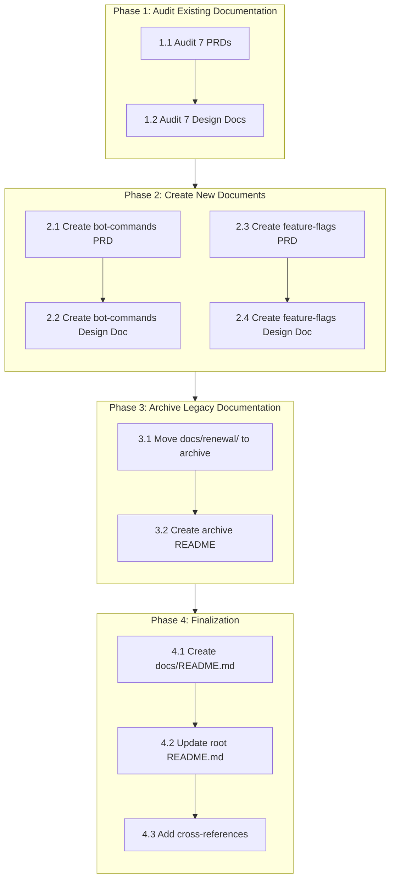
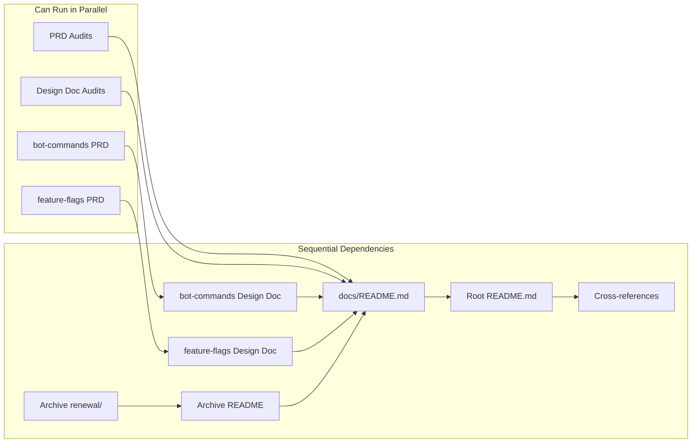

# Work Plan: Documentation Restructuring

Created Date: 2025-11-25
Type: documentation
Estimated Duration: 3-4 days
Estimated Impact: 25+ documentation files
Related Issue/PR: N/A

## Related Documents
- PRD: [docs/prd/documentation-restructuring-prd.md](../prd/documentation-restructuring-prd.md)
- Design Doc: [docs/design/documentation-restructuring-design.md](../design/documentation-restructuring-design.md)

## Objective
Systematize and unify project documentation through auditing existing PRD/Design Doc pairs, creating missing documentation for bot-commands and feature-flags subsystems, and archiving outdated legacy documents.

## Background
The Quantum Deal project has accumulated various types of documentation:
- **Modern structure**: 7 PRDs and 7 Design Docs for subscription subsystem
- **Legacy documentation**: 8 files in docs/renewal/ duplicating subscription-renewal content
- **Unstructured documentation**: bot-commands (5 files) and feature-flags (7 files) without PRD/Design Doc pairs

This inconsistency makes onboarding difficult and risks documentation drift from implementation.

## Phase Structure Diagram

## Task Dependency Diagram

## Risks and Countermeasures

### Technical Risks
- **Risk**: Documentation-code divergence not detected during audit
  - **Impact**: High - misleading documentation persists
  - **Countermeasure**: Use Design Doc checklist (7 items per document), verify file paths exist, grep code for FR implementations

- **Risk**: Loss of unique information during archival
  - **Impact**: Medium - historical context lost
  - **Countermeasure**: Full analysis of legacy files before archival, preserve all files in archive/

### Schedule Risks
- **Risk**: Audit reveals significant discrepancies requiring extensive updates
  - **Impact**: Medium - extends timeline
  - **Countermeasure**: Document discrepancies for future work; focus on marking status accurately rather than fixing all issues

- **Risk**: Source documentation insufficient for new PRDs
  - **Impact**: Low - incomplete PRDs
  - **Countermeasure**: Reference code implementation directly when documentation gaps exist

---

## Implementation Phases

### Phase 1: Audit Existing Documentation (Estimated effort: 1-2 days)

**Purpose**: Verify 14 existing documents (7 PRDs + 7 Design Docs) match current code implementation.

#### 1.1 PRD Audit Tasks

Each PRD audit verifies against the 7-item checklist from Design Doc section 1.1:

- [ ] **1.1.1 Audit subscription-core-prd.md** (FR-001)
  - Verify FR completeness and numbering
  - Compare FRs against libs/db/src/repositories/*, libs/db/src/schema/*
  - Check User Journey and Scope Boundary diagrams exist
  - Document discrepancies if found

- [ ] **1.1.2 Audit subscription-signals-prd.md** (FR-001)
  - Verify FR completeness and numbering
  - Compare FRs against libs/bot/src/commands/start/*, libs/signal/*
  - Check User Journey and Scope Boundary diagrams exist
  - Document discrepancies if found

- [ ] **1.1.3 Audit subscription-broadcast-prd.md** (FR-001)
  - Verify FR completeness and numbering
  - Compare FRs against libs/bot/src/commands/broadcast/*
  - Check User Journey and Scope Boundary diagrams exist
  - Document discrepancies if found

- [ ] **1.1.4 Audit subscription-trial-prd.md** (FR-001)
  - Verify FR completeness and numbering
  - Compare FRs against libs/bot/src/commands/trial/*
  - Check User Journey and Scope Boundary diagrams exist
  - Document discrepancies if found

- [ ] **1.1.5 Audit subscription-renewal-prd.md** (FR-001)
  - Verify FR completeness and numbering
  - Compare FRs against libs/bot/src/commands/renew/*
  - Check User Journey and Scope Boundary diagrams exist
  - Document discrepancies if found

- [ ] **1.1.6 Audit subscription-codes-prd.md** (FR-001)
  - Verify FR completeness and numbering
  - Compare FRs against libs/bot/src/commands/code/*
  - Check User Journey and Scope Boundary diagrams exist
  - Document discrepancies if found

- [ ] **1.1.7 Audit subscription-statistics-prd.md** (FR-001)
  - Verify FR completeness and numbering
  - Compare FRs against libs/bot/src/commands/statistics/*
  - Check User Journey and Scope Boundary diagrams exist
  - Document discrepancies if found

#### 1.2 Design Doc Audit Tasks

Each Design Doc audit verifies against the 7-item checklist from Design Doc section 1.2:

- [ ] **1.2.1 Audit subscription-core-design.md** (FR-002)
  - Verify architecture diagrams match code structure
  - Verify TypeScript types are current
  - Verify file locations exist (100% accuracy)
  - Verify API specifications match implementation

- [ ] **1.2.2 Audit subscription-signals-design.md** (FR-002)
  - Verify architecture diagrams match code structure
  - Verify TypeScript types are current
  - Verify file locations exist (100% accuracy)
  - Verify API specifications match implementation

- [ ] **1.2.3 Audit subscription-broadcast-design.md** (FR-002)
  - Verify architecture diagrams match code structure
  - Verify TypeScript types are current
  - Verify file locations exist (100% accuracy)
  - Verify API specifications match implementation

- [ ] **1.2.4 Audit subscription-trial-design.md** (FR-002)
  - Verify architecture diagrams match code structure
  - Verify TypeScript types are current
  - Verify file locations exist (100% accuracy)
  - Verify API specifications match implementation

- [ ] **1.2.5 Audit subscription-renewal-design.md** (FR-002)
  - Verify architecture diagrams match code structure
  - Verify TypeScript types are current
  - Verify file locations exist (100% accuracy)
  - Verify API specifications match implementation

- [ ] **1.2.6 Audit subscription-codes-design.md** (FR-002)
  - Verify architecture diagrams match code structure
  - Verify TypeScript types are current
  - Verify file locations exist (100% accuracy)
  - Verify API specifications match implementation

- [ ] **1.2.7 Audit subscription-statistics-design.md** (FR-002)
  - Verify architecture diagrams match code structure
  - Verify TypeScript types are current
  - Verify file locations exist (100% accuracy)
  - Verify API specifications match implementation

#### Phase 1 Completion Criteria
- [ ] 7 PRDs audited (49 checklist items verified: 7 PRDs x 7 items) (AC-001)
- [ ] 7 Design Docs audited (49 checklist items verified: 7 Design Docs x 7 items) (AC-002)
- [ ] Each document has status marked: Current or Requires Update
- [ ] Discrepancies documented with specific file references

#### Phase 1 Operational Verification
1. Each PRD has audit status recorded (Current/Requires Update)
2. Each Design Doc has audit status recorded (Current/Requires Update)
3. File paths in Design Docs verified to exist in codebase
4. Summary report generated listing all documents and their status

---

### Phase 2: Create New Documents (Estimated effort: 1-1.5 days)

**Purpose**: Create PRD and Design Doc pairs for bot-commands and feature-flags subsystems based on existing unstructured documentation.

#### 2.1 Bot Commands PRD Creation

- [ ] **2.1.1 Analyze source documents** (FR-003)
  - Read docs/bot-commands/README.md
  - Read docs/bot-commands/menu.md
  - Read docs/bot-commands/flow.md
  - Read docs/bot-commands/examples.md
  - Read docs/bot-commands/summary.md
  - Extract business requirements and user stories

- [ ] **2.1.2 Create bot-commands-prd.md** (FR-003)
  - Use docs/prd/template.md as template
  - Include minimum 5 Functional Requirements (FR-001 through FR-005+)
  - Create User Journey diagram (mermaid)
  - Create Scope Boundary diagram (mermaid)
  - Reference all 5 source files
  - Save to docs/prd/bot-commands-prd.md

#### 2.2 Bot Commands Design Doc Creation

- [ ] **2.2.1 Analyze implementation code**
  - Review libs/bot/src/services/bot-commands.service.ts
  - Review libs/bot/src/bot.update.ts
  - Review libs/bot/src/bot.service.ts
  - Document component relationships

- [ ] **2.2.2 Create bot-commands-design.md** (FR-004)
  - Use docs/design/template.md as template
  - Include Architecture Overview diagram (mermaid)
  - Include Data Flow diagram (mermaid)
  - Document file locations (minimum 3 paths verified)
  - Pass all 9 Design Doc checklist items
  - Save to docs/design/bot-commands-design.md

#### 2.3 Feature Flags PRD Creation

- [ ] **2.3.1 Analyze source documents** (FR-005)
  - Read docs/feature-flags/README.md
  - Read docs/feature-flags/FEATURE_CATALOG.md
  - Read docs/feature-flags/database-schema.md
  - Read docs/feature-flags/examples.md
  - Read docs/feature-flags/implementation-plan.md
  - Read docs/feature-flags/telegram-ui-flow.md
  - Read docs/feature-flags/QUICK_REFERENCE.md
  - Extract business requirements and user stories

- [ ] **2.3.2 Create feature-flags-prd.md** (FR-005)
  - Use docs/prd/template.md as template
  - Include minimum 5 Functional Requirements (FR-001 through FR-005+)
  - Create User Journey diagram (mermaid)
  - Create Scope Boundary diagram (mermaid)
  - Reference all 7 source files
  - Save to docs/prd/feature-flags-prd.md

#### 2.4 Feature Flags Design Doc Creation

- [ ] **2.4.1 Analyze implementation code**
  - Review libs/db/src/schema/subscription-features.ts
  - Review libs/db/src/repositories/subscription-features.repository.ts
  - Review libs/db/src/schema/user-subscription-features.ts
  - Document component relationships

- [ ] **2.4.2 Create feature-flags-design.md** (FR-006)
  - Use docs/design/template.md as template
  - Include Architecture Overview diagram (mermaid)
  - Include Data Flow diagram (mermaid)
  - Document file locations (minimum 3 paths verified)
  - Pass all 9 Design Doc checklist items
  - Save to docs/design/feature-flags-design.md

#### Phase 2 Completion Criteria
- [ ] bot-commands-prd.md created with User Journey + Scope Boundary diagrams (AC-003)
- [ ] bot-commands-design.md created with Architecture + Data Flow diagrams (AC-004)
- [ ] feature-flags-prd.md created with User Journey + Scope Boundary diagrams (AC-005)
- [ ] feature-flags-design.md created with Architecture + Data Flow diagrams (AC-006)
- [ ] All new PRDs have minimum 5 FRs
- [ ] All new Design Docs pass 9-item checklist

#### Phase 2 Operational Verification
1. New PRDs validate against template structure
2. New Design Docs validate against template structure
3. Mermaid diagrams render correctly (syntax validation)
4. File paths in Design Docs verified to exist in codebase

---

### Phase 3: Archive Legacy Documentation (Estimated effort: 0.5 day)

**Purpose**: Move outdated docs/renewal/ files to archive with proper documentation of archival reason.

#### 3.1 Legacy Document Archival

- [ ] **3.1.1 Create archive directory** (FR-007)
  - Create docs/archive/renewal/ directory

- [ ] **3.1.2 Move legacy files** (FR-007)
  - Move docs/renewal/README.md to docs/archive/renewal/
  - Move docs/renewal/architecture.md to docs/archive/renewal/
  - Move docs/renewal/database-schema.md to docs/archive/renewal/
  - Move docs/renewal/renewal-flow.md to docs/archive/renewal/
  - Move docs/renewal/api-flows.md to docs/archive/renewal/
  - Move docs/renewal/telegram-stars-integration.md to docs/archive/renewal/
  - Move docs/renewal/implementation-plan.md to docs/archive/renewal/
  - Move docs/renewal/testing-plan.md to docs/archive/renewal/

- [ ] **3.1.3 Remove empty directory**
  - Verify docs/renewal/ is empty
  - Remove docs/renewal/ directory

#### 3.2 Archive README Creation

- [ ] **3.2.1 Create archive README** (FR-007)
  - Create docs/archive/renewal/README.md with:
    - Archive date (2025-11-25)
    - Archival reason (superseded by unified PRD/Design Doc structure)
    - Links to 2 replacement documents (subscription-renewal-prd.md, subscription-renewal-design.md)
    - Table listing all 8 original files with descriptions

#### Phase 3 Completion Criteria
- [ ] All 8 files moved to docs/archive/renewal/ (AC-007)
- [ ] docs/archive/renewal/README.md created with required content (AC-007)
- [ ] docs/renewal/ directory empty or removed (AC-007)
- [ ] All file moves verified (8 files present in archive)

#### Phase 3 Operational Verification
1. Count files in docs/archive/renewal/ (expect 9: 8 original + README)
2. Verify docs/renewal/ does not exist or is empty
3. Verify README links are valid relative paths
4. Verify replacement documents exist at linked paths

---

### Phase 4: Finalization (Estimated effort: 0.5 day)

**Purpose**: Create navigation infrastructure and cross-references for improved documentation discovery.

#### 4.1 Documentation Navigation

- [ ] **4.1.1 Create docs/README.md** (FR-010)
  - Include navigation table for all 9 PRDs with working links
  - Include navigation table for all 9 Design Docs with working links
  - Include links to feature documentation (bot-commands/, feature-flags/)
  - Include links to ADR directory
  - Include links to development rules

- [ ] **4.1.2 Update root README.md** (FR-008)
  - Add documentation section pointing to docs/README.md
  - Brief overview of documentation structure

#### 4.2 Cross-References

- [ ] **4.2.1 Add cross-references between related PRDs** (FR-009)
  - Link subscription-core-prd.md to dependent PRDs
  - Link feature-flags-prd.md to bot-commands-prd.md (feature dependency)
  - Link subscription-renewal-prd.md to subscription-core-prd.md
  - Minimum 3 cross-reference links added

#### Phase 4 Completion Criteria
- [ ] docs/README.md created with complete navigation (AC-008)
- [ ] Navigation includes all 9 PRDs with working links (AC-008)
- [ ] Navigation includes all 9 Design Docs with working links (AC-008)
- [ ] Minimum 3 cross-reference links added (AC-008)
- [ ] Root README.md updated with documentation section

#### Phase 4 Operational Verification
1. All links in docs/README.md verified to resolve (9 PRDs + 9 Design Docs)
2. Cross-reference links in PRDs verified to resolve
3. Root README.md documentation section points to valid path
4. Navigation allows finding any document within 2 clicks from docs/

---

### Final Phase: Quality Assurance (Required)

**Purpose**: Overall verification that all acceptance criteria from Design Doc are satisfied.

#### Quality Tasks
- [ ] **Verify all Design Doc acceptance criteria achieved**
  - AC-001: PRD Audit (49 items) - verified
  - AC-002: Design Doc Audit (49 items) - verified
  - AC-003: Bot Commands PRD - verified
  - AC-004: Bot Commands Design Doc - verified
  - AC-005: Feature Flags PRD - verified
  - AC-006: Feature Flags Design Doc - verified
  - AC-007: Renewal Archival - verified
  - AC-008: Navigation - verified

- [ ] **Verify documentation structure matches Design Doc target schema**
  - docs/prd/ contains 9 PRDs (7 existing + 2 new)
  - docs/design/ contains 9 Design Docs (7 existing + 2 new)
  - docs/archive/renewal/ contains 9 files (8 legacy + README)
  - docs/README.md exists with navigation

- [ ] **Verify all Mermaid diagrams render correctly**
  - Preview all new and modified documents
  - Confirm diagrams display without syntax errors

#### Final Phase Completion Criteria
- [ ] All 8 acceptance criteria from Design Doc verified
- [ ] Documentation structure matches target schema
- [ ] All Mermaid diagrams render correctly
- [ ] All document links resolve correctly

---

## Completion Criteria (Overall)

- [ ] Phase 1 completed: 14 documents audited with status recorded
- [ ] Phase 2 completed: 4 new documents created (2 PRDs + 2 Design Docs)
- [ ] Phase 3 completed: 8 legacy files archived with README
- [ ] Phase 4 completed: Navigation infrastructure created
- [ ] Final Phase completed: All acceptance criteria verified
- [ ] All document links verified working
- [ ] Documentation coverage: 9 PRDs, 9 Design Docs (100% main features)

## Progress Tracking

### Phase 1: Audit Existing Documentation
- Start: ____-__-__ __:__
- Complete: ____-__-__ __:__
- Notes:

### Phase 2: Create New Documents
- Start: ____-__-__ __:__
- Complete: ____-__-__ __:__
- Notes:

### Phase 3: Archive Legacy Documentation
- Start: ____-__-__ __:__
- Complete: ____-__-__ __:__
- Notes:

### Phase 4: Finalization
- Start: ____-__-__ __:__
- Complete: ____-__-__ __:__
- Notes:

### Final Phase: Quality Assurance
- Start: ____-__-__ __:__
- Complete: ____-__-__ __:__
- Notes:

## Document Inventory Summary

### Documents to Audit (Phase 1)

| # | Document | Type | Path |
|---|----------|------|------|
| 1 | subscription-core-prd.md | PRD | docs/prd/ |
| 2 | subscription-signals-prd.md | PRD | docs/prd/ |
| 3 | subscription-broadcast-prd.md | PRD | docs/prd/ |
| 4 | subscription-trial-prd.md | PRD | docs/prd/ |
| 5 | subscription-renewal-prd.md | PRD | docs/prd/ |
| 6 | subscription-codes-prd.md | PRD | docs/prd/ |
| 7 | subscription-statistics-prd.md | PRD | docs/prd/ |
| 8 | subscription-core-design.md | Design Doc | docs/design/ |
| 9 | subscription-signals-design.md | Design Doc | docs/design/ |
| 10 | subscription-broadcast-design.md | Design Doc | docs/design/ |
| 11 | subscription-trial-design.md | Design Doc | docs/design/ |
| 12 | subscription-renewal-design.md | Design Doc | docs/design/ |
| 13 | subscription-codes-design.md | Design Doc | docs/design/ |
| 14 | subscription-statistics-design.md | Design Doc | docs/design/ |

### Documents to Create (Phase 2)

| # | Document | Source Files | Target Path |
|---|----------|--------------|-------------|
| 1 | bot-commands-prd.md | 5 files in docs/bot-commands/ | docs/prd/ |
| 2 | bot-commands-design.md | Code analysis | docs/design/ |
| 3 | feature-flags-prd.md | 7 files in docs/feature-flags/ | docs/prd/ |
| 4 | feature-flags-design.md | Code analysis | docs/design/ |

### Documents to Archive (Phase 3)

| # | Document | Current Path | Archive Path |
|---|----------|--------------|--------------|
| 1 | README.md | docs/renewal/ | docs/archive/renewal/ |
| 2 | architecture.md | docs/renewal/ | docs/archive/renewal/ |
| 3 | database-schema.md | docs/renewal/ | docs/archive/renewal/ |
| 4 | renewal-flow.md | docs/renewal/ | docs/archive/renewal/ |
| 5 | api-flows.md | docs/renewal/ | docs/archive/renewal/ |
| 6 | telegram-stars-integration.md | docs/renewal/ | docs/archive/renewal/ |
| 7 | implementation-plan.md | docs/renewal/ | docs/archive/renewal/ |
| 8 | testing-plan.md | docs/renewal/ | docs/archive/renewal/ |

### Documents to Create (Phase 4)

| # | Document | Purpose | Target Path |
|---|----------|---------|-------------|
| 1 | README.md | Archive explanation | docs/archive/renewal/ |
| 2 | README.md | Documentation navigation | docs/ |

## Notes

- This is a documentation-only task; no code changes are involved
- All documents must be written in English per project convention
- Use Mermaid for diagrams in Markdown files
- Templates are located at docs/prd/template.md and docs/design/template.md
- Work Plan will be deleted after completion with user approval (per documentation-criteria.md)
