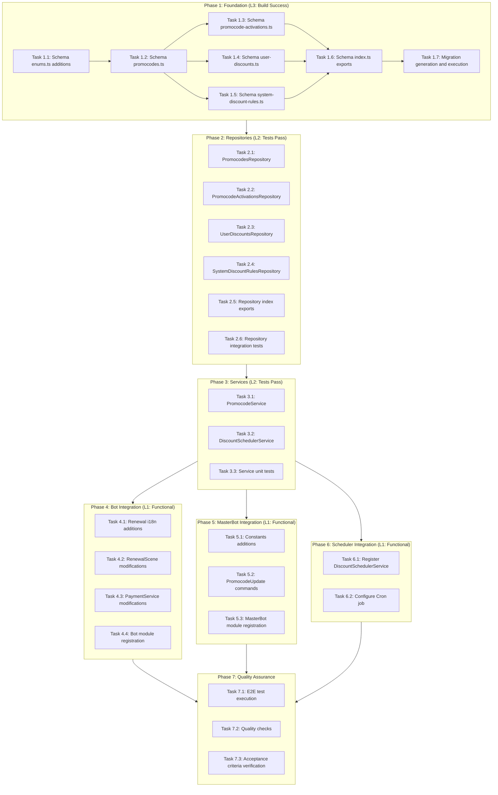

# Work Plan: Promocode Discount System

## Overview

**Feature**: Promocode Discount System
**Start Date**: 2026-01-16
**Source Documents**:
- Design Doc: `docs/design/promocodes-design.md`
- PRD: `docs/prd/promocodes-prd.md`
- ADR: `docs/adr/ADR-010-promocode-discount-system.md`

**Implementation Approach**: Vertical Slice (Feature-driven) with Foundation Layer First
- Phase 1: Database schema and migrations (L3: Build Success)
- Phase 2: Repository layer with integration tests (L2: Tests Pass)
- Phase 3: Service layer with unit tests (L2: Tests Pass)
- Phase 4: Bot integration (L1: Functional)
- Phase 5: MasterBot integration (L1: Functional)
- Phase 6: Scheduler integration (L1: Functional)
- Phase 7: Quality Assurance (all tests pass, acceptance criteria verified)

## Phase Structure Diagram



## Task Dependency Diagram

```mermaid
flowchart LR
    subgraph Schema["Schema Layer"]
        enums["enums.ts"]
        promocodes["promocodes.ts"]
        activations["promocode-activations.ts"]
        discounts["user-discounts.ts"]
        rules["system-discount-rules.ts"]
        schemaIndex["schema/index.ts"]
        migration["migration"]
    end

    subgraph Repositories["Repository Layer"]
        promoRepo["PromocodesRepository"]
        actRepo["PromocodeActivationsRepository"]
        discRepo["UserDiscountsRepository"]
        rulesRepo["SystemDiscountRulesRepository"]
        repoIndex["repositories/index.ts"]
        repoTests["Repository Integration Tests"]
    end

    subgraph Services["Service Layer"]
        promoService["PromocodeService"]
        schedService["DiscountSchedulerService"]
        serviceTests["Service Unit Tests"]
    end

    subgraph Bot["Bot Integration"]
        i18n["renewal.i18n.ts"]
        renewal["RenewalScene"]
        payment["PaymentService"]
        botModule["Bot Module"]
    end

    subgraph MasterBot["MasterBot Integration"]
        constants["constants.ts"]
        promoUpdate["PromocodeUpdate"]
        masterModule["MasterBot Module"]
    end

    subgraph Scheduler["Scheduler Integration"]
        cronReg["Cron Registration"]
    end

    enums --> promocodes
    promocodes --> activations
    promocodes --> discounts
    promocodes --> rules
    activations --> schemaIndex
    discounts --> schemaIndex
    rules --> schemaIndex
    schemaIndex --> migration

    migration --> promoRepo
    migration --> actRepo
    migration --> discRepo
    migration --> rulesRepo
    promoRepo --> repoIndex
    actRepo --> repoIndex
    discRepo --> repoIndex
    rulesRepo --> repoIndex
    repoIndex --> repoTests

    repoTests --> promoService
    repoTests --> schedService
    promoService --> serviceTests
    schedService --> serviceTests

    serviceTests --> i18n
    i18n --> renewal
    serviceTests --> payment
    renewal --> botModule
    payment --> botModule

    serviceTests --> constants
    constants --> promoUpdate
    promoUpdate --> masterModule

    serviceTests --> cronReg
```



---

## Phase 1: Foundation (L3: Build Success)

**Verification Level**: L3 - Build Success Verification
**Goal**: Create database schema and run migrations successfully

### Task 1.1: Add Enums to enums.ts
- [ ] **Implementation Complete**: Add PromocodeType, DiscountType, TriggerType enums to `libs/db/src/schema/enums.ts`
- [ ] **Quality Complete**: TypeScript compiles without errors
- [ ] **Integration Complete**: Enums exported and available for other schema files

**File**: `libs/db/src/schema/enums.ts`

**Implementation Details**:
```typescript
// Add these enum definitions
export enum PromocodeType {
  SINGLE_USE = 'single_use',
  MULTI_USE = 'multi_use',
  SYSTEM = 'system',
}

export enum DiscountType {
  PERCENTAGE = 'percentage',
  FIXED = 'fixed',
}

export enum TriggerType {
  DAYS_AFTER_EXPIRATION = 'days_after_expiration',
}
```

**AC Traceability**: Foundation for AC-001 to AC-027

---

### Task 1.2: Create promocodes.ts Schema
- [ ] **Implementation Complete**: Create `libs/db/src/schema/promocodes.ts` with full schema
- [ ] **Quality Complete**: TypeScript compiles without errors
- [ ] **Integration Complete**: Proper FK references to subscriptions, bots, managers

**File**: `libs/db/src/schema/promocodes.ts`

**Columns**:
- id (bigint, PK, auto-increment)
- code (varchar 50, unique, not null)
- type (promocodeTypeEnum, not null)
- discountType (discountTypeEnum, not null)
- discountValue (integer, not null)
- subscriptionId (bigint, FK to subscriptions)
- botId (bigint, FK to bots, nullable for global)
- isActive (boolean, default true)
- maxActivations (integer, nullable)
- validFrom (timestamp, nullable)
- validUntil (timestamp, nullable)
- createdBy (bigint, FK to managers.telegramId)
- createdAt, updatedAt, deactivatedAt (timestamps)

**Indexes**:
- unique: code
- index: (code, isActive)
- index: (botId, isActive)
- index: createdBy

**AC Traceability**: AC-021, AC-022, AC-023, AC-024, AC-025, AC-026

---

### Task 1.3: Create promocode-activations.ts Schema
- [ ] **Implementation Complete**: Create `libs/db/src/schema/promocode-activations.ts`
- [ ] **Quality Complete**: TypeScript compiles without errors
- [ ] **Integration Complete**: FK references to promocodes and botUsers

**File**: `libs/db/src/schema/promocode-activations.ts`

**Columns**:
- id (bigint, PK, auto-increment)
- promocodeId (bigint, FK to promocodes)
- botUserId (bigint, FK to botUsers)
- activatedAt (timestamp, default now)

**Constraints**:
- unique: (promocodeId, botUserId)
- index: botUserId
- index: promocodeId

**AC Traceability**: AC-006, AC-007, AC-008

---

### Task 1.4: Create user-discounts.ts Schema
- [ ] **Implementation Complete**: Create `libs/db/src/schema/user-discounts.ts`
- [ ] **Quality Complete**: TypeScript compiles without errors
- [ ] **Integration Complete**: FK references to botUsers and subscriptions

**File**: `libs/db/src/schema/user-discounts.ts`

**Columns**:
- id (bigint, PK, auto-increment)
- botUserId (bigint, FK to botUsers)
- subscriptionId (bigint, FK to subscriptions)
- discountType (discountTypeEnum, not null)
- discountValue (integer, not null)
- sourceType (varchar 20, 'promocode' | 'system_rule')
- sourceId (bigint, not null)
- createdAt (timestamp, default now)

**Constraints**:
- unique: (botUserId, subscriptionId)
- index: botUserId
- index: (sourceType, sourceId)

**AC Traceability**: AC-009, AC-015, AC-019

---

### Task 1.5: Create system-discount-rules.ts Schema
- [ ] **Implementation Complete**: Create `libs/db/src/schema/system-discount-rules.ts`
- [ ] **Quality Complete**: TypeScript compiles without errors
- [ ] **Integration Complete**: FK references to subscriptions, bots, managers

**File**: `libs/db/src/schema/system-discount-rules.ts`

**Columns**:
- id (bigint, PK, auto-increment)
- name (varchar 100, not null)
- subscriptionId (bigint, FK to subscriptions)
- botId (bigint, FK to bots, nullable for global)
- triggerType (triggerTypeEnum, not null)
- triggerValue (integer, not null)
- discountType (discountTypeEnum, not null)
- discountValue (integer, not null)
- isActive (boolean, default true)
- createdBy (bigint, FK to managers.telegramId)
- createdAt, updatedAt (timestamps)

**Indexes**:
- index: (subscriptionId, isActive)
- index: (botId, isActive)

**AC Traceability**: AC-014, AC-016, AC-017

---

### Task 1.6: Update Schema index.ts Exports
- [ ] **Implementation Complete**: Add exports in `libs/db/src/schema/index.ts`
- [ ] **Quality Complete**: All new schemas exported correctly
- [ ] **Integration Complete**: Can import from `@libs/db/schema`

**File**: `libs/db/src/schema/index.ts`

**Exports to Add**:
- promocodeTypeEnum, discountTypeEnum, triggerTypeEnum (from enums or promocodes)
- promocodes, Promocode, NewPromocode
- promocodeActivations, PromocodeActivation, NewPromocodeActivation
- userDiscounts, UserDiscount, NewUserDiscount
- systemDiscountRules, SystemDiscountRule, NewSystemDiscountRule

---

### Task 1.7: Generate and Run Migration
- [ ] **Implementation Complete**: Generate migration for 4 new tables
- [ ] **Quality Complete**: Migration runs without errors
- [ ] **Integration Complete**: Tables created in database with correct constraints

**Commands**:
```bash
npm run drizzle:generate
npm run drizzle:migrate
```

**Verification**:
1. All 4 tables created: promocodes, promocode_activations, user_discounts, system_discount_rules
2. All enums created: promocode_type, discount_type, trigger_type
3. All unique constraints in place
4. All FK constraints referencing correct tables

---

### Phase 1 Verification Procedure

**L3 Build Success Verification**:
```bash
# 1. Run TypeScript build
npm run build

# 2. Verify no type errors
npm run type-check

# 3. Verify migration successful
npm run drizzle:migrate

# 4. Verify tables exist (manual check or script)
```

**Completion Criteria**:
- [ ] `npm run build` passes
- [ ] All 4 schema files created
- [ ] Migration generated and executed
- [ ] Database tables created with correct structure

---

## Phase 2: Repositories (L2: Tests Pass)

**Verification Level**: L2 - Tests Pass Verification
**Goal**: Implement repository layer with CRUD operations

**Test File**: `libs/db/src/repositories/__tests__/promocodes.repository.int.test.ts`

### Task 2.1: Create PromocodesRepository
- [ ] **Implementation Complete**: Create `libs/db/src/repositories/promocodes.repository.ts`
- [ ] **Quality Complete**: Extends BaseRepository, type-safe
- [ ] **Integration Complete**: Injectable via NestJS DI

**File**: `libs/db/src/repositories/promocodes.repository.ts`

**Methods**:
- `findByCode(code: string): Promise<Promocode | null>` - Case-insensitive lookup
- `findByCodeAndBot(code: string, botId: number | null): Promise<Promocode | null>`
- `findActiveByManagerId(managerId: number): Promise<Promocode[]>`
- `findByManagerId(managerId: number, filters?: PromocodeFilters): Promise<Promocode[]>`
- `deactivate(id: number): Promise<Promocode | null>` - Set isActive=false, deactivatedAt
- `incrementActivationCount(id: number): Promise<void>` (if tracking count in table)

**AC Traceability**: AC-021, AC-022, AC-023, AC-024, AC-025, AC-026

---

### Task 2.2: Create PromocodeActivationsRepository
- [ ] **Implementation Complete**: Create `libs/db/src/repositories/promocode-activations.repository.ts`
- [ ] **Quality Complete**: Extends BaseRepository, type-safe
- [ ] **Integration Complete**: Injectable via NestJS DI

**File**: `libs/db/src/repositories/promocode-activations.repository.ts`

**Methods**:
- `findByPromocodeAndUser(promocodeId: number, botUserId: number): Promise<PromocodeActivation | null>`
- `findByPromocodeId(promocodeId: number): Promise<PromocodeActivation[]>`
- `countByPromocodeId(promocodeId: number): Promise<number>`
- `hasUserActivated(promocodeId: number, botUserId: number): Promise<boolean>`

**AC Traceability**: AC-006, AC-007, AC-008

---

### Task 2.3: Create UserDiscountsRepository
- [ ] **Implementation Complete**: Create `libs/db/src/repositories/user-discounts.repository.ts`
- [ ] **Quality Complete**: Extends BaseRepository, type-safe
- [ ] **Integration Complete**: Injectable via NestJS DI

**File**: `libs/db/src/repositories/user-discounts.repository.ts`

**Methods**:
- `findByBotUserAndSubscription(botUserId: number, subscriptionId: number): Promise<UserDiscount | null>`
- `existsForUser(botUserId: number, subscriptionId: number): Promise<boolean>`
- `upsert(discount: NewUserDiscount): Promise<UserDiscount>` - Insert or update

**AC Traceability**: AC-009, AC-015, AC-019

---

### Task 2.4: Create SystemDiscountRulesRepository
- [ ] **Implementation Complete**: Create `libs/db/src/repositories/system-discount-rules.repository.ts`
- [ ] **Quality Complete**: Extends BaseRepository, type-safe
- [ ] **Integration Complete**: Injectable via NestJS DI

**File**: `libs/db/src/repositories/system-discount-rules.repository.ts`

**Methods**:
- `findActiveRules(): Promise<SystemDiscountRule[]>`
- `findBySubscriptionAndBot(subscriptionId: number, botId: number | null): Promise<SystemDiscountRule[]>`

**AC Traceability**: AC-014, AC-016, AC-017

---

### Task 2.5: Update Repository index.ts Exports
- [ ] **Implementation Complete**: Add exports in `libs/db/src/repositories/index.ts`
- [ ] **Quality Complete**: All new repositories exported
- [ ] **Integration Complete**: Can import from `@libs/db/repositories`

**File**: `libs/db/src/repositories/index.ts`

**Exports to Add**:
- PromocodesRepository
- PromocodeActivationsRepository
- UserDiscountsRepository
- SystemDiscountRulesRepository

---

### Task 2.6: Implement Repository Integration Tests
- [ ] **Implementation Complete**: Implement all `it.todo()` tests in `promocodes.repository.int.test.ts`
- [ ] **Quality Complete**: All tests pass
- [ ] **Integration Complete**: Tests run against real database

**Test File**: `libs/db/src/repositories/__tests__/promocodes.repository.int.test.ts`

**Test Coverage** (24 test cases):
- PromocodesRepository: 7 tests (AC-021, AC-022, AC-023, AC-024, AC-025, AC-026)
- PromocodeActivationsRepository: 5 tests (AC-006, AC-007, AC-008)
- UserDiscountsRepository: 5 tests (AC-009, AC-015, AC-019)
- SystemDiscountRulesRepository: 4 tests (AC-014, AC-016, AC-017)

**Test Resolution Progress**: 0/24 resolved

---

### Phase 2 Verification Procedure

**L2 Tests Pass Verification**:
```bash
# 1. Run repository integration tests
npm test -- libs/db/src/repositories/__tests__/promocodes.repository.int.test.ts

# 2. Verify all tests pass
# Expected: 24 tests passing

# 3. Run type check
npm run type-check
```

**Completion Criteria**:
- [ ] All 4 repositories implemented
- [ ] Repository exports added to index
- [ ] Integration tests implemented (24 tests)
- [ ] All integration tests passing

**Test Resolution Progress**: 0/24 -> 24/24

---

## Phase 3: Services (L2: Tests Pass)

**Verification Level**: L2 - Tests Pass Verification
**Goal**: Implement service layer with business logic

**Test File**: `libs/bot/src/services/__tests__/promocode.service.test.ts`

### Task 3.1: Create PromocodeService
- [ ] **Implementation Complete**: Create `libs/bot/src/services/promocode.service.ts`
- [ ] **Quality Complete**: All methods type-safe, proper error handling
- [ ] **Integration Complete**: Injectable, depends on repositories

**File**: `libs/bot/src/services/promocode.service.ts`

**Interface**:
```typescript
interface PromocodeService {
  validatePromocode(code: string, botUserId: number, botId: number | null): Promise<ValidationResult>;
  activatePromocode(promocodeId: number, botUserId: number, subscriptionId: number): Promise<ActivationResult>;
  getUserActiveDiscount(botUserId: number, subscriptionId: number): Promise<UserDiscount | null>;
  calculateDiscountedPrice(originalPrice: number, discount: DiscountInfo): number;
  selectBestDiscount(tariffPriceStars: number, availableDiscounts: DiscountInfo[]): DiscountInfo | null;
  getDiscountedTariffs(tariffs: RenewalTariff[], discount: DiscountInfo | null): DiscountedTariff[];
}
```

**Type Definitions** (in same file or types file):
- ValidationResult
- ActivationResult
- DiscountInfo
- DiscountedTariff

**AC Traceability**: AC-002, AC-003, AC-004, AC-005, AC-006, AC-007, AC-008, AC-009, AC-010, AC-011, AC-012, AC-013, AC-019, AC-025, AC-026, AC-027

---

### Task 3.2: Create DiscountSchedulerService
- [ ] **Implementation Complete**: Create `libs/bot/src/services/discount-scheduler.service.ts`
- [ ] **Quality Complete**: Proper error handling, logging
- [ ] **Integration Complete**: Injectable, uses @Cron decorator

**File**: `libs/bot/src/services/discount-scheduler.service.ts`

**Interface**:
```typescript
interface DiscountSchedulerService {
  processAllRules(): Promise<SchedulerStats>;
  processRule(rule: SystemDiscountRule): Promise<RuleProcessingStats>;
  findEligibleUsers(rule: SystemDiscountRule): Promise<BotUser[]>;
}
```

**Type Definitions**:
- SchedulerStats
- RuleProcessingStats

**AC Traceability**: AC-014, AC-015, AC-016, AC-017

---

### Task 3.3: Implement Service Unit Tests
- [ ] **Implementation Complete**: Implement all `it.todo()` tests in `promocode.service.test.ts`
- [ ] **Quality Complete**: All tests pass with mocked dependencies
- [ ] **Integration Complete**: Tests use proper mocking strategy

**Test File**: `libs/bot/src/services/__tests__/promocode.service.test.ts`

**Test Coverage** (42 test cases):

**PromocodeService.validatePromocode**: 12 tests
- AC-002: Valid promocode returns success
- AC-003: Invalid/expired/used scenarios (7 error cases)
- AC-006: Single-use already used
- AC-007: Multi-use per-user restriction
- AC-025: Global promocode works across bots
- AC-026: Bot-specific restriction

**PromocodeService.calculateDiscountedPrice**: 6 tests
- AC-010: Percentage discount (2 tests)
- AC-011: Fixed discount
- AC-012: Minimum 1 Star floor (3 tests)

**PromocodeService.selectBestDiscount**: 5 tests
- AC-013: Maximum savings selection

**PromocodeService.activatePromocode**: 3 tests
- AC-008: Activation record created
- AC-009: Upsert user_discount

**PromocodeService.getUserActiveDiscount**: 3 tests
- AC-005: Returns discount
- AC-019: Persistence
- AC-027: Bot-specific precedence

**PromocodeService.getDiscountedTariffs**: 3 tests
- AC-004: Tariff transformation

**DiscountSchedulerService**: 10 tests
- processAllRules: 2 tests (AC-014, AC-017)
- processRule: 4 tests (AC-014, AC-015, AC-016)
- findEligibleUsers: 4 tests (AC-014)

**Test Resolution Progress**: 0/42 resolved

---

### Phase 3 Verification Procedure

**L2 Tests Pass Verification**:
```bash
# 1. Run service unit tests
npm test -- libs/bot/src/services/__tests__/promocode.service.test.ts

# 2. Verify all tests pass
# Expected: 42 tests passing

# 3. Run type check
npm run type-check

# 4. Run lint
npm run check
```

**Completion Criteria**:
- [ ] PromocodeService implemented
- [ ] DiscountSchedulerService implemented
- [ ] Unit tests implemented (42 tests)
- [ ] All unit tests passing

**Test Resolution Progress**: 0/42 -> 42/42

---

## Phase 4: Bot Integration (L1: Functional)

**Verification Level**: L1 - Functional Operation Verification
**Goal**: Integrate promocode functionality into bot user experience

### Task 4.1: Add Renewal i18n Messages
- [ ] **Implementation Complete**: Add i18n keys to `libs/bot/src/commands/renew/renewal.i18n.ts`
- [ ] **Quality Complete**: Keys follow existing naming convention
- [ ] **Integration Complete**: Messages available in en/ru locales

**File**: `libs/bot/src/commands/renew/renewal.i18n.ts`

**Messages to Add**:
```typescript
// Button labels
ENTER_PROMOCODE_BUTTON: 'Enter promocode'
PROMOCODE_PROMPT: 'Enter your promocode:'

// Success messages
PROMOCODE_SUCCESS: 'Promocode applied! You get {discount}% off'
PROMOCODE_SUCCESS_FIXED: 'Promocode applied! You save {discount} Stars'

// Error messages
PROMOCODE_INVALID: 'Invalid promocode'
PROMOCODE_INACTIVE: 'This promocode is no longer active'
PROMOCODE_NOT_FOR_BOT: 'This promocode is not valid for this bot'
PROMOCODE_NOT_YET_VALID: 'This promocode is not yet active'
PROMOCODE_EXPIRED: 'This promocode has expired'
PROMOCODE_ALREADY_USED: 'This promocode has already been used'
PROMOCODE_ALREADY_USED_BY_YOU: 'You have already used this promocode'
PROMOCODE_LIMIT_REACHED: 'This promocode has reached its activation limit'

// Price display
ORIGINAL_PRICE: 'Original: {price} Stars'
DISCOUNTED_PRICE: '{discountedPrice} Stars (was {originalPrice})'
```

**AC Traceability**: AC-002, AC-003, AC-004

---

### Task 4.2: Modify RenewalScene
- [ ] **Implementation Complete**: Add promocode entry flow to `libs/bot/src/commands/renew/renewal.scene.ts`
- [ ] **Quality Complete**: Proper state management, error handling
- [ ] **Integration Complete**: Works with existing renewal flow

**File**: `libs/bot/src/commands/renew/renewal.scene.ts`

**Modifications**:
1. Add "Enter promocode" button to tariff display
2. Handle button click -> show text input prompt
3. Validate promocode via PromocodeService
4. Store discount in scene state/context
5. Update showAllTariffs to display discounted prices
6. Pass discount to payment flow

**AC Traceability**: AC-001, AC-002, AC-003, AC-004, AC-005

---

### Task 4.3: Modify PaymentService
- [ ] **Implementation Complete**: Update `libs/bot/src/services/payment.service.ts`
- [ ] **Quality Complete**: Discount calculation correct, validation re-run
- [ ] **Integration Complete**: Invoice reflects discount

**File**: `libs/bot/src/services/payment.service.ts`

**Modifications**:
1. Add optional discount parameter to createRenewalInvoice
2. Calculate discounted price via PromocodeService
3. Create activation record on payment start/success
4. Create/update user_discount on successful payment
5. Re-validate discount in pre-checkout handler

**AC Traceability**: AC-008, AC-009, AC-018, AC-019, AC-020

---

### Task 4.4: Bot Module Registration
- [ ] **Implementation Complete**: Register PromocodeService in bot module
- [ ] **Quality Complete**: Dependency injection configured
- [ ] **Integration Complete**: Service available throughout bot

**File**: `libs/bot/src/bot.module.ts` (or appropriate module file)

**Registration**:
- Add PromocodeService to providers
- Import required repositories

---

### Phase 4 Verification Procedure

**L1 Functional Operation Verification**:

1. **Manual Test: Promocode Entry**
   - Open /renew scene
   - Click "Enter promocode" button
   - Enter valid promocode
   - Verify success message shows discount details
   - Verify tariff prices show discounted amounts

2. **Manual Test: Invalid Promocode**
   - Enter non-existent promocode
   - Verify "Invalid promocode" error displayed
   - Verify original prices remain

3. **Manual Test: Payment with Discount**
   - Apply valid promocode
   - Select tariff
   - Verify invoice amount is discounted
   - Complete payment (test mode)
   - Verify discount persists on next renewal visit

**Completion Criteria**:
- [ ] i18n messages added
- [ ] RenewalScene modified
- [ ] PaymentService modified
- [ ] Bot module registration complete
- [ ] Manual tests pass

---

## Phase 5: MasterBot Integration (L1: Functional)

**Verification Level**: L1 - Functional Operation Verification
**Goal**: Implement admin promocode management commands

### Task 5.1: Add Constants
- [ ] **Implementation Complete**: Add callback actions to `libs/masterbot/src/constants.ts`
- [ ] **Quality Complete**: Constants follow naming convention
- [ ] **Integration Complete**: Exported and available

**File**: `libs/masterbot/src/constants.ts`

**Constants to Add**:
```typescript
// Callback actions
export const PROMOCODE_CREATE = 'promocode_create'
export const PROMOCODE_LIST = 'promocode_list'
export const PROMOCODE_DEACTIVATE = 'promocode_deactivate'

// Regex patterns for actions
export const PROMOCODE_DEACTIVATE_REGEX = /^promocode_deactivate:(.+)$/
```

---

### Task 5.2: Create PromocodeUpdate Handler
- [ ] **Implementation Complete**: Create `libs/masterbot/src/promocode.update.ts`
- [ ] **Quality Complete**: Manager isolation enforced, input validation
- [ ] **Integration Complete**: Responds to /promocode command

**File**: `libs/masterbot/src/promocode.update.ts`

**Handlers**:
```typescript
@Update()
export class PromocodeUpdate {
  @Command('promocode')
  async onPromocodeCommand(ctx: UserContext): Promise<void>;

  @Action(/^promocode_create$/)
  async onCreatePromocode(ctx: UserContext): Promise<void>;

  @Action(/^promocode_list$/)
  async onListPromocodes(ctx: UserContext): Promise<void>;

  @Action(/^promocode_deactivate:(.+)$/)
  async onDeactivatePromocode(ctx: UserContext): Promise<void>;
}
```

**Promocode Creation Flow**:
1. Show subcommand menu (create/list)
2. For create: show type selection (single/multi)
3. Prompt for discount value
4. Prompt for discount type (percentage/fixed)
5. Optional: bot scope, validity dates
6. Generate code (8 uppercase alphanumeric)
7. Save to database with createdBy = manager.telegramId

**AC Traceability**: AC-021, AC-022, AC-023, AC-024

---

### Task 5.3: MasterBot Module Registration
- [ ] **Implementation Complete**: Register PromocodeUpdate in masterbot module
- [ ] **Quality Complete**: Dependency injection configured
- [ ] **Integration Complete**: /promocode command active

**File**: `libs/masterbot/src/masterbot.module.ts`

**Registration**:
- Add PromocodeUpdate to providers/controllers
- Import required repositories

---

### Phase 5 Verification Procedure

**L1 Functional Operation Verification**:

1. **Manual Test: Create Promocode**
   - Login as manager to MasterBot
   - Run /promocode command
   - Select "Create"
   - Enter parameters
   - Verify promocode created with 8-char alphanumeric code
   - Verify record in database

2. **Manual Test: List Promocodes**
   - Run /promocode list
   - Verify only own promocodes shown
   - Login as different manager
   - Verify first manager's promocodes NOT visible

3. **Manual Test: Deactivate Promocode**
   - Run /promocode deactivate <code>
   - Verify promocode.isActive = false
   - Try to use deactivated promocode
   - Verify validation fails

**Completion Criteria**:
- [ ] Constants added
- [ ] PromocodeUpdate implemented
- [ ] MasterBot module registration complete
- [ ] Manual tests pass

---

## Phase 6: Scheduler Integration (L1: Functional)

**Verification Level**: L1 - Functional Operation Verification
**Goal**: Configure daily scheduler for automatic discount assignment

### Task 6.1: Register DiscountSchedulerService
- [ ] **Implementation Complete**: Register service in appropriate module
- [ ] **Quality Complete**: Service properly configured
- [ ] **Integration Complete**: Can be manually triggered

**Module Registration**:
- Add DiscountSchedulerService to providers
- Configure NestJS Schedule module if not already

---

### Task 6.2: Configure Cron Job
- [ ] **Implementation Complete**: Add @Cron decorator for daily 00:00 UTC execution
- [ ] **Quality Complete**: Cron expression correct
- [ ] **Integration Complete**: Job registered in scheduler

**Cron Configuration**:
```typescript
@Cron('0 0 * * *', { timeZone: 'UTC' })
async processAllRules(): Promise<void> {
  // ...
}
```

---

### Phase 6 Verification Procedure

**L1 Functional Operation Verification**:

1. **Manual Test: Scheduler Execution**
   - Create system_discount_rule in database (7 days, 20%)
   - Create test user with subscription expired 8 days ago
   - Manually trigger scheduler.processAllRules()
   - Verify user_discount record created
   - User opens /renew
   - Verify discounted prices display automatically

2. **Manual Test: Idempotency**
   - Run scheduler again
   - Verify no duplicate discount created

3. **Manual Test: Rule Precedence**
   - Create global rule (15%)
   - Create bot-specific rule (25%)
   - Create eligible user in that bot
   - Run scheduler
   - Verify user gets 25% (bot-specific)

**Completion Criteria**:
- [ ] DiscountSchedulerService registered
- [ ] Cron job configured
- [ ] Manual tests pass

---

## Phase 7: Quality Assurance

**Verification Level**: All levels - Complete verification
**Goal**: Execute all tests, verify acceptance criteria

### Task 7.1: Execute E2E Tests
- [ ] **Implementation Complete**: Run all E2E tests from `promocodes.e2e.test.ts`
- [ ] **Quality Complete**: All E2E tests pass
- [ ] **Integration Complete**: Full system integration verified

**Test File**: `libs/bot/src/services/__tests__/promocodes.e2e.test.ts`

**E2E Test Coverage** (8 test cases):
- Promocode Redemption: 2 tests (complete flow, error handling)
- MasterBot Management: 1 test (create/list/deactivate)
- System Discount Scheduler: 1 test (automatic assignment)
- Multi-Bot Scoping: 1 test (global vs bot-specific)
- Payment Integration: 2 tests (discount in payment, validation edge case)
- Discount Calculation Edge Cases: 2 tests (minimum floor, best selection)

**Test Resolution Progress**: 0/8 resolved

---

### Task 7.2: Execute Quality Checks
- [ ] **Implementation Complete**: Run all quality commands
- [ ] **Quality Complete**: All checks pass
- [ ] **Integration Complete**: Code ready for review

**Commands**:
```bash
# Basic checks
npm run check        # Biome (lint + format)
npm run check:unused # Detect unused exports
npm run build        # TypeScript build

# Full test suite
npm test                    # All tests
npm run test:coverage:fresh # Coverage measurement

# Integrated check
npm run check:all
```

**Coverage Target**: >= 70% for new code

---

### Task 7.3: Acceptance Criteria Verification

**Verify all 27 acceptance criteria from Design Doc**:

**Promocode Entry and Validation (AC-001 to AC-005)**:
- [ ] AC-001: "Enter promocode" button appears in renewal scene
- [ ] AC-002: Valid promocode shows success message with discount details
- [ ] AC-003: Invalid/expired/used promocode shows specific error
- [ ] AC-004: Discounted prices display with strikethrough original
- [ ] AC-005: Discount state persists during scene navigation

**Promocode Activation (AC-006 to AC-009)**:
- [ ] AC-006: Single-use becomes inactive for all users after first activation
- [ ] AC-007: Multi-use remains active but unavailable for same user
- [ ] AC-008: Activation record created in promocode_activations
- [ ] AC-009: New promocode replaces existing discount (not additive)

**Discount Calculation (AC-010 to AC-013)**:
- [ ] AC-010: Percentage discount calculated correctly (floored)
- [ ] AC-011: Fixed discount calculated correctly
- [ ] AC-012: Minimum 1 Star floor enforced
- [ ] AC-013: Maximum savings discount selected when multiple available

**System Discount Rules (AC-014 to AC-017)**:
- [ ] AC-014: Scheduler assigns discounts to eligible expired users
- [ ] AC-015: No duplicate discounts created (idempotent)
- [ ] AC-016: Bot-specific rule takes precedence over global
- [ ] AC-017: Deactivated rules do not assign new discounts

**Payment Integration (AC-018 to AC-020)**:
- [ ] AC-018: Invoice amount reflects user's discount
- [ ] AC-019: Discount persists for future renewals (permanent)
- [ ] AC-020: Pre-checkout re-validates discount

**MasterBot Commands (AC-021 to AC-024)**:
- [ ] AC-021: /promocode create creates with specified parameters
- [ ] AC-022: /promocode list shows only manager's own promocodes
- [ ] AC-023: /promocode deactivate works only on own promocodes
- [ ] AC-024: Auto-generated code is 8 uppercase alphanumeric

**Multi-Bot Support (AC-025 to AC-027)**:
- [ ] AC-025: Global promocode (bot_id=NULL) works across all bots
- [ ] AC-026: Bot-specific promocode fails in wrong bot
- [ ] AC-027: Bot-specific takes precedence over global

---

### Phase 7 Verification Procedure

**Complete Verification**:
```bash
# 1. Run all tests
npm test

# 2. Verify coverage
npm run test:coverage:fresh
# Ensure >= 70% coverage on new files

# 3. Run quality checks
npm run check:all

# 4. Manual AC verification (checklist above)
```

**Completion Criteria**:
- [ ] All E2E tests pass (8/8)
- [ ] All unit tests pass (42/42)
- [ ] All integration tests pass (24/24)
- [ ] Coverage >= 70%
- [ ] Quality checks pass
- [ ] All 27 acceptance criteria verified

---

## Test Resolution Summary

| Phase | Test Type | File | Total | Resolved |
|-------|-----------|------|-------|----------|
| 2 | Integration | `promocodes.repository.int.test.ts` | 24 | 0 |
| 3 | Unit | `promocode.service.test.ts` | 42 | 0 |
| 7 | E2E | `promocodes.e2e.test.ts` | 8 | 0 |
| **Total** | | | **74** | **0** |

---

## Risks and Mitigations

| Risk | Impact | Probability | Mitigation |
|------|--------|-------------|------------|
| Race condition on single-use activation | Medium | Low | Unique constraint + application-level deactivation |
| Price calculation bug | High | Low | Comprehensive unit tests, minimum price floor |
| Scheduler overload with many users | Medium | Low | Batch processing, index optimization |
| Manager sees other's promocodes | Medium | Low | created_by filter on all queries, test coverage |
| Discount applied incorrectly in payment | High | Low | Re-validation at pre-checkout |

---

## Progress Tracking

### Overall Status

| Phase | Status | Tasks | Completed |
|-------|--------|-------|-----------|
| Phase 1: Foundation | Not Started | 7 | 0/7 |
| Phase 2: Repositories | Not Started | 6 | 0/6 |
| Phase 3: Services | Not Started | 3 | 0/3 |
| Phase 4: Bot Integration | Not Started | 4 | 0/4 |
| Phase 5: MasterBot Integration | Not Started | 3 | 0/3 |
| Phase 6: Scheduler Integration | Not Started | 2 | 0/2 |
| Phase 7: Quality Assurance | Not Started | 3 | 0/3 |
| **Total** | | **28** | **0/28** |

### Daily Progress Log

| Date | Tasks Completed | Notes |
|------|-----------------|-------|
| 2026-01-16 | Work plan created | Initial planning complete |

---

## References

- Design Doc: `docs/design/promocodes-design.md`
- PRD: `docs/prd/promocodes-prd.md`
- ADR: `docs/adr/ADR-010-promocode-discount-system.md`
- Test Files:
  - `libs/db/src/repositories/__tests__/promocodes.repository.int.test.ts`
  - `libs/bot/src/services/__tests__/promocode.service.test.ts`
  - `libs/bot/src/services/__tests__/promocodes.e2e.test.ts`

---

**Document Version**: 1.0
**Created**: 2026-01-16
**Last Updated**: 2026-01-16
