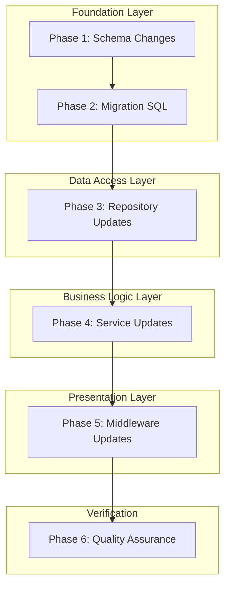

# Work Plan: User Subscriptions Migration to bot_users

Created Date: 2025-12-02
Type: refactor
Estimated Duration: 3-4 days
Estimated Impact: 12-15 files
Related Issue/PR: N/A

## Related Documents
- Design Doc: [docs/design/user-subscriptions-bot-users-migration-design.md](../design/user-subscriptions-bot-users-migration-design.md)
- ADR: [docs/adr/ADR-009-user-subscriptions-bot-users-migration.md](../adr/ADR-009-user-subscriptions-bot-users-migration.md)

## Objective

Migrate `user_subscriptions` table to use `botUserId` as the primary foreign key referencing `bot_users.id` (internal auto-generated ID). This enables per-bot subscription isolation, corrects trial eligibility logic, and aligns the subscription model with the multi-bot architecture established in ADR-004.

## Background

The current subscription system ties subscriptions to global user identity (`users.telegramId`) rather than bot-specific user context (`bot_users.id`). This creates:

1. **No Per-Bot Subscription Isolation**: A user's subscription history is global across all bots
2. **Trial Eligibility Logic Flaw**: `TrialService.isEligible()` checks for ANY subscription history across ALL bots
3. **Subscription Queries Require Join**: To get bot-specific subscriptions, queries must join through `bot_users`
4. **Inconsistent Data Model**: `bot_users` represents per-bot user context, but subscriptions don't follow this pattern

**Schema Change**:
- Add `botUserId` column as FK to `bot_users.id` (internal auto-generated ID)
- Deprecate old `userId` column (referenced `users.telegramId`)

## Phase Structure Diagram



## Task Dependency Diagram

```mermaid
graph LR
    subgraph Phase1[Phase 1: Schema]
        T1[Update Drizzle schema]
    end

    subgraph Phase2[Phase 2: Migration]
        T2[Generate migration via drizzle-kit]
        T3[Enhance migration with edge cases]
    end

    subgraph Phase3[Phase 3: Repository]
        T4[Add new botUserId methods]
        T5[Deprecate old userId methods]
        T6[Update unit tests]
    end

    subgraph Phase4[Phase 4: Services]
        T7[Update TrialService]
        T8[Update SubscriptionExpirationService]
        T9[Update ReminderSchedulerService]
    end

    subgraph Phase5[Phase 5: Middleware]
        T10[Update bot middleware]
        T11[Update partner-bot middleware]
    end

    subgraph Phase6[Phase 6: QA]
        T12[All tests pass]
        T13[Build and lint pass]
    end

    T1 --> T2
    T2 --> T3
    T3 --> T4
    T4 --> T5
    T5 --> T6
    T6 --> T7
    T7 --> T8
    T8 --> T9
    T9 --> T10
    T10 --> T11
    T11 --> T12
    T12 --> T13
```



## Risks and Countermeasures

### Technical Risks
- **Risk**: Migration fails mid-execution
  - **Impact**: High - Data integrity issues
  - **Countermeasure**: Use transaction, create database backup before running, use big-bang migration with maintenance window

- **Risk**: Orphan records without matching `bot_users`
  - **Impact**: Medium - Some subscriptions cannot be mapped
  - **Countermeasure**: Auto-create `bot_users` records in migration SQL (ADR-009 Decision 2)

- **Risk**: FK constraint violation on new column
  - **Impact**: Medium - Migration fails
  - **Countermeasure**: Create missing `bot_users` records before populating `botUserId`

### Schedule Risks
- **Risk**: Unexpected edge cases in existing data
  - **Impact**: Medium - Additional debugging time
  - **Countermeasure**: Test migration on development database with production data copy first

## Implementation Phases

### Phase 1: Schema Changes (Estimated commits: 1)
**Purpose**: Update Drizzle schema to add `botUserId` column with proper FK reference

**Verification Level**: L3 (Build Success)

#### Tasks
- [x] Update `libs/db/src/schema/user-subscriptions.ts`:
  - [x] Import `botUsers` schema for FK reference
  - [x] Add `botUserId` column: `bigint('bot_user_id', { mode: 'number' }).references(() => botUsers.id, { onDelete: 'cascade' })`
  - [x] Add index definition: `index('idx_user_subscriptions_bot_user').on(table.botUserId)`
  - [x] Add JSDoc deprecation comment to `userId` column
- [x] Quality check: `npm run build` passes (TypeScript compilation)

#### Phase Completion Criteria
- [x] **AC-1.4**: TypeScript types reflect new `botUserId` column
- [x] TypeScript build succeeds with no errors

#### Affected Files
- `libs/db/src/schema/user-subscriptions.ts`

---

### Phase 2: Migration SQL Execution (Estimated commits: 1)
**Purpose**: Generate and enhance database migration to add column and populate data

**Verification Level**: L1 (Functional Operation)

#### Tasks
- [x] Generate migration via `pnpm drizzle-kit generate`
- [x] Enhance generated migration SQL with:
  - [x] Phase 1: Add nullable `bot_user_id` column
  - [x] Phase 2: Create missing `bot_users` records for orphaned subscriptions
  - [x] Phase 3: Populate `bot_user_id` from existing `bot_users` records
  - [x] Phase 4: Add FK constraint
  - [x] Phase 5: Create index
  - [x] Phase 6: Make column NOT NULL (conditional, after verification)
- [x] Add prerequisite check comment for seed migration `20251126200000_seed_default_bot.sql`
- [ ] Test migration on development database

#### Migration SQL Template
```sql
-- Migration: Add botUserId to user_subscriptions
-- Prerequisite: Ensure 20251126200000_seed_default_bot.sql has been executed

-- Phase 1: Add nullable column
ALTER TABLE user_subscriptions ADD COLUMN bot_user_id BIGINT;

-- Phase 2: Create missing bot_users for orphaned subscriptions
INSERT INTO bot_users (user_id, bot_id, is_active, created_at, updated_at)
SELECT DISTINCT us.user_id, us.bot_id, true, NOW(), NOW()
FROM user_subscriptions us
LEFT JOIN bot_users bu ON bu.user_id = us.user_id AND bu.bot_id = us.bot_id
WHERE bu.id IS NULL AND us.bot_id IS NOT NULL;

-- Phase 3: Populate bot_user_id
UPDATE user_subscriptions us
SET bot_user_id = bu.id
FROM bot_users bu
WHERE us.user_id = bu.user_id AND us.bot_id = bu.bot_id;

-- Phase 4: Add FK constraint
ALTER TABLE user_subscriptions
ADD CONSTRAINT fk_user_subscriptions_bot_user
FOREIGN KEY (bot_user_id) REFERENCES bot_users(id) ON DELETE CASCADE;

-- Phase 5: Create index
CREATE INDEX idx_user_subscriptions_bot_user ON user_subscriptions(bot_user_id);

-- Phase 6: Make NOT NULL (after verification all records populated)
-- ALTER TABLE user_subscriptions ALTER COLUMN bot_user_id SET NOT NULL;
```

#### Phase Completion Criteria
- [ ] **AC-1.1**: `user_subscriptions.botUserId` column exists in database
- [ ] **AC-1.2**: Foreign key constraint references `bot_users.id` with CASCADE delete
- [ ] **AC-1.3**: Index `idx_user_subscriptions_bot_user` exists on `botUserId`
- [ ] **AC-2.1**: All existing subscriptions have non-null `botUserId` values
- [ ] **AC-2.2**: Orphaned subscriptions have corresponding `bot_users` records created
- [ ] **AC-2.3**: `botUserId` values correctly map to existing `bot_users(userId, botId)` pairs
- [ ] **AC-2.4**: Migration is idempotent (can be re-run safely)
- [ ] **AC-2.5**: Seed migration `20251126200000_seed_default_bot.sql` verified as prerequisite

#### Operational Verification Procedures
1. Run migration: `pnpm drizzle-kit migrate`
2. Verify no NULL `bot_user_id` (except legacy without botId):
   ```sql
   SELECT COUNT(*) FROM user_subscriptions WHERE bot_user_id IS NULL AND bot_id IS NOT NULL;
   -- Expected: 0
   ```
3. Verify FK integrity:
   ```sql
   SELECT COUNT(*) FROM user_subscriptions us
   LEFT JOIN bot_users bu ON us.bot_user_id = bu.id
   WHERE us.bot_user_id IS NOT NULL AND bu.id IS NULL;
   -- Expected: 0
   ```

#### Affected Files
- `libs/db/migrations/[timestamp]_user_subscriptions_bot_user_id.sql` (new)

---

### Phase 3: Repository Updates (Estimated commits: 2-3)
**Purpose**: Update `UserSubscriptionsRepository` to use `botUserId` for all operations

**Verification Level**: L2 (Test Operation)

#### Tasks
- [ ] Add new methods with `botUserId` parameter to `libs/db/src/repositories/user-subscriptions.repository.ts`:
  - [ ] `findByBotUserId(botUserId: number)` - Find all subscriptions for bot-user
  - [ ] `findActiveByBotUserId(botUserId: number)` - Find active subscriptions
  - [ ] `findByBotUserAndSubscription(botUserId: number, subscriptionId: number)` - Find specific subscription
  - [ ] `findActiveByBotUserIdWithSubscription(botUserId: number)` - Find with subscription details
  - [ ] `isBotUserSubscribed(botUserId: number, subscriptionId: number)` - Check subscription exists
  - [ ] `hasActiveSubscriptionByBotUser(botUserId: number, subscriptionId: number)` - Check active subscription
  - [ ] `activateForBotUser(botUserId: number, subscriptionId: number, expiresAt?: Date)` - Activate subscription
  - [ ] `deactivateForBotUser(botUserId: number, subscriptionId: number)` - Deactivate subscription
- [ ] Add JSDoc `@deprecated` annotations to old `userId` methods:
  - [ ] `findByUserId` - Add deprecation warning
  - [ ] `findActiveByUserId` - Add deprecation warning
  - [ ] `findByUserAndSubscription` - Add deprecation warning
  - [ ] `findActiveByUserIdWithSubscription` - Add deprecation warning
  - [ ] `isUserSubscribed` - Add deprecation warning
  - [ ] `hasActiveSubscription` - Add deprecation warning
  - [ ] `activate` - Add deprecation warning
  - [ ] `deactivate` - Add deprecation warning
- [ ] Update internal queries in existing methods that need `botUserId`:
  - [ ] `findExpiredTrials(botId)` - Already uses `botId`, consider using `botUserId` internally
  - [ ] `extendSubscription` - Update to use `botUserId` where available
- [x] Update unit tests in `libs/db/src/repositories/__tests__/user-subscriptions.repository.spec.ts`:
  - [x] Add tests for all new `botUserId` methods
  - [x] Verify deprecated methods still work (backward compatibility)
- [ ] Quality check: `npm run check` passes (lint + format)

#### Phase Completion Criteria
- [ ] **AC-3.1**: `findByBotUserId(botUserId)` returns subscriptions for specific bot-user
- [ ] **AC-3.2**: `findActiveByBotUserId(botUserId)` returns only active, non-expired subscriptions
- [ ] **AC-3.3**: `activateForBotUser(botUserId, subscriptionId, expiresAt)` creates subscription with `botUserId`
- [ ] **AC-3.4**: `isEligible(botUserId)` checks subscription history per bot-user, not globally
- [ ] **AC-3.5**: Existing methods with `userId` parameter are deprecated with warnings
- [ ] All unit tests pass

#### Operational Verification Procedures
1. Run unit tests: `npm test -- --testPathPattern=user-subscriptions.repository`
2. Verify all tests pass
3. Check TypeScript compilation: `npm run build`

#### Affected Files
- `libs/db/src/repositories/user-subscriptions.repository.ts`
- `libs/db/src/repositories/__tests__/user-subscriptions.repository.spec.ts`

---

### Phase 4: Service Updates (Estimated commits: 2-3)
**Purpose**: Update services to use `botUserId` for subscription operations

**Verification Level**: L2 (Test Operation)

#### Tasks
- [ ] Update `libs/bot/src/services/trial.service.ts`:
  - [ ] Change `isEligible(userId: number)` to `isEligible(botUserId: number)`
  - [ ] Update internal call from `findByUserId()` to `findByBotUserId()`
  - [ ] Change `activate(userId: number)` to `activate(botUserId: number)`
  - [ ] Update internal call from `activate()` to `activateForBotUser()`
  - [ ] Update logging to use `botUserId`
- [ ] Update `libs/bot/src/services/subscription-expiration.service.ts`:
  - [ ] Review `findExpiring()` usage - no changes needed (joins handle correctly)
  - [ ] Verify subscription queries still work with new column
- [ ] Update `libs/partner-bot/src/services/reminder-scheduler.service.ts`:
  - [ ] `findExpiredTrials(botId)` already uses `botId` filter
  - [ ] Consider updating to use `botUserId` in queries internally
  - [ ] Verify expired trial query returns correct results
- [ ] Quality check: Service tests pass (if any exist)
- [ ] Quality check: `npm run build` passes

#### Phase Completion Criteria
- [ ] **AC-4.1**: `TrialService.isEligible()` accepts `botUserId` parameter
- [ ] **AC-4.2**: `TrialService.activate()` creates subscription with `botUserId`
- [ ] **AC-4.3**: `SubscriptionExpirationService` queries by `botUserId` when available
- [ ] **AC-4.4**: `ReminderSchedulerService.findExpiredTrials()` uses `botUserId` for filtering
- [ ] Build succeeds with no type errors

#### Operational Verification Procedures
1. Run service tests: `npm test -- --testPathPattern=trial.service`
2. Verify TypeScript compilation: `npm run build`
3. Manual verification: TrialService correctly checks per-bot eligibility

#### Affected Files
- `libs/bot/src/services/trial.service.ts`
- `libs/bot/src/services/subscription-expiration.service.ts`
- `libs/partner-bot/src/services/reminder-scheduler.service.ts`

---

### Phase 5: Middleware Updates (Estimated commits: 1-2)
**Purpose**: Update middleware to pass `botUser.id` to subscription operations

**Verification Level**: L1 (Functional Operation)

#### Tasks
- [ ] Update `libs/bot/src/middleware/user-management.middleware.ts`:
  - [ ] Ensure `botUser` is loaded before subscription queries
  - [ ] Change subscription query from `findActiveByUserIdWithSubscription(telegramId)` to `findActiveByBotUserIdWithSubscription(botUserId)`
  - [ ] Attach `botUser.id` to context for downstream use
- [ ] Update `libs/partner-bot/src/middleware/user-management.middleware.ts`:
  - [ ] Same changes as bot middleware
  - [ ] Ensure `botUser` is properly resolved via `BotUsersRepository`
- [ ] Verify context types include `botUserId` where needed
- [ ] Quality check: `npm run build` passes

#### Phase Completion Criteria
- [ ] **AC-5.1**: Both bot and partner-bot middleware pass `botUser.id` to subscription operations
- [ ] **AC-5.2**: Context includes `botUser` with valid `id` for all subscription operations
- [ ] E2E flow works in development environment

#### Operational Verification Procedures
1. Start development server
2. Test bot interaction:
   - New user starts bot -> Check trial eligibility with `botUserId`
   - User with subscription -> Verify subscriptions loaded correctly
3. Verify logs show `botUserId` being used

#### Affected Files
- `libs/bot/src/middleware/user-management.middleware.ts`
- `libs/partner-bot/src/middleware/user-management.middleware.ts`

---

### Phase 6: Quality Assurance (Required) (Estimated commits: 1)
**Purpose**: Overall quality assurance and Design Doc consistency verification

**Verification Level**: L1 (Functional Operation)

#### Tasks
- [ ] Verify all Design Doc acceptance criteria achieved:
  - [ ] AC-1.1 through AC-1.4 (Schema Changes)
  - [ ] AC-2.1 through AC-2.5 (Migration Execution)
  - [ ] AC-3.1 through AC-3.5 (Repository Updates)
  - [ ] AC-4.1 through AC-4.4 (Service Updates)
  - [ ] AC-5.1 through AC-5.2 (Middleware Updates)
  - [ ] AC-6.1 through AC-6.4 (Quality Assurance)
- [ ] Execute all quality checks:
  - [ ] `npm run check` (Biome lint + format)
  - [ ] `npm run check:unused` (Detect unused exports)
  - [ ] `npm run build` (TypeScript build)
  - [ ] `npm test` (All tests)
  - [ ] `npm run test:coverage:fresh` (Coverage measurement)
- [ ] Verify integration test passes (if `user-subscriptions.repository.int.spec.ts` exists)
- [ ] Verify coverage >= 70%
- [ ] Update documentation if needed

#### Phase Completion Criteria
- [ ] **AC-6.1**: All unit tests pass with new `botUserId` parameter
- [ ] **AC-6.2**: All integration tests pass with actual database
- [ ] **AC-6.3**: TypeScript build succeeds with no type errors
- [ ] **AC-6.4**: Biome lint/format checks pass
- [ ] Coverage >= 70%

#### Operational Verification Procedures
1. Run full quality check: `npm run check:all`
2. Verify all tests pass: `npm test`
3. Check coverage report: `npm run test:coverage:fresh`
4. Open coverage report and verify >= 70%

#### Affected Files
- All test files
- Any documentation files needing updates

---

## Quality Assurance Summary

- [ ] Implement staged quality checks (details: refer to @docs/rules/technical-spec.md)
- [ ] All tests pass
- [ ] Type check pass
- [ ] Lint check pass
- [ ] Build success
- [ ] Coverage >= 70%

## Completion Criteria

- [ ] All 6 phases completed
- [ ] Each phase's operational verification procedures executed
- [ ] Design Doc acceptance criteria satisfied (AC-1.x through AC-6.x)
- [ ] Staged quality checks completed (zero errors)
- [ ] All tests pass
- [ ] Necessary documentation updated
- [ ] User review approval obtained

## Rollback Strategy

If critical issues discovered post-migration:

1. Redeploy previous application version (uses `userId` column)
2. All data remains intact (both columns populated)
3. Investigate and fix issues
4. Re-run migration with fixes

## Future Cleanup (Not in Scope)

After validation period (1-2 weeks post-deployment):
1. Drop `user_id` column
2. Drop associated `idx_user_subscriptions_user_bot` index
3. Remove deprecated repository methods
4. Update TypeScript types

## Progress Tracking

### Phase 1: Schema Changes
- Start: 2025-12-03
- Complete: 2025-12-03
- Notes: Added botUserId column with FK to bot_users.id, added index, added deprecation comment to userId

### Phase 2: Migration SQL Execution
- Start: 2025-12-03
- Complete: In Progress
- Notes: Migration file generated: `20251202221748_elite_piledriver.sql`. Task 02 (generate migration) completed. Task 03 (enhance migration) completed - added phased structure with orphan handling, data population, and verification queries.

### Phase 3: Repository Updates
- Start: YYYY-MM-DD HH:MM
- Complete: YYYY-MM-DD HH:MM
- Notes:

### Phase 4: Service Updates
- Start: YYYY-MM-DD HH:MM
- Complete: YYYY-MM-DD HH:MM
- Notes:

### Phase 5: Middleware Updates
- Start: YYYY-MM-DD HH:MM
- Complete: YYYY-MM-DD HH:MM
- Notes:

### Phase 6: Quality Assurance
- Start: YYYY-MM-DD HH:MM
- Complete: YYYY-MM-DD HH:MM
- Notes:

## Notes

- **Implementation Approach**: Horizontal Slice (Foundation-driven) - Schema changes must be complete before repository updates, repository updates before service changes
- **Migration Strategy**: Big-bang migration with acceptable downtime (ADR-009 Decision 3)
- **Orphan Handling**: Auto-create `bot_users` records for orphaned subscriptions (ADR-009 Decision 2)
- **Column Strategy**: Add new column, deprecate old column (ADR-009 Decision 1)
- **botUserId Reference**: References `bot_users.id` (internal auto-generated ID), NOT `users.telegramId`
