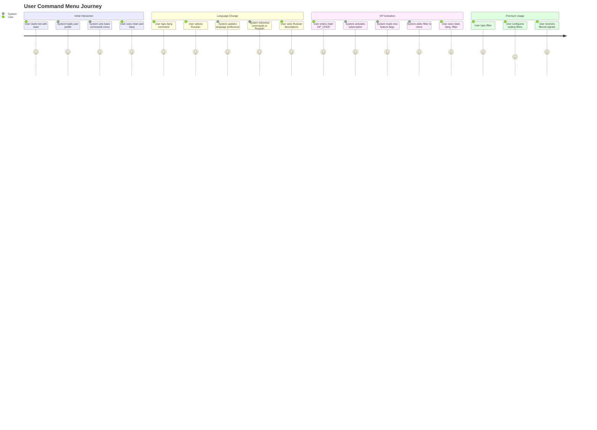
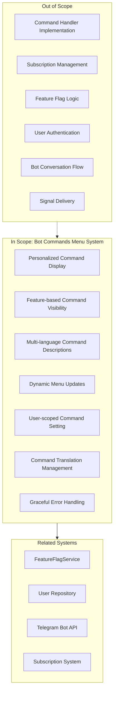
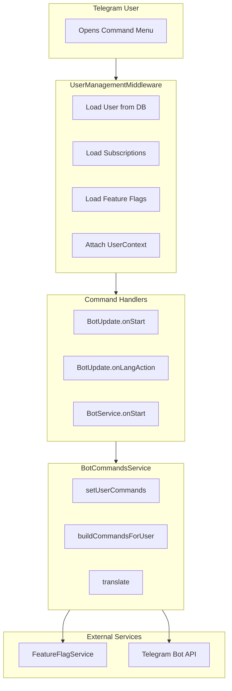

# PRD: Bot Commands Menu System

## Overview

### One-line Summary
A personalized bot commands menu system that dynamically displays available commands to Telegram users based on their subscription level, feature flags, and language preference.

### Background
The Quantum Deal Telegram bot provides trading signals to users through various commands. As the platform evolved with subscription tiers and feature-gated functionality, a need arose for a personalized command menu system that:

1. Shows users only the commands they have access to (based on subscription features)
2. Displays command descriptions in the user's preferred language (supporting 8 languages)
3. Automatically updates when user's access level or language changes
4. Provides a seamless UX without exposing unavailable commands to basic users

This system uses Telegram's `setMyCommands` API with user-specific scopes to deliver personalized command menus that adapt to each user's context.

## User Stories

### Primary Users

1. **Basic Users**: Users without premium subscriptions who need access to core commands
2. **VIP Users**: Users with active subscriptions that unlock additional features and commands
3. **Multi-language Users**: Users from different regions requiring localized command descriptions

### User Stories

**As a basic user:**
```
As a new user
I want to see only the commands I can use
So that I don't get confused by premium-only features
```

```
As a non-English speaker
I want to see command descriptions in my language
So that I understand what each command does
```

**As a VIP user:**
```
As a VIP subscriber
I want to see additional commands like /filter in my menu
So that I can easily access premium features I've paid for
```

```
As a subscriber who just activated a code
I want my command menu to update immediately
So that I can start using my new features right away
```

**As a returning user:**
```
As a user who changed my language preference
I want the command menu to update to my new language
So that descriptions match my interface language
```

### Use Cases

1. **New User Onboarding**: User starts the bot for the first time, receives basic commands menu (`/start`, `/lang`)
2. **VIP Activation**: User activates VIP code, menu updates to include `/filter` command
3. **Language Change**: User switches language from English to Russian, command descriptions update accordingly
4. **Feature Downgrade**: User's subscription expires, premium commands are removed from menu (user can still type them but won't see them in menu)
5. **Multi-device Sync**: Commands are scoped per user, so the menu is consistent across all user's devices

## User Journey Diagram



## Scope Boundary Diagram



## Functional Requirements

### Must Have (MVP) - IMPLEMENTED

- [x] **FR-001**: Set personalized commands per user using Telegram's `setMyCommands` API with user-specific scope
- [x] **FR-002**: Display `/start` and `/lang` commands for all users (always visible)
- [x] **FR-003**: Display `/filter` command only for users with `CUSTOM_USER_FILTERING` feature flag
- [x] **FR-004**: Support command descriptions in 8 languages (ru, en, uk, hi, fr, kk, uz, tg)
- [x] **FR-005**: Update commands on `/start` command execution
- [x] **FR-006**: Update commands on language change via `/lang`
- [x] **FR-007**: Update commands after subscription code activation
- [x] **FR-008**: Fallback to English when translation is not available for a language
- [x] **FR-009**: Graceful error handling - menu failures do not break bot functionality

### Nice to Have

- [ ] **FR-010**: Cache commands per user to reduce API calls
- [ ] **FR-011**: Support for group-specific commands (different scope types)
- [ ] **FR-012**: Admin-only commands with special scope
- [ ] **FR-013**: Rate limiting/throttling for command updates
- [ ] **FR-014**: Analytics/tracking for command usage

### Out of Scope

- **Command handler implementation**: Command logic is handled by separate handlers in `bot.update.ts`
- **Subscription management**: Handled by subscription repositories and services
- **Feature flag computation**: Handled by `FeatureFlagService`
- **User management**: Handled by user repository
- **Payment processing**: Separate system

## Non-Functional Requirements

### Performance
- **Response Time**: Command setting should complete within 1 second
- **API Efficiency**: Commands only updated when necessary (not on every request)
- **Optimization Points**: Updates occur only on /start, language change, and subscription activation

### Reliability
- **Error Tolerance**: Command menu is non-critical; failures are logged but don't break bot
- **Graceful Degradation**: Users can still type commands directly even if menu fails to update
- **Resilience**: Silent failure mode - errors don't propagate to user-facing responses

### Security
- **Scope Isolation**: Commands are scoped to individual users (type: 'chat', chat_id: userId)
- **Feature Verification**: Command visibility tied to actual feature flags, not just UI
- **Defense in Depth**: Command handlers also verify feature access (double-check)

### Scalability
- **User Scale**: Each user has independent command menu (no global state)
- **Language Scale**: Translation system supports adding new languages via COMMAND_TRANSLATIONS constant
- **Command Scale**: New commands can be added by extending buildCommandsForUser method

## Command Architecture

### Command Visibility Matrix

| Command | Always Visible | Requires Feature | Feature Flag |
|---------|---------------|------------------|--------------|
| `/start` | Yes | No | - |
| `/lang` | Yes | No | - |
| `/filter` | No | Yes | `CUSTOM_USER_FILTERING` |

### Supported Languages

| Code | Language | Flag |
|------|----------|------|
| `ru` | Russian | Flag: RU |
| `en` | English | Flag: GB |
| `uk` | Ukrainian | Flag: UA |
| `hi` | Hindi | Flag: IN |
| `fr` | French | Flag: FR |
| `kk` | Kazakh | Flag: KZ |
| `uz` | Uzbek | Flag: UZ |
| `tg` | Tajik | Flag: TJ |

### Update Triggers

| Trigger | Commands Updated | Reason |
|---------|-----------------|--------|
| `/start` (no code) | Yes | Initial setup or refresh |
| `/start CODE` | Yes | Features may have changed |
| Language change | Yes | Descriptions need translation |
| `/filter` command | No | No changes needed |
| Regular messages | No | Not relevant to menu |

## System Architecture



## Success Criteria

### Quantitative Metrics

1. **Command Update Success Rate**: 99%+ of setUserCommands calls complete without error
2. **Response Time**: Command updates complete within 1 second of trigger event
3. **Translation Coverage**: 100% of commands have translations in all 8 supported languages
4. **Feature Accuracy**: 100% correlation between user's feature flags and visible commands

### Qualitative Metrics

1. **User Experience**: Users only see commands they can actually use
2. **Internationalization**: Non-English users see command descriptions in their native language
3. **Discoverability**: New premium users immediately see newly available commands
4. **Consistency**: Command menu matches user's subscription level at all times

## Technical Considerations

### Dependencies

- **Telegram Bot API**: `setMyCommands` method with scope parameter
- **@quantumdeal/telegraf**: Bot framework with dependency injection
- **FeatureFlagService**: Provides user's enabled feature set
- **User Repository**: Provides user language preference

### Constraints

- **Telegram API Limits**: Rate limits on setMyCommands calls
- **Scope Type**: Currently only supports 'chat' scope (user-specific)
- **Command Limit**: Telegram allows maximum 100 commands per scope
- **Description Length**: Command descriptions limited to 256 characters

### Risks and Mitigation

| Risk | Impact | Probability | Mitigation |
|------|--------|-------------|------------|
| Telegram API rate limiting | Medium | Low | Throttle updates, batch when possible |
| Translation missing | Low | Low | Fallback to English |
| Feature flag sync delay | Medium | Low | Immediate refresh on activation |
| Command menu not updating | Low | Low | Users can type commands directly |

## Implementation Details

### Files Involved

| File | Role |
|------|------|
| `libs/bot/src/services/bot-commands.service.ts` | Core service managing command menus |
| `libs/bot/src/bot.update.ts` | Command handlers that trigger menu updates |
| `libs/bot/src/bot.service.ts` | Triggers menu update on code activation |
| `libs/bot/src/bot.module.ts` | Module registration for BotCommandsService |

### API Usage

```typescript
// Setting commands for a user
await bot.telegram.setMyCommands(commands, {
  scope: { type: 'chat', chat_id: userId },
});
```

## Appendix

### References
- Source documentation: `docs/bot-commands/README.md`
- Menu documentation: `docs/bot-commands/menu.md`
- Flow diagrams: `docs/bot-commands/flow.md`
- Usage examples: `docs/bot-commands/examples.md`
- Implementation summary: `docs/bot-commands/summary.md`
- Service implementation: `libs/bot/src/services/bot-commands.service.ts`

### Glossary
- **Command Menu**: The list of commands shown when user types "/" in Telegram
- **Scope**: Telegram API parameter that determines which users see which commands
- **Feature Flag**: A toggleable feature that users gain access to through subscriptions
- **BotCommand**: Telegram API type representing a command with its description
- **setMyCommands**: Telegram Bot API method for setting available commands

---

**Document Version**: 1.0.0
**Created**: 2025-11-25
**Status**: Reverse-engineered from implementation
**Last Updated**: 2025-11-25
