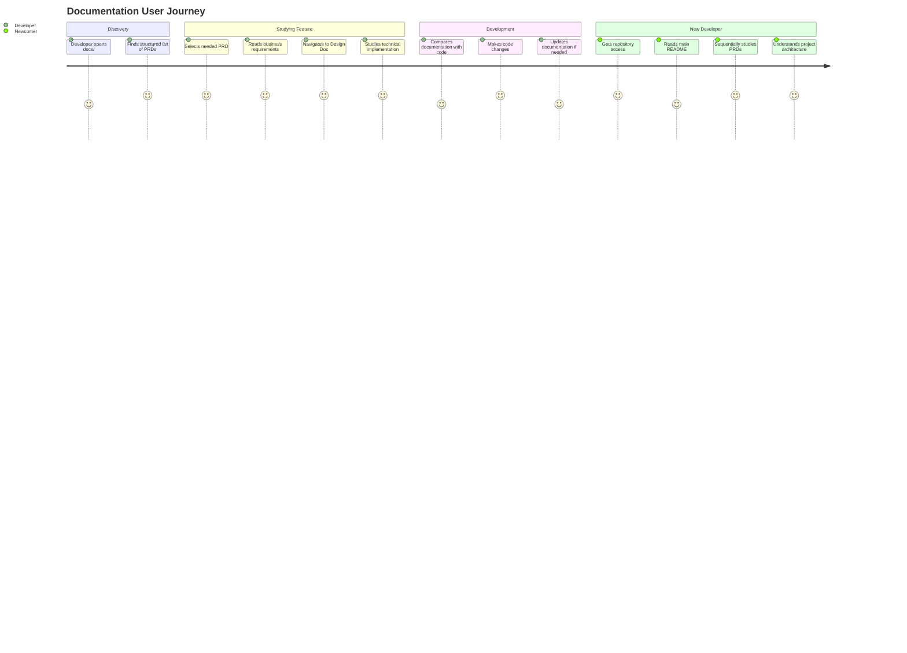
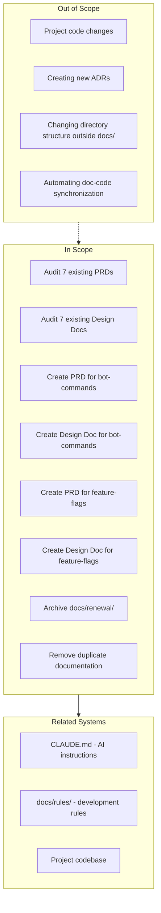

# PRD: Quantum Deal Project Documentation Restructuring

## Overview

### Brief Description
Systematization and unification of project documentation through auditing existing PRD/Design Doc, creating missing documentation for bot-commands and feature-flags, and archiving outdated legacy documents.

### Background
The Quantum Deal project has accumulated various types of documentation during development:

1. **Modern structure (docs/prd/ and docs/design/)**: 7 PRDs and 7 Design Docs for the subscription subsystem, created according to standard templates
2. **Legacy documentation (docs/renewal/)**: 8 files of outdated technical documentation, partially duplicating subscription-renewal-prd.md
3. **Unstructured documentation**:
   - `docs/bot-commands/` - 5 files without PRD/Design Doc
   - `docs/feature-flags/` - 7 files without PRD/Design Doc

The lack of uniformity makes onboarding new developers difficult and complicates maintaining documentation relevance.

## User Stories

### Primary Users

1. **Project Developer**: Works with the codebase and needs up-to-date technical documentation
2. **New Team Member**: Studies the project and requires a clear entry point to documentation
3. **AI Assistant (Claude Code)**: Uses documentation to understand task context

### User Stories

**As a developer:**
```
I want to find up-to-date documentation for any project feature,
So that I can quickly understand business requirements and technical implementation
```

```
I want to be confident that documentation matches the current code,
So that I don't waste time investigating discrepancies
```

```
I want to have a uniform document structure,
So that I can quickly navigate any documentation section
```

**As a new team member:**
```
I want to have a clear entry point to documentation,
So that I can quickly learn the project architecture and business logic
```

```
I want to understand the purpose of each subsystem,
So that I can effectively contribute to development
```

**As an AI assistant:**
```
I want to have structured documentation in a unified format,
So that I can accurately understand task context and generate correct solutions
```

### Use Cases

1. **Finding feature information**: Developer opens docs/prd/, finds the needed PRD, then navigates to the corresponding Design Doc
2. **New developer onboarding**: New team member sequentially studies PRDs of all subsystems, gaining a holistic picture of the project
3. **Relevance check**: Developer compares PRD with code before starting feature modification
4. **Archiving outdated content**: Administrator moves legacy documents to archive while preserving history

## User Journey Diagram



## Scope Boundary Diagram



## Functional Requirements

### Must Have (MVP)

- [ ] **FR-001**: Audit 7 existing PRDs for code compliance
  - subscription-core-prd.md
  - subscription-signals-prd.md
  - subscription-broadcast-prd.md
  - subscription-trial-prd.md
  - subscription-renewal-prd.md
  - subscription-codes-prd.md
  - subscription-statistics-prd.md

- [ ] **FR-002**: Audit 7 existing Design Docs for code compliance
  - subscription-core-design.md
  - subscription-signals-design.md
  - subscription-broadcast-design.md
  - subscription-trial-design.md
  - subscription-renewal-design.md
  - subscription-codes-design.md
  - subscription-statistics-design.md

- [ ] **FR-003**: Create PRD for bot-commands based on existing documentation
  - Sources: menu.md, flow.md, examples.md, summary.md, README.md
  - Format: according to docs/prd/template.md

- [ ] **FR-004**: Create Design Doc for bot-commands
  - Format: according to docs/design/template.md

- [ ] **FR-005**: Create PRD for feature-flags based on existing documentation
  - Sources: README.md, FEATURE_CATALOG.md, database-schema.md, examples.md, implementation-plan.md, telegram-ui-flow.md, QUICK_REFERENCE.md
  - Format: according to docs/prd/template.md

- [ ] **FR-006**: Create Design Doc for feature-flags
  - Format: according to docs/design/template.md

- [ ] **FR-007**: Archive legacy documentation docs/renewal/
  - Move to docs/archive/renewal/
  - Add README explaining archival reason
  - Include link to current documentation (subscription-renewal-prd.md)

### Should Have

- [ ] **FR-008**: Update root README.md with documentation navigation
- [ ] **FR-009**: Add cross-references between related PRDs
- [ ] **FR-010**: Create docs/README.md with documentation structure overview

### Could Have

- [ ] **FR-011**: Add diagrams to PRDs where missing
- [ ] **FR-012**: Unify terminology across all documents

### Out of Scope

- **Code changes**: Task affects only documentation
- **Creating ADRs**: Architectural decisions are documented separately
- **Automation**: Doc-code synchronization tools are out of scope
- **Translation**: All documents remain in English

## Non-Functional Requirements

### Documentation Quality
- All PRDs must contain mandatory sections according to template.md
- All PRDs must contain User Journey Diagram and Scope Boundary Diagram
- Design Docs must contain links to source code files

### Consistency
- Unified terminology across all documents
- Unified format for file and document references
- Document versioning with update date

### Maintainability
- Documents must be understandable without additional context
- Each document must be self-sufficient within its domain

## Success Criteria

### Quantitative Metrics

1. **Documentation coverage**: 100% of main project features have PRD and Design Doc
   - Before: 7 PRDs, 7 Design Docs (subscriptions) + unstructured documentation
   - After: 9 PRDs, 9 Design Docs (subscriptions + bot-commands + feature-flags)

2. **Relevance**: 100% of PRDs match current implementation after audit

3. **Structuring**: 0 legacy documents in active directory
   - Before: 8 files in docs/renewal/
   - After: 0 files (moved to archive)

### Qualitative Metrics

1. **Onboarding**: New developer can understand project architecture in 1 day of reading documentation
2. **Navigation**: Any information is found within maximum 2 clicks from docs/ root
3. **Clarity**: Documents are understandable without additional explanations

## Technical Considerations

### Dependencies
- Existing PRDs and Design Docs (docs/prd/, docs/design/)
- Document templates (docs/prd/template.md, docs/design/template.md)
- Documentation rules (docs/rules/documentation-criteria.md)
- Codebase for relevance verification

### Constraints
- Documents are created in English (according to project convention)
- Format: Markdown with Mermaid diagrams
- Storage: Git repository

### Risks and Mitigation

| Risk | Impact | Probability | Mitigation |
|------|--------|-------------|------------|
| Documentation-code divergence | High | Medium | Thorough verification during audit |
| Loss of important information during archival | Medium | Low | Pre-archival check, preservation in archive/ |
| Incomplete new PRDs | Medium | Medium | Use existing documentation as source |
| Information duplication between documents | Low | Medium | Cross-references instead of duplication |

## Document Inventory

### Existing PRDs (require audit)

| Document | Path | Status |
|----------|------|--------|
| Core Subscription | docs/prd/subscription-core-prd.md | Requires audit |
| Signals | docs/prd/subscription-signals-prd.md | Requires audit |
| Broadcast | docs/prd/subscription-broadcast-prd.md | Requires audit |
| Trial | docs/prd/subscription-trial-prd.md | Requires audit |
| Renewal | docs/prd/subscription-renewal-prd.md | Requires audit |
| Codes | docs/prd/subscription-codes-prd.md | Requires audit |
| Statistics | docs/prd/subscription-statistics-prd.md | Requires audit |

### Existing Design Docs (require audit)

| Document | Path | Status |
|----------|------|--------|
| Core Subscription | docs/design/subscription-core-design.md | Requires audit |
| Signals | docs/design/subscription-signals-design.md | Requires audit |
| Broadcast | docs/design/subscription-broadcast-design.md | Requires audit |
| Trial | docs/design/subscription-trial-design.md | Requires audit |
| Renewal | docs/design/subscription-renewal-design.md | Requires audit |
| Codes | docs/design/subscription-codes-design.md | Requires audit |
| Statistics | docs/design/subscription-statistics-design.md | Requires audit |

### Documents for PRD/Design Doc Creation

| Area | Sources | Target Documents |
|------|---------|------------------|
| Bot Commands | docs/bot-commands/*.md (5 files) | bot-commands-prd.md, bot-commands-design.md |
| Feature Flags | docs/feature-flags/*.md (7 files) | feature-flags-prd.md, feature-flags-design.md |

### Legacy Documents for Archival

| Document | Archival Reason |
|----------|-----------------|
| docs/renewal/README.md | Duplicates subscription-renewal-prd.md |
| docs/renewal/architecture.md | Duplicates subscription-renewal-design.md |
| docs/renewal/database-schema.md | Duplicates subscription-renewal-design.md |
| docs/renewal/renewal-flow.md | Duplicates subscription-renewal-prd.md |
| docs/renewal/api-flows.md | Duplicates subscription-renewal-design.md |
| docs/renewal/telegram-stars-integration.md | Duplicates subscription-renewal-design.md |
| docs/renewal/implementation-plan.md | Outdated implementation plan |
| docs/renewal/testing-plan.md | Outdated testing plan |

## Appendix

### References
- PRD Template: docs/prd/template.md
- Design Doc Template: docs/design/template.md
- Documentation Criteria: docs/rules/documentation-criteria.md
- Project Context: docs/rules/project-context.md

### Glossary
- **PRD (Product Requirements Document)**: Document with business requirements and user stories
- **Design Doc**: Document with technical implementation details
- **Legacy documentation**: Outdated documentation subject to archival
- **Audit**: Verification of documentation compliance with current code

---

**Document Version**: 1.1.0
**Created**: 2025-11-25
**Updated**: 2025-11-25
**Status**: Active
**Language**: English

### Change History

| Version | Date | Changes |
|---------|------|---------|
| 1.0.0 | 2025-11-25 | Initial version (Russian) |
| 1.1.0 | 2025-11-25 | Translated to English |
