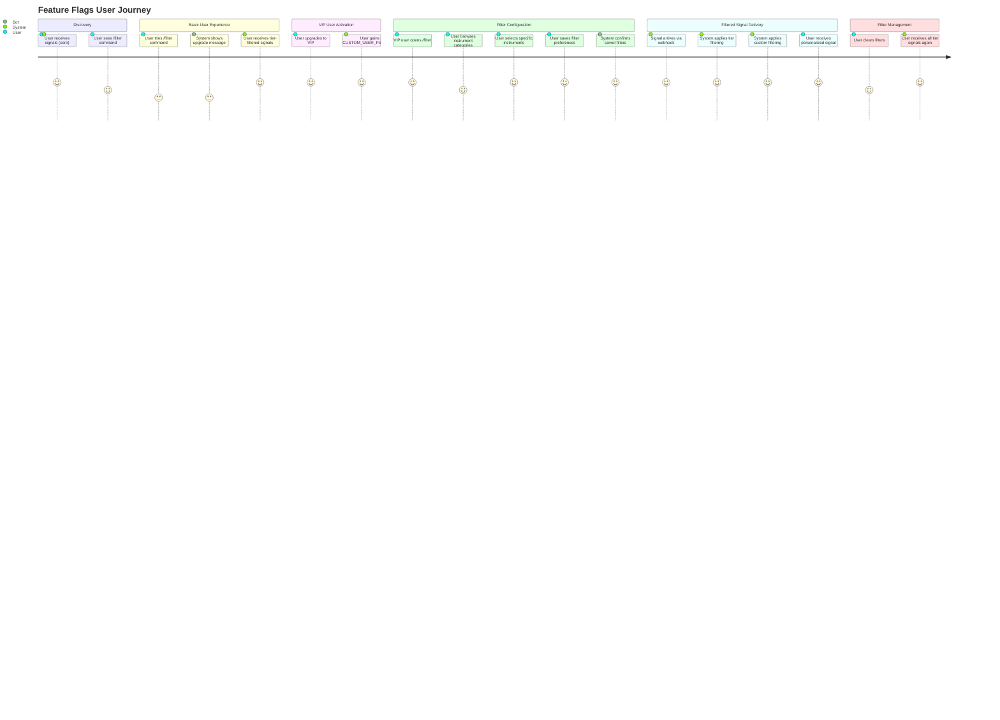

# PRD: Feature Flags System

## Overview

### One-line Summary
A feature flags system that provides fine-grained control over filtering capabilities for trading signal delivery based on subscription tiers, enabling both system-controlled tier-based filtering and user-configurable custom filtering preferences.

### Background
The Quantum Deal platform delivers professional trading signals to beginner traders via Telegram. To differentiate subscription tiers and provide premium value to VIP subscribers, a feature flags system was needed to control which filtering capabilities are available to users. The system focuses on two core filtering features:

1. **TIER_BASED_FILTERING**: System-controlled automatic filtering based on subscription tier sectors (available to all tiers)
2. **CUSTOM_USER_FILTERING**: User-configurable instrument selection for personalized signal delivery (VIP tier only)

**Key Design Principle**: Signal delivery is core bot functionality available to all active subscribers. Feature flags control only the filtering behavior applied to signals, not whether signals are delivered.

## User Stories

### Primary Users

1. **Basic Subscribers**: Users with entry-level subscriptions who receive signals filtered by their subscription's sector configuration
2. **VIP Subscribers**: Premium users who can personalize their signal delivery by selecting specific instruments in addition to tier-based filtering
3. **Administrators**: System operators who manage subscription features via direct database operations

### User Stories

**As a Basic subscriber:**
```
As a Basic subscriber
I want to receive trading signals filtered by my subscription's sector configuration
So that I only receive relevant signals for my trading markets (e.g., crypto, forex)
```

**As a VIP subscriber:**
```
As a VIP subscriber
I want to select specific trading instruments to receive signals for
So that I can focus on the exact symbols I trade (e.g., BTCUSD, EURUSD)
```

```
As a VIP subscriber
I want to clear my custom filters at any time
So that I can return to receiving all signals within my tier's sectors
```

**As an administrator:**
```
As an administrator
I want to enable or disable features for subscription tiers via SQL
So that I can manage feature availability without code deployment
```

```
As an administrator
I want to configure sector filtering at the subscription level
So that different subscription products can target different market segments
```

### Use Cases

1. **Basic User Signal Filtering**: User with Basic subscription receives only crypto signals because their subscription's TIER_BASED_FILTERING is configured with `sectors: ['crypto']`

2. **VIP User Custom Filtering**: VIP user opens `/filter` command, selects specific instruments (BTCUSD.a, EURUSD.a, GBPUSD.a), and saves preferences. Subsequently receives signals only for those instruments.

3. **VIP User Filter Reset**: VIP user clears custom filters, returning to receive all signals within their tier's configured sectors.

4. **Subscription Upgrade**: User upgrades from Basic to VIP, gaining access to CUSTOM_USER_FILTERING feature while retaining TIER_BASED_FILTERING. Previous settings (if any from prior VIP subscription) are restored.

5. **Subscription Downgrade**: User downgrades from VIP to Basic, losing CUSTOM_USER_FILTERING access. Custom filter settings are preserved in database for potential future upgrade.

6. **Webhook Signal Broadcasting**: System receives trading signal, queries subscriptions by sector, checks user's custom filtering settings, and delivers signal only to users who should receive it.

## User Journey Diagram



## Scope Boundary Diagram

```mermaid
flowchart TB
    subgraph InScope["In Scope: Feature Flags System"]
        direction TB
        F1[Feature Flag Enumeration]
        F2[subscription_features Table]
        F3[user_subscription_features Table]
        F4[FeatureFlagService - Read Operations]
        F5[UserSettingsService]
        F6[@RequireFeature Decorator]
        F7[FeatureGuard]
        F8[Telegram Filter UI Scene]
        F9[Feature-aware Webhook Broadcasting]
    end

    subgraph OutScope["Out of Scope"]
        direction TB
        O1[Payment Processing]
        O2[Subscription Creation]
        O3[User Authentication]
        O4[Core Signal Delivery Logic]
        O5[Feature Management API]
        O6[Admin Dashboard UI]
    end

    subgraph Related["Related Systems"]
        direction TB
        R1[Subscriptions Table]
        R2[User Subscriptions Table]
        R3[Users Table]
        R4[Instruments Table]
        R5[Webhook Processor]
    end

    InScope --> Related
    OutScope -.->|"Interacts with"| InScope

    F2 -->|"References"| R1
    F3 -->|"References"| R3
    F8 -->|"Queries"| R4
    F9 -->|"Uses"| R5
```

## Functional Requirements

### Must Have (MVP)

- [x] **FR-001**: Two feature flags enumeration - `TIER_BASED_FILTERING` and `CUSTOM_USER_FILTERING`
- [x] **FR-002**: `subscription_features` table mapping features to subscriptions with JSONB config
- [x] **FR-003**: `user_subscription_features` table storing user-specific settings with JSONB storage
- [x] **FR-004**: Feature aggregation from all active user subscriptions (union of features)
- [x] **FR-005**: FeatureFlagService with read-only operations for feature queries
- [x] **FR-006**: `hasFeature()` helper function for checking user feature access
- [x] **FR-007**: `getFeatureConfig()` helper function for retrieving feature configuration
- [x] **FR-008**: `@RequireFeature` decorator for protecting command handlers
- [x] **FR-009**: FeatureGuard for enforcing feature access at handler level
- [x] **FR-010**: UserManagementMiddleware loads features with user context
- [x] **FR-011**: TIER_BASED_FILTERING available on all tiers (Basic + VIP)
- [x] **FR-012**: CUSTOM_USER_FILTERING available only on VIP tier
- [x] **FR-013**: Sector-based filtering via `subscription_features.config.sectors`
- [x] **FR-014**: Telegram `/filter` command for VIP users to configure custom filters
- [x] **FR-015**: Instrument selection UI with category browsing (Forex, Crypto, Stocks, Commodities)
- [x] **FR-016**: Save/clear custom filter settings functionality
- [x] **FR-017**: Feature-aware signal broadcasting in webhook processor
- [x] **FR-018**: `findBySector()` query for tier-based filtering
- [x] **FR-019**: User settings preservation on subscription downgrade

### Nice to Have

- [ ] **FR-020**: Redis caching for user features (15-minute TTL)
- [ ] **FR-021**: Feature usage analytics and metrics
- [ ] **FR-022**: Audit trail for feature changes
- [ ] **FR-023**: Bulk feature operations for migrations

### Out of Scope

- **Feature Management API**: Features are managed via direct SQL queries, not bot API methods
- **Admin Dashboard**: No web UI for feature management; use database tools
- **Payment Integration**: Handled by separate subscription/payment systems
- **Signal Generation**: Feature flags control filtering, not signal creation
- **New Feature Types**: System designed for 2 filtering features only; expansion requires PRD revision

## Non-Functional Requirements

### Performance

- **Feature Load Time**: < 50ms to load user features from database
- **Database Query Time**: < 20ms for feature lookup queries
- **Webhook Processing Delay**: < 500ms additional latency for feature filtering
- **Cache Hit Rate**: > 90% for user feature lookups (when Redis caching implemented)

### Reliability

- **Data Integrity**: Foreign key constraints with CASCADE deletion
- **Soft Deletion**: `isActive` flags preserve user settings on downgrade
- **Unique Constraints**: One record per (subscription_id, feature_key) and (user_id, feature_key)

### Security

- **Access Control**: Feature guards prevent unauthorized access to protected handlers
- **Type Safety**: TypeScript enum for feature keys prevents string typos
- **Input Validation**: JSONB settings validated before storage
- **Database-level Management**: Features managed via direct SQL, not exposed via API

### Scalability

- **JSONB Configuration**: Flexible feature configs without schema changes
- **Feature Aggregation**: Users can have multiple subscriptions with combined features
- **Symbol-based Filtering**: User settings store symbol names (not IDs) for portability
- **Index Optimization**: Proper indexes on subscription_id, feature_key, and user_id columns

## Success Criteria

### Quantitative Metrics

1. **Feature Load Performance**: 95th percentile feature load time < 100ms
2. **Filter Accuracy**: 100% of signals correctly filtered based on user settings
3. **Database Query Efficiency**: All feature queries use indexes (no sequential scans)
4. **UI Response Time**: Filter scene actions complete within 500ms
5. **Error Rate**: < 0.1% errors in feature checks during signal delivery

### Qualitative Metrics

1. **Developer Experience**: Clean API with type-safe feature checks via decorators and helpers
2. **User Experience**: VIP users can easily configure filters via intuitive Telegram UI
3. **Maintainability**: Feature system is self-contained with clear documentation
4. **Extensibility**: New features can be added to enum without database schema changes

## Technical Considerations

### Dependencies

- **Database**: PostgreSQL with Drizzle ORM
- **Framework**: NestJS with dependency injection
- **Telegram**: Telegraf framework for bot scenes
- **Schema**: Uses bigint IDs with auto-identity generation
- **Instruments Table**: Required for custom filtering UI (symbol selection)

### Constraints

- **Read-Only Bot**: Bot only reads features; management via direct SQL
- **Two Features Only**: System designed for TIER_BASED_FILTERING and CUSTOM_USER_FILTERING
- **Deprecation**: `subscriptions.scope` field deprecated in favor of `subscription_features.config.sectors`
- **Symbol Storage**: User settings store symbol names (e.g., 'BTCUSD.a'), not instrument IDs
- **Empty Filter = All**: Empty symbols array means receive all signals (default behavior)

### Database Indexes

| Index | Table | Purpose |
|-------|-------|---------|
| `uq_subscription_feature` | subscription_features | Unique (subscription_id, feature_key) |
| `idx_subscription_features_subscription_id` | subscription_features | Fast subscription lookups |
| `idx_subscription_features_feature_key` | subscription_features | Fast feature lookups |
| `idx_subscription_features_enabled` | subscription_features | Active features query |
| `unique_user_feature` | user_subscription_features | Unique (user_id, feature_key) |
| `idx_user_subscription_features_user_id` | user_subscription_features | Fast user settings lookup |
| `idx_user_subscription_features_jsonb` | user_subscription_features | GIN index for JSONB queries |

### Risks and Mitigation

| Risk | Impact | Probability | Mitigation |
|------|--------|-------------|------------|
| Feature check performance in hot path | High | Medium | Implement Redis caching with 15-min TTL |
| User confusion between tier and custom filters | Medium | Low | Clear UI messaging explaining filter hierarchy |
| Orphaned user settings after subscription change | Low | Low | Soft delete preserves settings; CASCADE on hard delete |
| Symbol name changes breaking user filters | Medium | Low | Use stable symbol names; migration script for renames |
| Feature flag enum expansion complexity | Low | Low | System designed for 2 features; new features require PRD |

## Feature Specifications

### TIER_BASED_FILTERING

| Attribute | Value |
|-----------|-------|
| Key | `tier_based_filtering` |
| Available Tiers | Basic, VIP (all tiers) |
| Configuration Level | Subscription |
| Config Storage | `subscription_features.config.sectors` |
| User Configurable | No (system-controlled) |
| Description | Automatic filtering based on subscription sector configuration |

**Config Example:**
```json
{
  "sectors": ["crypto", "forex", "stocks"]
}
```

### CUSTOM_USER_FILTERING

| Attribute | Value |
|-----------|-------|
| Key | `custom_user_filtering` |
| Available Tiers | VIP only |
| Configuration Level | User |
| Settings Storage | `user_subscription_features.settings.symbols` |
| User Configurable | Yes (via /filter command) |
| Description | User-selectable instrument whitelist for signal filtering |

**Settings Example:**
```json
{
  "symbols": ["BTCUSD.a", "EURUSD.a", "GBPUSD.a"]
}
```

## Subscription Tier Matrix

| Feature | Basic | VIP |
|---------|-------|-----|
| Signal Delivery | Core (always) | Core (always) |
| TIER_BASED_FILTERING | Yes | Yes |
| CUSTOM_USER_FILTERING | No | Yes |

## Filter Hierarchy

When processing signals for a VIP user, filters are applied in sequence:

1. **TIER_BASED_FILTERING** (First): System checks if signal's sector matches subscription's configured sectors
2. **CUSTOM_USER_FILTERING** (Second): If user has configured custom filters, system checks if signal's instrument is in user's whitelist

Both filters must pass for the signal to be delivered. If custom filters are not configured (empty array), all signals passing tier filter are delivered.

## Appendix

### References

- Feature Flags Architecture: `docs/feature-flags/README.md`
- Feature Catalog: `docs/feature-flags/FEATURE_CATALOG.md`
- Database Schema: `docs/feature-flags/database-schema.md`
- Implementation Plan: `docs/feature-flags/implementation-plan.md`
- Telegram UI Flow: `docs/feature-flags/telegram-ui-flow.md`
- Code Examples: `docs/feature-flags/examples.md`
- Quick Reference: `docs/feature-flags/QUICK_REFERENCE.md`
- Related PRD: `docs/prd/subscription-core-prd.md`

### Glossary

- **Feature Flag**: Named capability that can be enabled for specific subscriptions
- **Signal Delivery**: Core bot functionality (NOT a feature flag) - all active subscribers receive signals
- **Subscription Features**: Set of features available for a specific subscription type/tier
- **User Features**: Union of all features from a user's active subscriptions
- **TIER_BASED_FILTERING**: System-controlled automatic filtering based on subscription tier sectors
- **CUSTOM_USER_FILTERING**: User-configurable instrument filtering preferences (VIP only)
- **Basic Tier**: Entry-level subscription with signal delivery + tier-based filtering
- **VIP Tier**: Premium subscription with both filtering features enabled
- **Settings JSONB**: JSON field in `user_subscription_features` storing feature-specific configuration
- **Feature Template**: Predefined feature set for quick subscription creation (e.g., SIGNALS_VIP)
- **Sector**: Trading market category (crypto, forex, stocks, commodities) used for tier-based filtering
- **Symbol**: Trading instrument identifier (e.g., 'BTCUSD.a', 'EURUSD.a') used for custom filtering

---

**Document Version**: 1.0.0
**Created**: 2025-11-25
**Status**: Active
**Last Updated**: 2025-11-25
