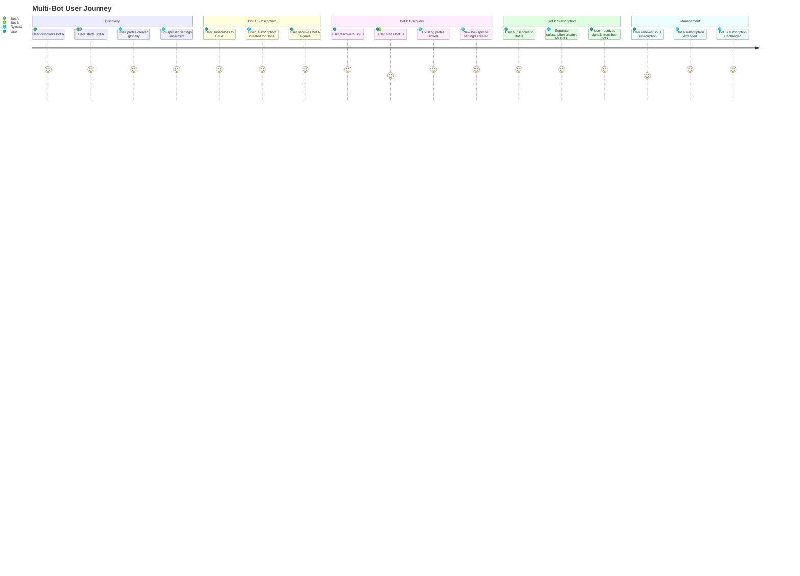
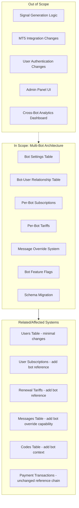

# PRD: Multi-Bot Database Architecture

## Overview

### One-line Summary
Transform the database architecture to support multiple Telegram bots operating independently, with shared user profiles, per-bot subscriptions, customizable bot settings, and flexible message configurations.

### Background
The Quantum Deal platform currently operates with a single-bot architecture where all users, subscriptions, and settings are implicitly tied to one bot instance. As the business expands to serve multiple broker partners through different branded Telegram bots, the system needs to support:

1. **Multiple independent bots** - Each bot serves a different broker/brand with its own identity
2. **User presence across bots** - A single Telegram user may interact with multiple bots
3. **Per-bot subscriptions** - Users subscribe independently to each bot's services
4. **Bot-specific settings** - Each bot has its own token, name, messages, and payment configuration
5. **Message customization** - Bots can use default messages or override with custom ones

This architectural change enables the multi-brand business model described in the project context, where a single MT5 signal source is distributed to multiple Telegram bots serving different broker partnerships.

## User Stories

### Primary Users

1. **End Users (Subscribers)**: Beginner traders who may subscribe to multiple bots for different trading signal providers
2. **Bot Administrators**: Technical staff (developers) who configure and manage bot instances directly through database operations (SQL queries, migrations, Drizzle ORM scripts)
3. **System**: Automated processes that handle signal distribution, subscription management, and payments across all bots

### User Stories

**As an end user:**
```
As a trader
I want to use multiple trading signal bots
So that I can receive signals from different providers without creating separate accounts
```

```
As a subscriber
I want to manage my subscriptions independently for each bot
So that I can choose different subscription tiers for different signal providers
```

```
As a user
I want my preferences and settings to be specific to each bot
So that I can customize my experience per provider without affecting other bots
```

**As a bot administrator (developer):**
```
As an administrator
I want to configure each bot's token, name, and settings independently via database
So that each bot maintains its distinct brand identity
```

```
As an administrator
I want to set up different payment tariffs for each bot through database records
So that pricing can reflect each brand's market positioning
```

```
As an administrator
I want to customize messages per bot by inserting database records while sharing common defaults
So that bots can have consistent base messaging with brand-specific customizations
```

### Use Cases

1. **New Bot Registration**: Administrator inserts new bot record in database with token, name, and default settings via migration or SQL script
2. **User Joins Multiple Bots**: Single Telegram user starts and subscribes to multiple bots independently
3. **Subscription Management**: User activates subscription on one bot without affecting other bot subscriptions
4. **Message Customization**: Administrator inserts bot_messages records in database to override specific messages while inheriting defaults
5. **Payment Processing**: User pays for subscription through bot-specific tariffs
6. **Feature Configuration**: Administrator updates bot_settings JSONB field in database to enable/disable features per bot (e.g., trial availability)

## User Journey Diagram



## Scope Boundary Diagram



## Functional Requirements

### Must Have (MVP)

- [ ] **FR-001**: Create `bots` table with fields: id, token, name, isActive, createdAt, updatedAt
- [ ] **FR-002**: Create `bot_settings` table for bot configuration (feature flags, default values)
- [ ] **FR-003**: Create `bot_users` table linking users to bots with per-bot settings (preferences, state, language)
- [ ] **FR-004**: Add `botId` foreign key to `user_subscriptions` table for per-bot subscriptions
- [ ] **FR-005**: Add `botId` foreign key to `renewal_tariffs` table for per-bot pricing
- [ ] **FR-006**: Add `botId` column to `codes` table to scope activation codes to specific bots
- [ ] **FR-007**: Create `bot_messages` table for per-bot message overrides with (botId, type, lang) composite lookup
- [ ] **FR-008**: Implement message resolution hierarchy: `bot_messages(botId, type, lang)` > `messages(type, lang)` > fallback
- [ ] **FR-009**: Support user having multiple active subscriptions across different bots
- [ ] **FR-010**: Ensure payment transactions chain correctly through bot-scoped subscriptions
- [ ] **FR-011**: Add unique constraint on (userId, botId) in bot_users table
- [ ] **FR-012**: Add partial unique index on (userId, subscriptionId, botId) WHERE isActive = true - allows subscription history while preventing duplicate active subscriptions

### Nice to Have

- [ ] **FR-013**: Bot groups for managing related bots together
- [ ] **FR-014**: Bot templates for quick setup of new bots with predefined settings
- [ ] **FR-015**: Message inheritance hierarchy (global > group > bot)
- [ ] **FR-016**: Cross-bot user statistics aggregation

### Out of Scope

- **Signal routing logic**: How signals are distributed to bots (existing functionality)
- **MT5 connection**: Webhook receiver architecture remains unchanged
- **User authentication**: Telegram authentication unchanged (telegramId remains primary identity)
- **Admin panel/UI**: No administrative user interface will be built. All bot configuration, tariff management, message customization, and other settings are managed directly through the database using:
  - Database migrations for schema changes
  - Direct SQL queries or Drizzle ORM scripts for data modifications
  - Environment variables for sensitive data (tokens, API keys)
- **Bot analytics**: Cross-bot reporting and dashboards (separate feature)

## Non-Functional Requirements

### Performance
- **Query Efficiency**: Bot-user lookups must use indexed foreign keys
- **Message Resolution**: Message override resolution must complete within 10ms
- **Subscription Queries**: Finding user subscriptions for a bot must be O(1) with proper indexing

### Reliability
- **Data Integrity**: Foreign key constraints ensure referential integrity across bot relationships
- **Migration Safety**: Schema migration must be reversible and preserve existing data
- **Cascade Rules**: Define clear cascade behavior for bot deletion scenarios

### Security
- **Token Storage**: Bot tokens must be stored securely. Encryption approach to be defined in Design Doc, referencing project's security standards and available encryption mechanisms.
- **Bot Isolation**: Users on one bot cannot access another bot's data through the API
- **Access Control**: Bot settings modification restricted to users with database access (developers/administrators)

### Scalability
- **Horizontal Scaling**: Schema supports unlimited bots without structural changes
- **Independent Operations**: Bots operate independently without cross-bot locking
- **Efficient Queries**: Indexes designed for common access patterns (user+bot lookups)

## Data Model

### New Tables

```mermaid
erDiagram
    bots ||--o{ bot_settings : "has"
    bots ||--o{ bot_users : "has members"
    bots ||--o{ bot_messages : "has overrides"
    bots ||--o{ user_subscriptions : "scopes"
    bots ||--o{ renewal_tariffs : "has pricing"
    bots ||--o{ codes : "scopes"
    users ||--o{ bot_users : "belongs to"
    messages ||--o{ bot_messages : "overridden by"
    subscriptions ||--o{ user_subscriptions : "used via"

    bots {
        bigint id PK
        varchar token UK "encrypted"
        varchar name
        varchar username "bot username"
        boolean isActive
        timestamp createdAt
        timestamp updatedAt
    }

    bot_settings {
        bigint id PK
        bigint botId FK UK
        jsonb settings "feature flags, defaults"
        jsonb paymentSettings "tariff config"
        timestamp createdAt
        timestamp updatedAt
    }

    bot_users {
        bigint id PK
        bigint userId FK
        bigint botId FK
        varchar lang "user's language for this bot"
        jsonb preferences "bot-specific prefs"
        jsonb state "conversation state"
        boolean isActive
        timestamp createdAt
        timestamp updatedAt
    }

    bot_messages {
        bigint id PK
        bigint botId FK
        varchar type "message type key"
        varchar lang "language code"
        text message "override content"
        timestamp createdAt
        timestamp updatedAt
    }

    user_subscriptions {
        bigint id PK
        bigint userId FK
        bigint subscriptionId FK
        bigint botId FK "NEW"
        timestamp activatedAt
        timestamp expiresAt
        boolean isActive
        timestamp createdAt
    }

    renewal_tariffs {
        bigint id PK
        bigint subscriptionId FK
        bigint botId FK "NEW - nullable for global"
        integer periodDays
        integer priceStars
        varchar displayName
        integer discountPercent
        boolean isActive
        integer sortOrder
        timestamp createdAt
        timestamp updatedAt
    }

    codes {
        bigint id PK
        varchar code
        bigint subscriptionId FK
        bigint botId FK "NEW"
        bigint userId FK
        bigint managerId FK
        timestamp activationDate
        timestamp expirationDate
        boolean isActive
        timestamp createdAt
    }
```

### Modified Tables Summary

| Table | Change | Description |
|-------|--------|-------------|
| `users` | Minimal | Global user profile (telegramId, username, firstName, lastName, isPremium). Fields `lang`, `subscribeId`, `subscribeExpirationDate` become legacy/fallback - new per-bot values stored in `bot_users`. `isActive` becomes global account status (false = account disabled system-wide). |
| `user_subscriptions` | Add column | Add `botId` foreign key to scope subscriptions to bots. Partial unique index on (userId, subscriptionId, botId) WHERE isActive = true allows history. |
| `renewal_tariffs` | Add column | Add `botId` foreign key (nullable for global). Update unique constraint from `(subscriptionId, periodDays)` to `(subscriptionId, periodDays, COALESCE(botId, 0))`. Tariff lookup: bot-specific > global (null botId). |
| `codes` | Add column | Add `botId` foreign key to scope activation codes |

### Field Migration Notes

| Legacy Field | Migration Strategy |
|--------------|-------------------|
| `users.lang` | Becomes default/fallback. Per-bot language in `bot_users.lang`. Resolution: `bot_users.lang` > `users.lang` > system default |
| `users.subscribeId`, `users.subscribeExpirationDate` | Deprecated. New subscriptions use `user_subscriptions` with `botId`. Existing values kept for backward compatibility during transition. |
| `users.isActive` | Global account status. Per-bot active status in `bot_users.isActive` (e.g., user blocked specific bot). |

### Subscription Features Scope

**Note**: `subscription_features` and `user_subscription_features` tables remain global (not bot-scoped). Feature configuration applies identically across all bots using the same subscription type. This simplifies feature management while allowing different subscription tiers per bot through `renewal_tariffs.botId`.

### Bot Settings Structure

```typescript
interface BotSettings {
  // Feature flags (stored in settings.features JSONB path)
  // Queryable via: bot_settings.settings->'features'->>'trialEnabled'
  features: {
    trialEnabled: boolean;
    paymentsEnabled: boolean;
    signalsEnabled: boolean;
    broadcastEnabled: boolean;
  };
  // Default values
  defaults: {
    subscriptionDays: number;
    trialDays: number;
    language: string;
  };
  // UI customization
  ui: {
    welcomeImage?: string;
    brandColor?: string;
  };
}

interface PaymentSettings {
  // Stars payment configuration
  starsEnabled: boolean;
  // Minimum/maximum amounts
  minAmount: number;
  maxAmount: number;
  // Refund policy
  refundWindowHours: number;
}
```

## Success Criteria

### Quantitative Metrics

1. **Schema Completeness**: All new tables created with proper indexes and constraints
2. **Migration Success**: 100% of existing data properly migrated to new schema
3. **Query Performance**: Bot-user lookups < 5ms at p95
4. **Data Integrity**: Zero orphaned records across bot relationships
5. **Test Coverage**: 80%+ coverage on multi-bot repository operations

### Qualitative Metrics

1. **Developer Experience**: Clear API for bot-scoped operations
2. **Maintainability**: Schema changes documented and migration scripts provided
3. **Extensibility**: Easy to add new bot settings without schema changes (JSONB)
4. **Backward Compatibility**: Existing single-bot workflows continue to function

## Technical Considerations

### Dependencies
- **PostgreSQL**: JSONB support for flexible settings storage
- **Drizzle ORM**: Schema definition and migration support
- **NestJS**: Module and provider injection for multi-bot support
- **Grammy**: Bot instance management per token

### Constraints
- **Telegram Limitations**: Bot tokens must be unique across all bots
- **User Identity**: Telegram user ID is globally unique, used as primary key
- **Migration Window**: Schema migration during low-traffic period recommended
- **Backward Compatibility**: Existing code must work during transition period

### Configuration Management Approach
All bot configuration is managed directly through the database without an administrative UI:
- **Bot registration**: Insert new bot record via SQL/Drizzle ORM script with token (from environment variable), name, and settings
- **Settings changes**: Direct database updates via SQL queries or migration scripts
- **Tariff management**: Insert/update renewal_tariffs records directly in database
- **Message customization**: Insert/update bot_messages records for per-bot message overrides
- **Feature flags**: Update bot_settings.settings JSONB field via SQL

This approach is appropriate for the current team structure (solo developer with AI assistance) and avoids the complexity of building and maintaining an admin interface.

### Migration Strategy

1. **Phase 1**: Add new tables (bots, bot_settings, bot_users, bot_messages) without breaking existing code
2. **Phase 2**: Add nullable `botId` columns to existing tables
3. **Phase 3**: Create default bot entry using current environment's BOT_TOKEN and default settings. Populate `botId` for all existing user_subscriptions, codes, and renewal_tariffs with this default bot's ID. Create bot_users entries for all existing users linked to default bot.
4. **Phase 4**: Add NOT NULL constraints and foreign keys (where applicable - some like renewal_tariffs.botId remain nullable for global tariffs)
5. **Phase 5**: Update application code to use bot-scoped queries

### Risks and Mitigation

| Risk | Impact | Probability | Mitigation |
|------|--------|-------------|------------|
| Data migration failures | High | Low | Reversible migrations, backup before migration |
| Performance degradation from additional joins | Medium | Medium | Proper indexing, query optimization |
| Complexity increase in codebase | Medium | High | Clear abstractions, repository pattern isolation |
| Bot token security exposure | High | Low | Encryption at rest, audit logging |
| Breaking existing single-bot deployments | High | Medium | Backward-compatible API, default bot fallback |

## API Impact

### Repository Changes Required

| Repository | Changes |
|------------|---------|
| `UsersRepository` | Minimal - global user operations unchanged |
| `UserSubscriptionsRepository` | Add botId parameter to queries |
| `CodesRepository` | Add botId parameter to activation |
| `RenewalTariffsRepository` | Add botId parameter for tariff lookup |
| `MessagesRepository` | Add bot-aware message resolution |
| **NEW** `BotsRepository` | CRUD operations for bots |
| **NEW** `BotSettingsRepository` | Settings management per bot |
| **NEW** `BotUsersRepository` | Bot-user relationship management |
| **NEW** `BotMessagesRepository` | Message override management |

### Service Layer Impact

| Service | Changes |
|---------|---------|
| `SubscriptionService` | Accept botId in subscription operations |
| `PaymentService` | Route through bot-scoped tariffs |
| `MessageService` | Implement message resolution hierarchy |
| `NotificationService` | Send messages through correct bot instance |
| **NEW** `BotManagementService` | Bot lifecycle and configuration |

## Appendix

### References
- Current schema: `libs/db/src/schema/`
- Subscription PRD: `docs/prd/subscription-core-prd.md`
- Project context: `docs/rules/project-context.md`

### Glossary
- **Bot**: A Telegram bot instance with unique token and configuration
- **Global User**: User record identified by Telegram ID, shared across all bots
- **Bot User**: Per-bot settings and state for a user
- **Bot-Scoped Subscription**: Subscription tied to specific bot, not transferable
- **Message Override**: Bot-specific message replacing the global default
- **Default Bot**: The initial bot created during migration to maintain backward compatibility

### Database Indexes

```sql
-- Bot Users: Fast lookup by user and bot
CREATE UNIQUE INDEX idx_bot_users_user_bot ON bot_users(user_id, bot_id);

-- User Subscriptions: Scoped queries
CREATE INDEX idx_user_subscriptions_bot ON user_subscriptions(bot_id);
CREATE INDEX idx_user_subscriptions_user_bot ON user_subscriptions(user_id, bot_id);

-- Renewal Tariffs: Bot-specific pricing lookup
CREATE INDEX idx_renewal_tariffs_bot ON renewal_tariffs(bot_id);

-- Codes: Bot-scoped activation
CREATE INDEX idx_codes_bot ON codes(bot_id);

-- Bot Messages: Message resolution
CREATE INDEX idx_bot_messages_bot_type_lang ON bot_messages(bot_id, type, lang);
```

---

**Document Version**: 1.2.0
**Created**: 2025-11-26
**Last Updated**: 2025-11-26
**Status**: Draft
**Author**: Claude Code PRD Agent

### Change History

| Version | Date | Changes |
|---------|------|---------|
| 1.2.0 | 2025-11-26 | Clarified no admin panel needed - all bot settings managed directly through database (SQL/migrations/Drizzle ORM scripts). Updated Out of Scope, Technical Considerations, and administrator references throughout document. |
| 1.1.0 | 2025-11-26 | Fixed critical issues from document review: FR-012 partial unique index, field migration notes, feature flags storage clarification, message resolution hierarchy, migration strategy details |
| 1.0.0 | 2025-11-26 | Initial PRD creation |
