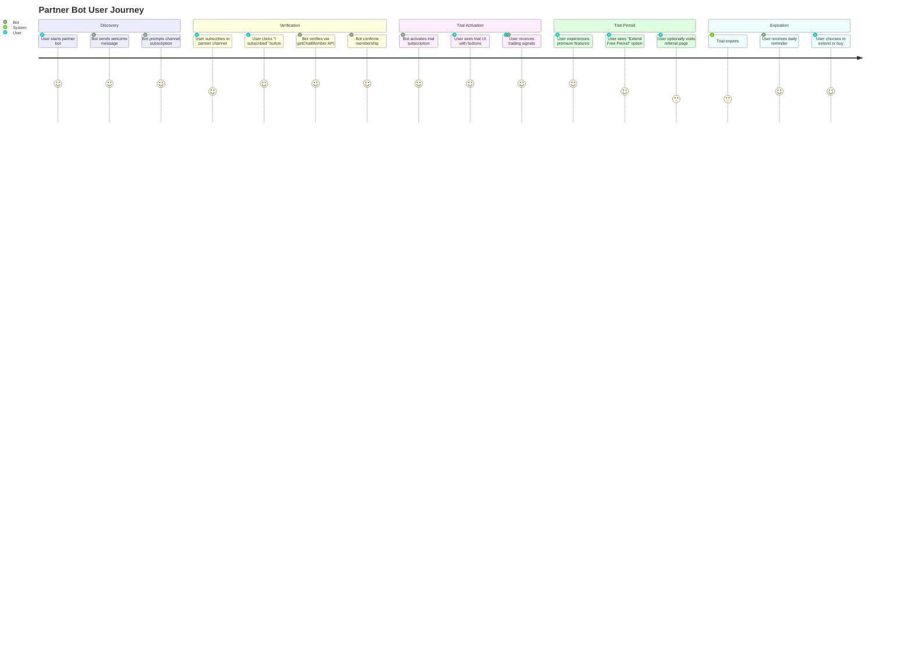
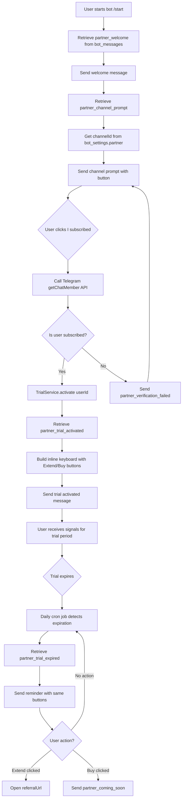

# PRD: Partner Bot Flow with Channel Subscription Verification

## Overview

### One-line Summary
A specialized partner bot flow that gates trial activation behind channel subscription verification, enabling partner-driven user acquisition through Telegram channels.

### Background
The Quantum Deal platform operates a multi-bot architecture serving different broker partners for lead generation. While the main bot offers direct trial activation, partner bots need a different user journey that drives users to subscribe to partner channels before accessing premium features. This creates a value exchange: users must demonstrate commitment by joining partner channels, and partners receive qualified leads who have explicitly shown interest in trading signals.

**Business Goals:**
1. **Partner Lead Generation**: Drive qualified user subscriptions to partner Telegram channels
2. **Commitment Verification**: Ensure users are genuinely interested before consuming trial resources
3. **Partner Value Creation**: Provide measurable user acquisition metrics to partners
4. **Trial Conversion Quality**: Improve trial-to-paid conversion by filtering uncommitted users
5. **Referral Mechanism**: Enable trial extension through partner referral programs

**Target Partners:**
- Broker companies with Telegram marketing channels
- Trading education platforms seeking lead generation
- Affiliate partners promoting trading services

## User Stories

### Primary Users

1. **New Users**: First-time visitors arriving from partner channels or referral links
2. **Partner Organizations**: Broker partners who want qualified leads subscribing to their channels
3. **System**: Automated processes managing subscription verification and trial activation

### User Stories

**As a new user:**
```
As a new user arriving from a partner
I want clear instructions on how to access the trial
So that I understand the steps required to start receiving signals
```

```
As a new user
I want to verify my channel subscription with one button click
So that I can quickly activate my trial without complex verification
```

```
As a trial user
I want to extend my free period by referring friends
So that I can continue evaluating the service before committing financially
```

**As a partner organization:**
```
As a partner organization
I want users to subscribe to my channel before accessing trials
So that I build my Telegram audience with qualified trading prospects
```

```
As a partner organization
I want a referral system integrated into the trial UI
So that satisfied trial users drive additional quality leads to my channel
```

### Use Cases

1. **First-Time User Onboarding**: User starts partner bot via deep link, sees welcome message, receives channel subscription prompt
2. **Channel Subscription Verification**: User subscribes to partner channel, clicks "I subscribed" button, bot verifies via Telegram API, trial activates
3. **False Verification Attempt**: User clicks "I subscribed" without actually subscribing, bot detects non-membership, shows error with retry instructions
4. **Trial Extension via Referral**: Active trial user clicks "Extend Free Period", opens partner referral page, completes referral tasks for extension
5. **Trial Expiration Reminders**: Trial expires, user receives daily reminder with "Extend Free Period" and "Buy Subscription" options until action taken

## User Journey Diagram



## Scope Boundary Diagram

```mermaid
flowchart TB
    subgraph InScope["In Scope: Partner Bot Flow"]
        S1[Welcome Message from bot_messages]
        S2[Channel Subscription Prompt multilang]
        S3[Channel Membership Verification via Telegram API]
        S4[Trial Activation reusing TrialService]
        S5[Trial UI with Extend/Buy buttons]
        S6[Partner Referral URL from bot_settings]
        S7[Daily Expiration Reminders indefinitely]
        S8[Coming Soon message for Buy Subscription]
        S9[SQL INSERT statements for bot_messages]
        S10[Multi-language support 8 languages]
    end

    subgraph OutScope["Out of Scope"]
        O1[Partner Referral Page Implementation]
        O2[Referral Tracking Backend]
        O3[Trial Extension Mechanism Backend]
        O4[Payment Processing Integration]
        O5[Subscription Purchase Flow]
        O6[Partner Analytics Dashboard]
        O7[Channel Subscription Webhook Integration]
    end

    subgraph Related["Related Systems"]
        R1[Trial Subscription System - subscription-trial-prd.md]
        R2[Multi-Bot Architecture - multi-bot-architecture-prd.md]
        R3[Bot Messages Infrastructure - bot_messages table]
        R4[Bot Settings Management - bot_settings table]
    end

    InScope --> Related
    OutScope -.-> InScope
```



## Functional Requirements

### Must Have (MVP)

- [ ] **FR-PB001**: Welcome message retrieval from `bot_messages` table with type `partner_welcome`, multi-language support
- [ ] **FR-PB002**: Channel subscription prompt message from `bot_messages` with type `partner_channel_prompt`, includes inline button "I subscribed"
- [ ] **FR-PB003**: Channel membership verification using Telegram `getChatMember` API call when user clicks "I subscribed"
- [ ] **FR-PB004**: Channel ID retrieval from `bot_settings.settings.partner.channelId` (JSONB field)
- [ ] **FR-PB005**: Trial activation using existing `TrialService.activate()` method after successful verification
- [ ] **FR-PB006**: Trial UI message from `bot_messages` type `partner_trial_activated` with inline keyboard containing two buttons
- [ ] **FR-PB007**: "Extend Free Period" button opens partner referral URL from `bot_settings.settings.partner.referralUrl`
- [ ] **FR-PB008**: "Buy Subscription" button shows "Coming soon" message from `bot_messages` type `partner_coming_soon`
- [ ] **FR-PB009**: Trial expiration reminder messages sent daily indefinitely until user action
- [ ] **FR-PB010**: Expiration reminder retrieves message from `bot_messages` type `partner_trial_expired` with same button layout
- [ ] **FR-PB011**: Verification failure message from `bot_messages` type `partner_verification_failed` when user not subscribed
- [ ] **FR-PB012**: Multi-language message support for 8 languages: ru, en, uk, hi, fr, kk, uz, tg
- [ ] **FR-PB013**: User language determination from `bot_users.lang` with fallback to `bot_settings.settings.defaults.language`
- [ ] **FR-PB014**: SQL INSERT statements generation for all message types in all 8 languages

### Nice to Have

- [ ] **FR-PB015**: Retry mechanism for channel verification with exponential backoff (network reliability)
- [ ] **FR-PB016**: Admin command to manually mark user as verified (support cases)
- [ ] **FR-PB017**: Analytics events for funnel tracking (started bot → verified → activated trial → expired → action taken)
- [ ] **FR-PB018**: Channel leave detection via webhook to deactivate trial
- [ ] **FR-PB019**: A/B testing support for different referral incentives
- [ ] **FR-PB020**: Custom reminder frequency configuration in bot_settings

### Out of Scope

- **Partner Referral Page**: External landing page implementation (partner responsibility)
- **Trial Extension Backend**: Actual extension logic triggered by referral completion
- **Payment Integration**: "Buy Subscription" functionality implementation
- **Partner Dashboard**: Analytics and lead quality metrics UI
- **Fraud Detection**: Multiple account / VPN detection for channel subscription abuse
- **Subscription Purchase Flow**: Full payment processing and subscription management

## Non-Functional Requirements

### Performance

- **Channel Verification Time**: Under 3 seconds from button click to response (including Telegram API call)
- **Message Retrieval**: Single database query to `bot_messages` with bot_id/type/lang index
- **Daily Reminder Dispatch**: Batch processing for expired trials completed within 5 minutes
- **Concurrent Verifications**: Support 100+ simultaneous channel verification requests

### Reliability

- **Telegram API Fallback**: Graceful degradation if `getChatMember` API unavailable (retry + manual verification option)
- **Duplicate Prevention**: Idempotent trial activation (no duplicate subscriptions if user clicks multiple times)
- **Message Fallback Chain**: bot_messages → global messages → English fallback → hardcoded (never fails)
- **Reminder Resilience**: Scheduled job continues after failure, skips processed users

### Security

- **Channel ID Validation**: Verify channel ID format before API calls to prevent injection
- **User Context Isolation**: Each verification only checks requesting user's membership
- **Rate Limiting**: Prevent abuse of verification endpoint (max 10 attempts per user per hour)
- **URL Safety**: Validate referral URLs are HTTPS and from approved domains

### Scalability

- **Horizontal Scaling**: Partner bot flow works across multiple bot instances without shared state
- **Database Indexing**: Composite index on `bot_messages(bot_id, type, lang)` for fast lookups
- **Reminder Job Sharding**: Distribute expired user checks across multiple workers
- **Configuration-based**: All partner-specific settings in database, no code changes per partner

## Data Model

### bot_settings Schema Extension

**Database Schema**: No changes to `bot_settings` table structure (remains generic with JSONB `settings` column)

**TypeScript Type Definitions**:
- **Location**: `libs/partner-bot/src/types/partner-settings.ts` (NOT in `libs/db`)
- **Rationale**: Partner-specific types belong in partner-bot library; db library stays generic
- **Usage**: Partner-bot code casts JSONB data to typed interface for type safety

```typescript
// libs/partner-bot/src/types/partner-settings.ts
// Partner-specific settings structure (for JSONB field typing)
export interface PartnerBotSettings {
  features: {
    trialEnabled: boolean;
    paymentsEnabled: boolean;
    signalsEnabled: boolean;
    broadcastEnabled: boolean;
    partnerFlowEnabled: boolean; // Enable partner bot flow vs standard flow
  };
  defaults: {
    subscriptionDays: number;
    trialDays: number;
    language: string;
  };
  partner?: {
    channelId: string; // Telegram channel ID (format: @channelname or -100123456789)
    channelUsername?: string; // Optional: @channelname for display
    referralUrl: string; // Partner referral page URL (HTTPS)
    verificationRetries: number; // Max verification attempts per hour (default: 10)
  };
}
```

**Usage Example**:
```typescript
const rawSettings = await botSettingsRepo.findByBotId(botId);
const typedSettings = rawSettings.settings as PartnerBotSettings;
const channelId = typedSettings.partner?.channelId;
```

### bot_messages Types

| Type | Description | Variables | Example (en) |
|------|-------------|-----------|--------------|
| `partner_welcome` | Initial greeting message | None | "Welcome to TradePro Partner Bot! Get 7 days of free trading signals." |
| `partner_channel_prompt` | Subscription instruction | `{channelUrl}`, `{channelName}` | "To activate your trial, subscribe to our channel: {channelUrl}\n\nClick the button below after subscribing." |
| `partner_verification_failed` | Not subscribed error | `{channelName}` | "We couldn't verify your subscription to {channelName}. Please subscribe and try again." |
| `partner_trial_activated` | Success + trial UI | `{expiryDate}`, `{daysRemaining}` | "Trial activated! Your access expires on {expiryDate}. Enjoy premium signals for {daysRemaining} days." |
| `partner_trial_expired` | Daily reminder | `{referralUrl}` | "Your trial has expired. Extend your free period or purchase a subscription to continue receiving signals." |
| `partner_coming_soon` | Buy button placeholder | None | "Subscription purchases coming soon! Contact support@tradepro.com for early access." |

### Message Variable Interpolation

**Implementation Approach**: Simple string replacement using JavaScript's `String.prototype.replace()`

**Specification**:
- **Template Format**: Variables enclosed in curly braces: `{variableName}`
- **Replacement Method**: Chain multiple `replace()` calls for each variable
- **No Dedicated Service**: Use inline replacement in message handling code
- **Implementation Example**:
  ```typescript
  let message = await messagesRepo.resolveMessage(botId, 'partner_channel_prompt', lang);
  message = message.replace('{channelUrl}', actualChannelUrl)
                   .replace('{channelName}', actualChannelName);
  ```

**Rationale**: Simple approach sufficient for limited variable count (max 2-3 per message). Avoids complexity of template engine or dedicated service class.

### Data Flow Diagram



## Configuration

### Environment Variables

No new environment variables required. Reuses existing:
- `TRIAL_ENABLED`: Must be true for partner bot flow to work
- `TRIAL_DURATION_DAYS`: Trial period length (default: 7)

### bot_settings Configuration Example

```json
{
  "features": {
    "partnerFlowEnabled": true,
    "trialEnabled": true,
    "paymentsEnabled": false,
    "signalsEnabled": true,
    "broadcastEnabled": false
  },
  "defaults": {
    "subscriptionDays": 30,
    "trialDays": 7,
    "language": "en"
  },
  "partner": {
    "channelId": "@tradepro_signals",
    "channelUsername": "TradePro Signals",
    "referralUrl": "https://partner.example.com/referral?utm_source=telegram",
    "verificationRetries": 10
  }
}
```

### bot_messages Seed SQL

Required SQL INSERT statements for all message types and languages (generated separately, see Appendix).

## Success Criteria

### Quantitative Metrics

1. **Channel Subscription Rate**: Percentage of `/start` users who complete channel subscription verification
   - Target: >60% verification completion rate
2. **Verification Success Rate**: Percentage of "I subscribed" clicks that pass verification on first attempt
   - Target: >80% first-attempt success rate
3. **Trial Activation Rate**: Percentage of verified users who successfully activate trial
   - Target: 100% (no technical failures)
4. **Referral Click-Through Rate**: Percentage of trial users who click "Extend Free Period"
   - Target: >25% CTR during trial period
5. **Reminder Engagement Rate**: Percentage of expired trial users who click buttons in daily reminders
   - Target: >15% engagement rate

### Qualitative Metrics

1. **User Experience**: Clear instructions and immediate feedback at each step (verified via user testing)
2. **Message Clarity**: Natural-sounding multi-language messages (native speaker review)
3. **Partner Satisfaction**: Partners report qualified lead quality meets expectations
4. **Technical Reliability**: Zero missed reminders, no verification false negatives

## Technical Considerations

### Dependencies

- **Existing Trial System**: Reuses `TrialService` from `@libs/bot` for activation logic
- **Multi-Bot Infrastructure**: Leverages `bot_messages` and `bot_settings` tables per ADR-004
- **Telegraf Bot Framework**: Uses `Telegraf.telegram.getChatMember()` API for verification
- **Bot Messages Repository**: Uses `BotMessagesRepository.resolveMessage()` for message retrieval
- **Bot Settings Repository**: Uses `BotSettingsRepository.findByBotId()` for configuration
- **Scheduled Jobs**: Requires cron job infrastructure for daily expiration reminders

### Integration Points

| Component | Integration | Purpose |
|-----------|-------------|---------|
| `TrialService` | `activate(userId)` | Reuse existing trial activation logic |
| `BotMessagesRepository` | `resolveMessage(botId, type, lang)` | Multi-language message retrieval |
| `BotSettingsRepository` | `findByBotId(botId)` | Partner configuration (channelId, referralUrl) |
| `Telegraf.telegram` | `getChatMember(channelId, userId)` | Channel membership verification |
| `UserSubscriptionsRepository` | `findExpiredTrials(botId)` | Query users for daily reminders |
| `BotCommandsService` | `setUserCommands(userId, features, lang)` | Update bot menu after trial activation |

### Constraints

- **Channel Privacy**: Channel must be public or bot must be admin to verify memberships
- **No Database Schema Changes**: Reuses existing tables, extends JSONB fields only
- **Referral Page External**: Partner responsible for referral page implementation and tracking
- **No Trial Extension Logic**: "Extend Free Period" only opens URL, no backend extension yet
- **Coming Soon Placeholder**: "Buy Subscription" non-functional until payment system implemented

### File Structure

```
libs/partner-bot/
├── src/
│   ├── actions/
│   │   ├── channel-verification.action.ts  # Handle "I subscribed" button
│   │   ├── trial-ui.action.ts              # Handle Extend/Buy buttons
│   │   └── actions.i18n.ts                 # i18n utilities for actions
│   ├── commands/
│   │   └── start/
│   │       ├── start.update.ts             # Partner bot /start handler
│   │       └── start.i18n.ts               # Start command i18n
│   ├── services/
│   │   ├── partner-flow.service.ts         # Orchestrates partner bot flow
│   │   ├── channel-verifier.service.ts     # Telegram API verification logic
│   │   └── reminder-scheduler.service.ts   # Daily expiration reminder job
│   ├── middleware/
│   │   └── user-management.middleware.ts   # Existing user context middleware
│   ├── partner-bot.module.ts               # NestJS module definition
│   └── index.ts                            # Public exports
├── test/
│   └── services/
│       ├── partner-flow.service.spec.ts
│       └── channel-verifier.service.spec.ts
└── README.md                                # Library documentation
```

### Risks and Mitigation

| Risk | Impact | Probability | Mitigation |
|------|--------|-------------|------------|
| Telegram API downtime prevents verification | High | Low | Implement retry logic + manual verification command for support |
| Users leave channel after verification | Medium | Medium | Out of scope for MVP; future: webhook detection + trial deactivation |
| Partner referral page broken/offline | Medium | Low | URL validation + fallback message if 404 detected |
| Daily reminder spam complaints | High | Low | Include "Stop reminders" button + respect user mute preferences |
| Channel ID misconfiguration | High | Low | Validate channel ID format + test verification before bot activation |
| Rate limiting abuse (users spam verify button) | Medium | Medium | Implement per-user rate limiting (10 attempts/hour) |

## Implementation Phases

**Note**: This is a high-level overview. Detailed task breakdown will be in the Design Document and Work Plan.

### Phase 1: Core Verification Flow (Essential)
- Partner bot /start command handler
- Channel subscription prompt with button
- `getChatMember` verification logic
- Trial activation integration
- Basic error handling and messages

### Phase 2: Trial UI and Buttons (Essential)
- Trial activated message with inline keyboard
- "Extend Free Period" button → open referral URL
- "Buy Subscription" button → coming soon message
- Button action handlers

### Phase 3: Expiration Reminders (Essential)
- Daily cron job for expired trials
- Reminder message dispatch
- Same button layout as trial UI
- Indefinite reminder continuation

### Phase 4: Polish and Quality (Essential)
- Multi-language message generation SQL
- Rate limiting for verification
- Comprehensive error messages
- Unit and integration tests
- Documentation

## API Reference

### PartnerFlowService

| Method | Description | Returns |
|--------|-------------|---------|
| `startFlow(userId, botId)` | Initiate partner bot flow for new user | `Promise<void>` |
| `sendChannelPrompt(userId, botId, lang)` | Send channel subscription prompt | `Promise<void>` |
| `handleVerificationRequest(userId, botId)` | Process "I subscribed" button click | `Promise<{ verified: boolean, error?: string }>` |
| `sendTrialUI(userId, botId, lang, expiresAt)` | Send trial activated message with buttons | `Promise<void>` |
| `sendExpirationReminder(userId, botId, lang)` | Send daily reminder after expiration | `Promise<void>` |

### ChannelVerifierService

| Method | Description | Returns |
|--------|-------------|---------|
| `verifyMembership(channelId, userId)` | Check if user is subscribed to channel | `Promise<boolean>` |
| `getRateLimitStatus(userId)` | Get user's verification attempt count | `Promise<{ attempts: number, resetAt: Date }>` |
| `incrementAttempts(userId)` | Record verification attempt | `Promise<void>` |

### ReminderSchedulerService

| Method | Description | Returns |
|--------|-------------|---------|
| `scheduleDaily()` | Setup daily cron job | `void` |
| `processExpiredTrials(botId)` | Send reminders to all expired trial users | `Promise<{ sent: number, failed: number }>` |

### Callback Actions

| Action | Description | Trigger |
|--------|-------------|---------|
| `partner_verify_subscription` | Verify channel membership | "I subscribed" button |
| `partner_extend_trial` | Open referral page | "Extend Free Period" button |
| `partner_buy_subscription` | Show coming soon message | "Buy Subscription" button |

## Appendix

### Supported Languages

| Code | Language | Native Name | Pluralization Rules |
|------|----------|-------------|---------------------|
| `en` | English | English | 2 forms (1 day, N days) |
| `ru` | Russian | Русский | 3 forms (1 день, 2-4 дня, 5+ дней) |
| `uk` | Ukrainian | Українська | 3 forms (1 день, 2-4 дні, 5+ днів) |
| `hi` | Hindi | हिन्दी | 1 form |
| `fr` | French | Français | 2 forms (1 jour, N jours) |
| `kk` | Kazakh | Қазақша | 1 form |
| `uz` | Uzbek | O'zbek | 1 form |
| `tg` | Tajik | Тоҷикӣ | 1 form |

### Message Type Checklist

- [ ] `partner_welcome` (8 languages)
- [ ] `partner_channel_prompt` (8 languages)
- [ ] `partner_verification_failed` (8 languages)
- [ ] `partner_trial_activated` (8 languages)
- [ ] `partner_trial_expired` (8 languages)
- [ ] `partner_coming_soon` (8 languages)

**Total**: 6 message types × 8 languages = 48 SQL INSERT statements required

### Sample SQL INSERT (English)

```sql
-- Example for partner_welcome (English)
INSERT INTO bot_messages (bot_id, type, lang, message)
VALUES (
  1, -- Replace with actual bot_id
  'partner_welcome',
  'en',
  'Welcome to TradePro Partner Bot! 🎯\n\nGet 7 days of professional trading signals completely free.\n\nLet''s get started!'
);

-- Example for partner_channel_prompt (English)
INSERT INTO bot_messages (bot_id, type, lang, message)
VALUES (
  1,
  'partner_channel_prompt',
  'en',
  '📢 To activate your free trial, please subscribe to our Telegram channel:\n\n{channelUrl}\n\nAfter subscribing, click the button below to verify.'
);

-- Note: Full SQL generation in implementation phase
```

### Glossary

- **Partner Bot**: A bot instance configured with `partnerFlowEnabled: true`, using channel verification flow
- **Channel Verification**: Process of confirming user membership in partner Telegram channel via API
- **Trial UI**: Message with inline keyboard buttons ("Extend Free Period", "Buy Subscription")
- **Expiration Reminder**: Daily message sent to users with expired trials until action taken
- **Referral URL**: Partner-provided landing page for trial extension incentives
- **getChatMember**: Telegram Bot API method returning user's membership status in a channel
- **bot_messages**: Database table for per-bot customizable messages with multi-language support
- **bot_settings**: Database table for per-bot configuration including partner settings

### References

#### Prerequisite ADRs
- **ADR-004**: Multi-Bot Database Architecture - Defines `bot_messages` and `bot_settings` table structure
- **ADR-005**: Telegram Bot Framework - Establishes Telegraf as bot framework (provides `getChatMember` API)
- **ADR-006**: Dynamic Telegraf Module Loading - Multi-bot instance management architecture

#### Related Documents
- **Related PRD**: `subscription-trial-prd.md` - Core trial subscription system
- **Related PRD**: `multi-bot-architecture-prd.md` - Multi-bot infrastructure

#### External References
- **Telegram API**: [getChatMember documentation](https://core.telegram.org/bots/api#getchatmember)

#### Existing Codebase
- **Existing Code**: `libs/bot/src/actions/trial/trial.action.ts` - Trial activation reference
- **Existing Code**: `libs/bot/src/services/trial.service.ts` - TrialService implementation
- **Database Schema**: `libs/db/migrations/20251126190521_young_falcon.sql` - bot_messages/bot_settings tables

---

## Document History

### Version 1.1.0 - 2025-12-02
**Changes**:
- Removed Telegram API rate limit constraint from Constraints section (not critical for this use case)
- Added "Message Variable Interpolation" section specifying simple `string.replace()` approach instead of complex service
- Clarified BotSettings schema: partner-specific TypeScript types stay in `libs/partner-bot`, `libs/db` remains generic with JSONB
- Added "Prerequisite ADRs" section in References (ADR-004, ADR-005, ADR-006)

**Reviewer**: document-reviewer
**Approval**: Conditions addressed

### Version 1.0.0 - 2025-12-02
**Initial version**: Complete PRD for partner bot flow with channel subscription verification

---

**Document Version**: 1.1.0
**Created**: 2025-12-02
**Last Updated**: 2025-12-02
**Status**: Approved
**Related Documents**: `subscription-trial-prd.md`, `multi-bot-architecture-prd.md`
**Estimated Scope**: Large (12-15 files)
