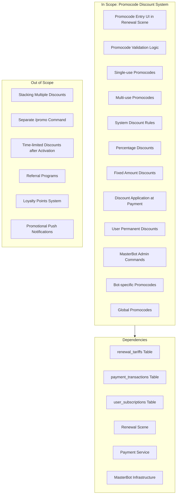

# PRD: Promocode Discount System

## Overview

### One-line Summary
A comprehensive promocode system that reduces subscription renewal costs through user-entered codes and system-generated automatic discounts, supporting percentage and fixed-amount discounts with flexible activation rules.

### Background
Quantum Deal AI uses Telegram Stars payments for subscription renewals. To increase user acquisition, retention, and re-engagement, a promotional discount system is needed. This system will allow:

1. **Marketing campaigns**: Single-use and multi-use promocodes for promotions
2. **Win-back campaigns**: Automatic discounts for users with expired subscriptions
3. **Flexible pricing**: Both percentage and fixed-amount discount options
4. **Multi-bot support**: Global promocodes and bot-specific promocodes

**Relationship to Other Features**:
- **Subscription Renewal** (`subscription-renewal-prd.md`): Discounts apply during renewal payment flow
- **Core Infrastructure** (`subscription-core-prd.md`): Uses user_subscriptions for eligibility checks
- **MasterBot**: Admin interface for promocode management

## User Stories

### Primary Users

1. **Subscribers**: Users renewing subscriptions who can enter promocodes
2. **Expired Users**: Users with lapsed subscriptions eligible for automatic discounts
3. **Admins**: Managers who create and manage promocodes via MasterBot

### User Stories

**As a subscriber:**
```
As a subscriber
I want to enter a promocode during renewal
So that I can get a discount on my subscription
```

```
As a subscriber
I want to see the discounted price before paying
So that I can confirm the discount is applied correctly
```

**As an expired user:**
```
As a user with an expired subscription
I want to automatically receive a discount after N days
So that I'm incentivized to resubscribe at a lower price
```

```
As a user with an automatic discount
I want the discount to apply to all future renewals
So that I maintain the benefit permanently
```

**As an admin:**
```
As an admin
I want to create single-use promocodes
So that I can run limited exclusive promotions
```

```
As an admin
I want to create multi-use promocodes
So that I can run broad marketing campaigns
```

```
As an admin
I want to create system discount rules
So that users automatically receive discounts based on conditions
```

```
As an admin
I want to see only my own promocodes
So that I can manage my campaigns without seeing others' codes
```

### Use Cases

1. **Manual Promocode Entry**: User enters promocode during renewal, receives discount on current and/or future payments
2. **Automatic System Discount**: User's subscription expires, after N days system automatically assigns permanent discount
3. **Admin Creates Promocode**: Admin uses MasterBot to create promocode with specific parameters
4. **Admin Lists Own Promocodes**: Admin views and manages only promocodes they created
5. **Discount Application**: During payment, system calculates final price with best available discount

## User Journey Diagram

```mermaid
flowchart TD
    subgraph ManualPromocode["Manual Promocode Flow"]
        M1[User opens renewal scene] --> M2[User clicks 'Enter promocode']
        M2 --> M3[User enters promocode]
        M3 --> M4{System validates}
        M4 -->|Valid| M5[Show discounted prices]
        M4 -->|Invalid| M6[Show error message]
        M5 --> M7[User selects tariff and pays]
        M6 --> M2
    end

    subgraph AutomaticDiscount["Automatic System Discount Flow"]
        A1[User subscription expires] --> A2[N days pass]
        A2 --> A3[Scheduler triggers rule]
        A3 --> A4[System assigns permanent discount]
        A4 --> A5[User opens renewal scene]
        A5 --> A6[User sees discounted prices automatically]
        A6 --> A7[User renews with permanent discount]
    end

    subgraph AdminFlow["Admin Management Flow"]
        AD1[Admin sends /promocode create] --> AD2[Admin configures parameters]
        AD2 --> AD3[System generates/validates promocode]
        AD3 --> AD4[Promocode created]
        AD4 --> AD5[Admin shares with users]
    end
```



## Scope Boundary Diagram



## Functional Requirements

### Must Have (MVP)

#### Promocode Types
- [ ] **FR-001**: Support single-use promocodes (deactivated globally after first activation)
- [ ] **FR-002**: Support multi-use promocodes (one use per user, unlimited total users)
- [ ] **FR-003**: Support system promocodes (automatically applied based on rules)

#### Discount Mechanics
- [ ] **FR-004**: Support percentage discounts (e.g., 20% off)
- [ ] **FR-005**: Support fixed Stars amount discounts (e.g., -50 Stars)
- [ ] **FR-006**: Apply maximum discount when multiple are available (not additive)
- [ ] **FR-007**: User can have only one active promocode at a time
- [ ] **FR-008**: System discounts are permanent (apply to all future renewals forever, persisting across multiple renewal cycles)

#### User Interface
- [ ] **FR-009**: Display "Enter promocode" button in renewal scene (below tariff selection, before payment)
- [ ] **FR-010**: Validate promocode and show result (success message with discount details or error with reason)
- [ ] **FR-011**: Display discounted price after promocode applied (strikethrough original price, show new price)
- [ ] **FR-012**: Show both original and discounted prices in tariff cards (format: "~~100⭐~~ 80⭐"), discount state persists during scene navigation

#### Admin Interface (MasterBot)
- [ ] **FR-013**: Create promocode with parameters (type, discount, scope)
- [ ] **FR-014**: List promocodes created by current manager only (other managers' promocodes not visible)
- [ ] **FR-015**: Deactivate own promocodes only

#### System Discount Rules (Database Configuration)
- [ ] **FR-016**: Configure trigger conditions via database (N days after subscription expiration, valid range: 0-365 days)
- [ ] **FR-017**: Automatically assign permanent discount to eligible users via scheduler
- [ ] **FR-018**: Support multiple rules with different triggers and discounts

#### Multi-bot Support
- [ ] **FR-019**: Support global promocodes (work across all bots, bot_id = NULL)
- [ ] **FR-020**: Support bot-specific promocodes (work only in specific bot)
- [ ] **FR-021**: Bot-specific promocodes take precedence over global promocodes when both are valid for the same user

### Nice to Have

- [ ] **FR-022**: Promocode usage limits (max total activations)
- [ ] **FR-023**: Promocode validity period (start/end dates)
- [ ] **FR-024**: Bulk promocode generation

### Out of Scope

- **Discount Stacking**: Multiple discounts do not stack; only the maximum discount applies
- **Separate /promo Command**: Promocode entry integrated into renewal flow only
- **Time-limited User Discounts**: Once assigned, discounts are permanent
- **Referral System**: No user-to-user referral mechanism in this feature
- **Loyalty Points**: No points accumulation system

## Non-Functional Requirements

### Performance

| Metric | Target |
|--------|--------|
| Promocode Validation | < 100ms |
| Discount Calculation | < 50ms |
| System Rule Processing | < 500ms per batch |
| Admin Command Response | < 1s |

### Reliability

- **Atomic Operations**: Promocode activation and discount assignment in single transaction
- **Idempotent Activation**: Prevent duplicate activations for same user/promocode
- **State Consistency**: Invalid promocodes cannot be activated
- **Scheduler Reliability**: System rule processing with failure recovery

### Security

- **Code Generation**: Cryptographically random promocode generation
- **Access Control**: Only admins can create/manage promocodes via MasterBot
- **Validation**: Comprehensive checks before activation (active, eligible, unused)
- **Audit Trail**: All activations logged with timestamps

### Scalability

- **Indexed Queries**: Efficient promocode lookup by code and user
- **Batch Processing**: System rules processed in batches
- **Caching**: Active promocodes cached for frequent validation

## Data Model

### New Tables

#### promocodes

| Column | Type | Description |
|--------|------|-------------|
| id | bigint | Primary key |
| code | varchar(50) | Unique promocode string |
| type | varchar(20) | 'single_use', 'multi_use', 'system' |
| discount_type | varchar(20) | 'percentage', 'fixed' |
| discount_value | integer | Discount amount (percent or Stars) |
| subscription_id | bigint | FK to subscriptions (signals only for MVP) |
| bot_id | bigint | FK to bots (NULL = global) |
| is_active | boolean | Active status |
| max_activations | integer | Optional total activation limit |
| valid_from | timestamp | Optional start date |
| valid_until | timestamp | Optional end date |
| created_by | bigint | FK to managers |
| created_at | timestamp | Creation time |
| updated_at | timestamp | Last update |
| deactivated_at | timestamp | Deactivation time |

**Constraints**:
- Unique: code
- Index: (code, is_active)
- Index: (bot_id, is_active)

#### promocode_activations

| Column | Type | Description |
|--------|------|-------------|
| id | bigint | Primary key |
| promocode_id | bigint | FK to promocodes |
| bot_user_id | bigint | FK to bot_users |
| activated_at | timestamp | Activation time |

**Constraints**:
- Unique: (promocode_id, bot_user_id) - prevents duplicate activations; for single_use promocodes, deactivation is handled at application level after first activation
- Index: promocode_id
- Index: bot_user_id

#### user_discounts

| Column | Type | Description |
|--------|------|-------------|
| id | bigint | Primary key |
| bot_user_id | bigint | FK to bot_users |
| subscription_id | bigint | FK to subscriptions |
| discount_type | varchar(20) | 'percentage', 'fixed' |
| discount_value | integer | Discount amount |
| source_type | varchar(20) | 'promocode', 'system_rule' |
| source_id | bigint | FK to promocodes or system_discount_rules |
| created_at | timestamp | Assignment time |

**Constraints**:
- Unique: (bot_user_id, subscription_id) - one discount per user per subscription
- Index: bot_user_id

#### system_discount_rules

| Column | Type | Description |
|--------|------|-------------|
| id | bigint | Primary key |
| name | varchar(100) | Rule name |
| subscription_id | bigint | FK to subscriptions |
| bot_id | bigint | FK to bots (NULL = global) |
| trigger_type | varchar(30) | 'days_after_expiration' |
| trigger_value | integer | Days after expiration |
| discount_type | varchar(20) | 'percentage', 'fixed' |
| discount_value | integer | Discount amount |
| is_active | boolean | Active status |
| created_by | bigint | FK to managers |
| created_at | timestamp | Creation time |
| updated_at | timestamp | Last update |

**Constraints**:
- Index: (subscription_id, is_active)
- Index: (bot_id, is_active)

## Discount Calculation Logic

### Priority and Selection

```
1. Check if user has permanent discount (user_discounts)
2. Check if user has active promocode (recent activation)
3. Select maximum discount value
4. Apply discount to tariff price
5. Floor result (no fractional Stars)
6. Minimum price: 1 Star
```

### Calculation Examples

**Percentage Discount (20%)**:
- Original: 100 Stars
- Discount: 100 * 0.20 = 20 Stars
- Final: 80 Stars

**Fixed Discount (-50 Stars)**:
- Original: 100 Stars
- Discount: 50 Stars
- Final: 50 Stars

**Maximum Selection (not additive)**:
Maximum discount is determined by calculating the actual Stars saved for the current tariff price and selecting the discount that results in the highest savings:
- Tariff price: 100 Stars
- Promocode: 15% off = 15 Stars saved
- System discount: 30 Stars off = 30 Stars saved
- Comparison: 30 > 15, so 30 Stars discount is applied
- Final: 100 - 30 = 70 Stars

## Admin Commands (MasterBot)

### Promocode Management

**Note**: Manager can only see and manage promocodes they created. Other managers' promocodes are not visible.

```
/promocode create
  --code <string>           # Promocode string (auto-generate if omitted: 8 alphanumeric uppercase characters)
  --type <single|multi>     # Promocode type
  --discount <value>        # Discount value
  --discount-type <%|fixed> # Percentage or fixed amount
  --bot <bot_id>            # Bot-specific (omit for global)
  --max <number>            # Max activations (optional)
  --valid-from <date>       # Start date (optional)
  --valid-until <date>      # End date (optional)

/promocode list
  --type <single|multi>       # Filter by type
  --active <true|false>       # Filter by status
  --bot <bot_id>              # Filter by bot
  # Returns only promocodes created by current manager

/promocode deactivate <code>
  # Can only deactivate own promocodes
```

### System Discount Rules

System discount rules (automatic discounts for expired subscriptions) are configured directly in the database via `system_discount_rules` table. No MasterBot commands for rule management.

## Integration Points

### Renewal Scene Modifications

1. Add "Enter promocode" button to renewal scene
2. Handle promocode input and validation
3. Update price display with discount information
4. Pass discount to payment service

### Payment Service Modifications

1. Calculate final price with discount
2. Store discount reference in payment_transaction
3. Handle discount audit trail

### Scheduler Requirements

1. Periodic job to process system discount rules (daily at 00:00 UTC)
2. Query users with expired subscriptions matching rule criteria
3. Assign permanent discounts to eligible users
4. Handle rule changes (no retroactive removal)
5. Idempotent processing (re-running does not duplicate discounts)

## Success Criteria

### Quantitative Metrics

1. **Promocode Redemption Rate**: > 80% of entered valid promocodes result in payment
2. **Win-back Rate**: > 10% of users receiving system discounts resubscribe within 30 days
3. **Discount Application Accuracy**: 100% correct discount calculations
4. **System Performance**: P95 < 100ms for promocode validation

### Qualitative Metrics

1. **User Experience**: Clear feedback on promocode status
2. **Admin Efficiency**: Promocode creation < 30 seconds
3. **Error Clarity**: Actionable error messages for invalid promocodes
4. **Audit Completeness**: Full trail of all discount applications

## Technical Considerations

### Dependencies

- **Renewal Scene**: Entry point for promocode input
- **Payment Service**: Discount application during payment
- **MasterBot**: Admin command infrastructure
- **Scheduler**: Periodic system rule processing
- **Database**: New tables and relations

### Constraints

- **Signals Subscription Only**: MVP scoped to signals subscription type
- **Telegram Stars Currency**: Discount cannot result in zero or negative price
- **Single Active Discount**: User can only have one active promocode/discount per subscription
- **Permanent System Discounts**: Cannot be revoked after assignment

### Risks and Mitigation

| Risk | Impact | Probability | Mitigation |
|------|--------|-------------|------------|
| Discount abuse (sharing codes) | Medium | Medium | Single-use codes, usage limits |
| System rule misconfiguration | High | Low | Validation, preview before activation |
| Price calculation errors | High | Low | Comprehensive test coverage, minimum price floor |
| Performance degradation | Medium | Low | Indexed queries, caching |
| Concurrent activation race | Medium | Low | Database constraints, transaction isolation |

## Appendix

### References

- Subscription Renewal PRD: `docs/prd/subscription-renewal-prd.md`
- Core Infrastructure PRD: `docs/prd/subscription-core-prd.md`
- MasterBot Commands PRD: `docs/prd/bot-commands-prd.md`
- Renewal Schema: `libs/db/src/schema/renewal-tariffs.ts`
- Payment Schema: `libs/db/src/schema/payment-transactions.ts`

### Glossary

- **Promocode**: A promotional code that provides a discount when applied
- **Single-use Promocode**: Deactivated globally after first activation by any user
- **Multi-use Promocode**: Can be used once per user, unlimited total users
- **System Discount**: Automatically applied permanent discount based on rules
- **Permanent Discount**: Discount that applies to all future renewals indefinitely
- **Discount Stacking**: Combining multiple discounts (NOT supported - maximum applies)
- **Win-back Campaign**: Marketing effort to re-engage users with expired subscriptions

---

**Document Version**: 1.0.0
**Created**: 2026-01-14
**Status**: Proposed
**Last Updated**: 2026-01-14
**Related PRDs**: `subscription-renewal-prd.md`, `subscription-core-prd.md`
