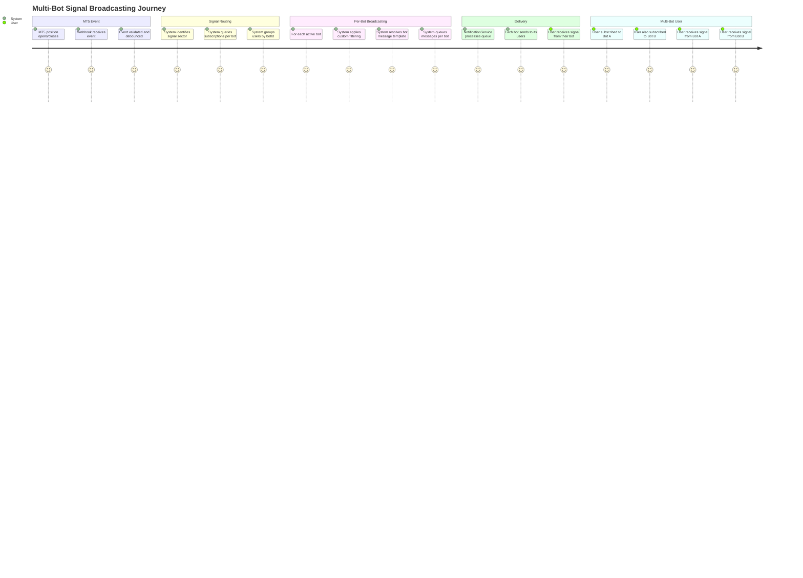
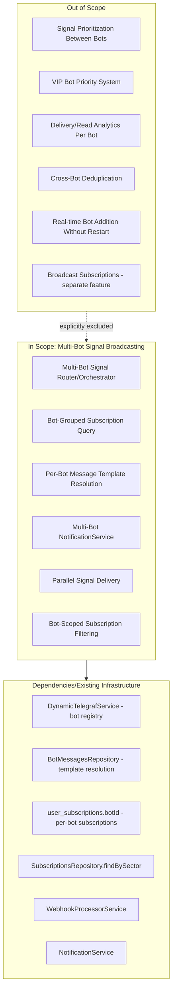
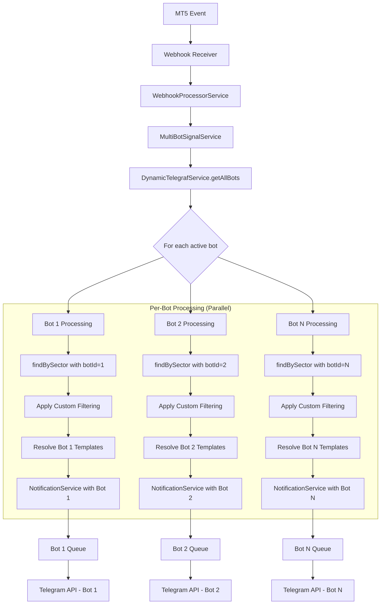
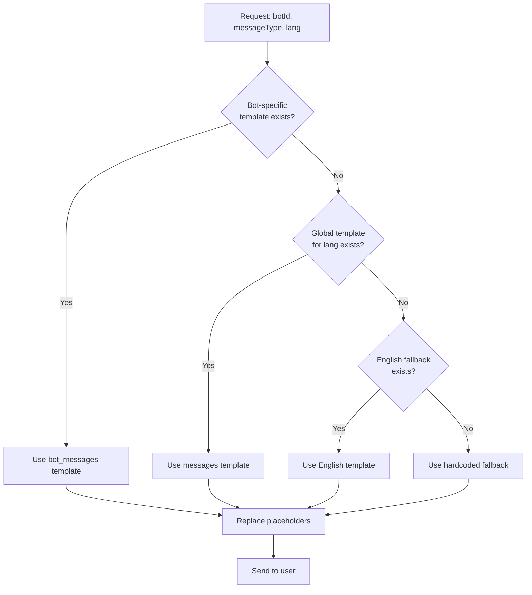

# PRD: Multi-Bot Signal Broadcasting

## Overview

### One-line Summary
Extend the signal broadcasting system to deliver trading signals across ALL active bots simultaneously, with per-bot message templates and bot-scoped subscription filtering.

### Background
The Quantum Deal platform currently operates a signal broadcasting system that works with a single bot instance. With the multi-bot architecture now in place (per `multi-bot-architecture-prd.md`), trading signals from the MT5 source need to be distributed to users across ALL active bots, not just a single bot.

**Current State (Single-Bot)**:
- `NotificationService` is injected with a single bot instance (`@InjectBot('QuantumDealBot')`)
- `WebhookProcessorService` sends signals through this single bot
- `SubscriptionsRepository.findBySector()` finds users but does not group by botId
- No orchestration layer for multi-bot signal routing

**Target State (Multi-Bot)**:
- Signal broadcasts happen across ALL active bots
- Each bot sends to its own subscribed users
- Bots use their own message templates (with fallback to defaults)
- Users subscribed to multiple bots receive signals from EACH bot separately

**Business Context**:
This feature enables the multi-brand business model where a single MT5 signal source is distributed to multiple Telegram bots serving different broker partnerships, as described in the project context.

## User Stories

### Primary Users

1. **Subscribers (End Users)**: Traders who receive signals via one or more branded bots
2. **System**: Automated signal distribution and multi-bot notification orchestration

### User Stories

**As a subscriber:**
```
As a trader subscribed to Bot A
I want to receive trading signals through Bot A
So that I get signals in the bot I registered with
```

```
As a trader subscribed to multiple bots (Bot A and Bot B)
I want to receive signals from BOTH bots
So that I see signals in each bot's conversation independently
```

```
As a trader
I want to receive signals formatted with my bot's branding
So that the experience is consistent with the bot I'm using
```

**As the system:**
```
As the signal broadcasting system
I need to find all active subscriptions across all bots
So that no eligible subscriber misses a trading signal
```

```
As the signal broadcasting system
I need to use bot-specific message templates
So that each bot maintains its distinct brand identity in signal messages
```

```
As the signal broadcasting system
I need to send signals in parallel across all bots
So that signal delivery is timely (within 5 seconds of MT5 event)
```

### Use Cases

1. **Signal Broadcast to Multiple Bots**: MT5 event occurs -> System identifies all active subscriptions grouped by bot -> Each bot sends to its subscribers using its message template
2. **User on Multiple Bots**: User subscribed to Bot A and Bot B -> Signal event occurs -> User receives two separate messages (one from each bot)
3. **Bot-Specific Templating**: Bot A has custom Russian-focused templates -> Signal uses Bot A's template for Bot A users -> Other bots use default templates
4. **New Bot Addition**: New bot added to system -> Application restarts -> New bot automatically participates in signal broadcasting

## User Journey Diagram



## Scope Boundary Diagram



## Functional Requirements

### Must Have (MVP)

- [ ] **FR-001**: Create `MultiBotSignalService` to orchestrate signal distribution across all active bots
  - Receives signal event from `WebhookProcessorService`
  - Iterates through all active dynamic bots from `DynamicTelegrafService`
  - Coordinates per-bot signal delivery

- [ ] **FR-002**: Extend `SubscriptionsRepository.findBySector()` to return `botId` with each subscription
  - Join with `user_subscriptions.botId` to determine which bot each subscription belongs to
  - Support grouping results by botId for efficient per-bot processing
  - Alternative: Create new method `findBySectorGroupedByBot(sector): Map<botId, SubscriptionWithFeatures[]>`

- [ ] **FR-003**: Modify `NotificationService` to accept bot instance as parameter
  - Current: Single injected bot instance (`@InjectBot('QuantumDealBot')`)
  - New: Accept `Telegraf` instance per message or create per-bot notification channels
  - Maintain rate limiting per bot (Telegram limits are per-bot)

- [ ] **FR-004**: Integrate `BotMessagesRepository.resolveMessage()` for signal message templates
  - Use bot-specific templates when available (`bot_messages` table)
  - Fallback to global templates (`messages` table)
  - Fallback to English if user's language not available

- [ ] **FR-005**: Support users receiving signals from MULTIPLE bots (no deduplication)
  - If user is subscribed to Bot A and Bot B, they receive signals from BOTH
  - Each delivery is independent through its respective bot

- [ ] **FR-006**: Maintain parallel processing for signal delivery
  - All bots should process signals in parallel (not sequentially)
  - Use `Promise.all` or similar for concurrent bot processing
  - Overall signal delivery must complete within 5 seconds

- [ ] **FR-007**: Handle bot-specific subscription status
  - Only send to users with active subscriptions for THAT specific bot
  - Respect `user_subscriptions.isActive` per bot
  - Respect `user_subscriptions.expiresAt` per bot

### Nice to Have

- [ ] **FR-010**: Per-bot delivery metrics/logging
  - Log delivery counts per bot for monitoring
  - Track success/failure rates per bot

- [ ] **FR-011**: Configurable bot inclusion/exclusion for signals
  - Feature flag in `bot_settings.settings.features.signalsEnabled`
  - Bots with `signalsEnabled: false` skip signal broadcasting

- [ ] **FR-012**: Retry isolation per bot
  - If Bot A's delivery fails, don't block Bot B's delivery
  - Independent retry queues per bot

### Out of Scope

- **Bot Prioritization/VIP System**: All bots are equal, parallel sending (no VIP priority)
- **Detailed Delivery Analytics**: No per-bot read/delivery analytics dashboard
- **Cross-Bot Deduplication**: Users on multiple bots SHOULD receive from each bot separately
- **Broadcast Subscriptions**: Manager broadcast feature is separate (see `subscription-broadcast-prd.md`)
- **Real-time Bot Addition**: New bots require application restart to participate

## Non-Functional Requirements

### Performance
- **Signal Delivery Latency**: < 5 seconds from MT5 event to Telegram delivery (existing requirement)
- **Per-Bot Processing**: Each bot's delivery should complete within 2 seconds
- **Parallel Processing**: All bots process concurrently, not sequentially
- **Rate Limiting**: 28 messages/second per bot (existing Telegram limit)

### Reliability
- **Fault Isolation**: One bot's failure does not block other bots
- **Fail-Open Filtering**: On filter error, signals are delivered (existing behavior)
- **Template Fallback**: Use global templates if bot-specific templates unavailable
- **Graceful Degradation**: If dynamic bot service unavailable, static bot continues working

### Security
- **Subscription Validation**: Active subscription + non-expired check per bot
- **Bot Token Isolation**: Each bot uses its own token for sending
- **No Cross-Bot Data Leakage**: User data from one bot not visible to another

### Scalability
- **Bot Count**: Support up to 100 dynamic bots per application instance
- **User Count**: No hardcoded limits on users per bot
- **Parallel Scaling**: Bottleneck queues per bot for rate limiting

## Data Flow

### Multi-Bot Signal Delivery Pipeline



### Message Template Resolution



## Success Criteria

### Quantitative Metrics

1. **Multi-Bot Delivery Rate**: >99% of signals delivered to eligible subscribers across ALL bots
2. **Delivery Latency**: <5 seconds from MT5 event to Telegram message (same as existing)
3. **Per-Bot Success Rate**: Each bot achieves >99% delivery rate independently
4. **Template Resolution Hit Rate**: >95% of messages use configured templates (not hardcoded fallback)
5. **Parallel Efficiency**: Total broadcast time <= max(individual bot times) + 500ms overhead

### Qualitative Metrics

1. **Brand Consistency**: Each bot's signals match its configured template style
2. **User Experience**: Users on multiple bots receive signals from each bot correctly
3. **Fault Isolation**: Individual bot failures don't affect other bots' delivery
4. **Developer Experience**: Clear API for adding new bots to signal broadcasting

## Technical Considerations

### Dependencies

- **DynamicTelegrafService**: Bot registry for accessing all active bots
- **BotMessagesRepository**: Per-bot message template resolution
- **SubscriptionsRepository**: Extended to support bot-scoped queries
- **NotificationService**: Modified to support multiple bot instances
- **WebhookProcessorService**: Entry point for signal events
- **Bottleneck**: Rate limiting library (per-bot instances needed)

### Constraints

- **Telegram API Limits**: 30 messages/second per bot
- **Application Restart Required**: New bots require restart to participate
- **Bot Token Requirement**: Each bot needs valid token in database
- **Webhook Path Uniqueness**: Each bot has unique webhook path

### Architecture Changes

| Component | Current State | Target State |
|-----------|---------------|--------------|
| `NotificationService` | Single bot injection | Multi-bot support (per-call or factory) |
| `SubscriptionsRepository.findBySector` | Returns users without botId grouping | Returns users with botId, supports grouping |
| `WebhookProcessorService` | Direct NotificationService call | Routes through MultiBotSignalService |
| Rate Limiting | Single Bottleneck instance | Per-bot Bottleneck instances |

### Risks and Mitigation

| Risk | Impact | Probability | Mitigation |
|------|--------|-------------|------------|
| Rate limit exceeded on one bot | Medium | Medium | Per-bot Bottleneck queues |
| Bot token invalid/expired | Medium | Low | Validation at startup, graceful skip |
| Template resolution slow | Low | Low | Cache frequently used templates |
| Memory increase with many bots | Medium | Medium | Lazy initialization, bot count limits |
| Database query performance | Medium | Low | Index on (sector, botId), query optimization |

## API Reference

### MultiBotSignalService (New)

| Method | Description |
|--------|-------------|
| `broadcastSignal(order, eventType)` | Main entry point for multi-bot signal distribution |
| `getEligibleBots()` | Get all bots participating in signal broadcasting |
| `getDeliveryStats()` | Get per-bot delivery statistics |

### Extended SubscriptionsRepository

| Method | Description |
|--------|-------------|
| `findBySectorGroupedByBot(sector)` | Find subscriptions grouped by botId |
| `findBySector(sector)` (extended) | Include botId in return type |

### Modified NotificationService

| Method | Description |
|--------|-------------|
| `addMessage(userId, message, options, bot?)` | Accept optional bot instance |
| `createBotQueue(botId)` | Create per-bot rate-limited queue |

## Appendix

### References

- Multi-Bot Architecture PRD: `docs/prd/multi-bot-architecture-prd.md`
- Signals Subscription PRD: `docs/prd/subscription-signals-prd.md`
- Project Context: `docs/rules/project-context.md`
- Service: `libs/bot/src/services/webhook.service.ts`
- Service: `libs/bot/src/services/notification.service.ts`
- Service: `libs/telegraf/src/services/dynamic-telegraf.service.ts`
- Repository: `libs/db/src/repositories/subscriptions.repository.ts`
- Repository: `libs/db/src/repositories/bot-messages.repository.ts`

### Glossary

- **Signal**: A trading notification sent when MT5 position opens/closes
- **Multi-Bot Broadcasting**: Sending the same signal through multiple bots to their respective subscribers
- **Bot-Scoped Subscription**: User subscription tied to a specific bot (`user_subscriptions.botId`)
- **Template Resolution**: Process of finding the appropriate message template (bot-specific > global > English > hardcoded)
- **Fault Isolation**: Design principle where one bot's failure doesn't affect other bots
- **Per-Bot Rate Limiting**: Separate Bottleneck instances per bot to respect Telegram's per-bot limits

### Database Schema References

```sql
-- Existing: user_subscriptions with botId
user_subscriptions (
  id BIGINT PRIMARY KEY,
  user_id BIGINT REFERENCES users(telegram_id),
  subscription_id BIGINT REFERENCES subscriptions(id),
  bot_id BIGINT REFERENCES bots(id),  -- Per-bot scoping
  is_active BOOLEAN,
  expires_at TIMESTAMP,
  ...
)

-- Existing: bot_messages for per-bot templates
bot_messages (
  id BIGINT PRIMARY KEY,
  bot_id BIGINT REFERENCES bots(id),
  type VARCHAR,  -- Message type (e.g., 'open', 'close_plus')
  lang VARCHAR,  -- Language code
  message TEXT,  -- Template content
  ...
)
```

---

**Document Version**: 1.0.0
**Created**: 2025-12-01
**Status**: Draft
**Last Updated**: 2025-12-01
**Related PRDs**:
- `multi-bot-architecture-prd.md`
- `subscription-signals-prd.md`
