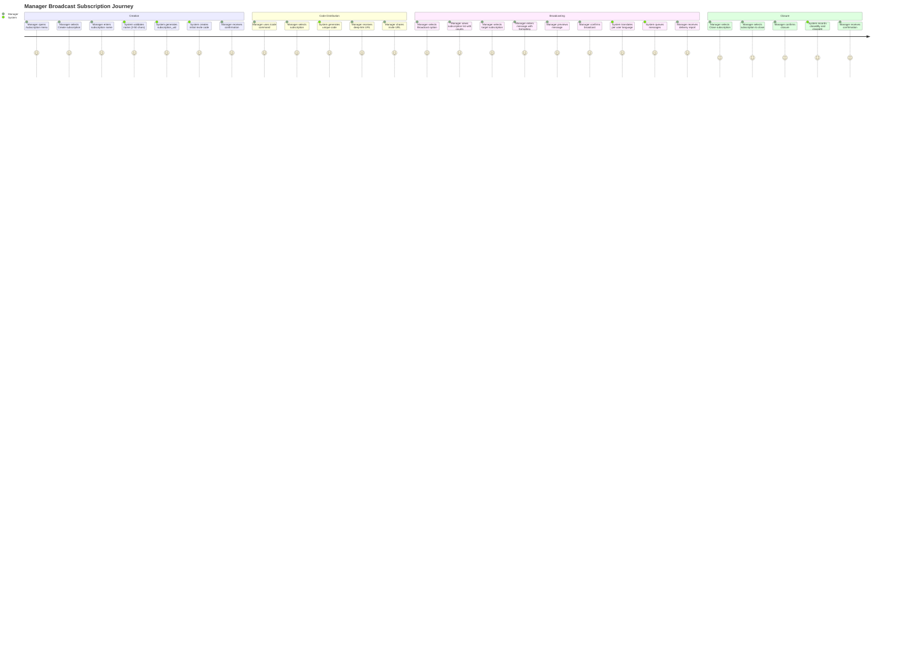
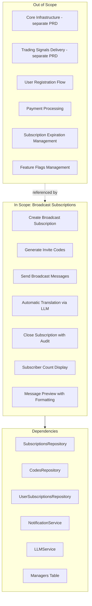
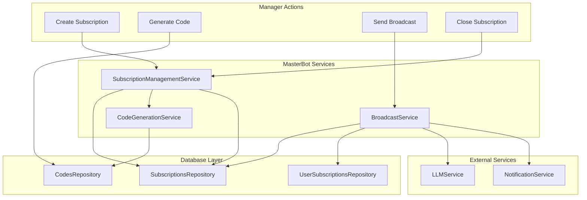

# PRD: Broadcast Subscriptions

## Overview

### One-line Summary
A manager-facing broadcast subscription system that enables creation of custom subscription channels, subscriber messaging with automatic translation, and invite code generation through the MasterBot administrative interface.

### Background
Quantum Deal provides trading signals to users via Telegram. Beyond trading signals, managers need to create and manage separate broadcast channels for announcements, promotions, and community engagement. The Broadcast Subscriptions feature enables managers to:

1. Create custom subscription channels with unique identifiers (`subscription_{uid}` pattern)
2. Send messages to all subscribers of a specific channel with automatic LLM-based translation
3. Generate invite codes for subscription activation
4. Close subscriptions with full audit trail

This feature is distinct from the core signals subscription (`signals` type) and provides managers with tools for direct subscriber communication.

## User Stories

### Primary Users

1. **Managers**: Administrative users who create broadcast subscriptions, send messages, and manage subscriber access
2. **Subscribers**: End users who join broadcast channels and receive messages

### User Stories

**As a manager:**
```
As a manager
I want to create a new broadcast subscription with a custom name
So that I can build a dedicated channel for specific announcements or promotions
```

```
As a manager
I want to send a message to all subscribers of a broadcast subscription
So that I can communicate important updates, promotions, or announcements
```

```
As a manager
I want my broadcast messages to be automatically translated to subscriber languages
So that all subscribers receive messages in their preferred language
```

```
As a manager
I want to generate invite codes for broadcast subscriptions
So that I can distribute access to specific users or marketing channels
```

```
As a manager
I want to close a broadcast subscription
So that I can stop new registrations while preserving existing subscriber access
```

```
As a manager
I want to see how many subscribers each broadcast subscription has
So that I can understand my audience reach before sending messages
```

**As a subscriber:**
```
As a subscriber
I want to receive broadcast messages in my preferred language
So that I can understand all communications from managers
```

### Use Cases

1. **Create Broadcast Subscription**: Manager enters `/subscription` command, selects "Create subscription", enters name (3-50 alphanumeric characters), system generates unique `subscription_{uid}` type and initial invite code
2. **Send Broadcast Message**: Manager selects subscription from list with subscriber counts, enters message (supports Markdown formatting), previews message, confirms sending - system queues messages with translation for each user language
3. **Generate Invite Code**: Manager uses `/code` command, selects subscription, system generates 15-character alphanumeric code and returns Telegram deep-link URL
4. **Close Broadcast Subscription**: Manager selects subscription to close, confirms action, system records closure with manager ID and timestamp

## User Journey Diagram



## Scope Boundary Diagram



## Functional Requirements

### Must Have (MVP) - IMPLEMENTED

- [x] **FR-001**: Create broadcast subscription via MasterBot `/subscription` command
  - Validates name: 3-50 characters, alphanumeric + spaces only
  - Generates unique type: `subscription_{10-char-nanoid}`
  - Creates initial invite code automatically

- [x] **FR-002**: Close broadcast subscription with audit trail
  - Validates subscription is broadcast type (not signals)
  - Records `closedBy` (manager telegramId) and `closedAt` timestamp
  - Shows confirmation dialog before closure

- [x] **FR-003**: Send broadcast message to all subscribers
  - Shows subscription list with active subscriber counts
  - Filters out subscriptions with 0 subscribers
  - Validates message: 1-4096 characters (Telegram limit)
  - Shows message preview before sending
  - Preserves Markdown formatting via entity conversion

- [x] **FR-004**: Automatic message translation
  - Groups users by language preference
  - Translates to all languages in single LLM call (gpt-5-nano)
  - Preserves Markdown, emojis, links during translation
  - Falls back to original message on translation failure

- [x] **FR-005**: Generate invite codes for subscriptions
  - 15-character alphanumeric codes (uppercase + digits)
  - Uses crypto.randomBytes for secure generation
  - Collision detection with 10 retry attempts
  - Returns Telegram deep-link URL: `https://t.me/{bot}?start={code}`

- [x] **FR-006**: Subscription management menu
  - Three main actions: Create, Close, Broadcast
  - Inline keyboard navigation
  - Russian localization for UI messages

### Nice to Have - IMPLEMENTED

- [x] **FR-007**: Message formatting preservation
  - Converts Telegram entities to Markdown for translation
  - Supports bold, italic, code, links, mentions
  - Preserves formatting through LLM translation

- [x] **FR-008**: Manager action logging
  - Logs SUBSCRIPTION_CREATED, SUBSCRIPTION_CLOSED, BROADCAST_SENT
  - Includes metadata: subscriptionId, name, counts

- [x] **FR-009**: Session state management
  - Tracks flow state (awaiting_subscription_name, awaiting_broadcast_message, confirming_broadcast)
  - Persists broadcast message and entities between steps

### Out of Scope

- **Core subscription infrastructure**: Handled by `subscription-core-prd.md`
- **Trading signals**: Handled by webhook processing module
- **User registration and activation flow**: Handled by bot command handlers
- **Subscription expiration and renewal**: Handled by expiration service
- **Payment processing**: Handled by payment-transactions system

## Non-Functional Requirements

### Performance
- **Translation Efficiency**: Single LLM call for all languages (O(1) vs O(n))
- **Message Queuing**: Uses NotificationService with priority-based queue
- **Batch Processing**: Messages added in single batch operation

### Reliability
- **Translation Fallback**: Original message used if LLM fails
- **Audit Trail**: All closure actions recorded with manager ID
- **Session Recovery**: Session initialization on each action (defensive)

### Security
- **Manager Authentication**: All commands require valid manager context
- **Type Validation**: Cannot close signals subscription through broadcast commands
- **Code Generation**: Cryptographically secure random generation

### Scalability
- **Language Support**: 20+ languages supported in translation
- **Subscriber Scaling**: No hardcoded limits on subscriber count
- **Queue-based Delivery**: Messages delivered via rate-limited notification queue

## Manager API Reference

### Commands

| Command | Description |
|---------|-------------|
| `/subscription` | Opens subscription management menu |
| `/code` | Opens code generation for any active subscription |
| `/stats` | View user and subscription statistics |
| `/help` | Show available commands |

### Subscription Menu Actions

| Action | Callback | Description |
|--------|----------|-------------|
| Create Subscription | `subscription_create` | Start subscription creation flow |
| Close Subscription | `subscription_close` | Show list of closable subscriptions |
| Send Broadcast | `subscription_broadcast` | Show list of subscriptions for messaging |

### Callback Patterns

| Pattern | Description |
|---------|-------------|
| `subscription_{id}` | Select subscription for code generation |
| `close_sub_{id}` | Select subscription for closure |
| `close_sub_confirm_{id}` | Confirm subscription closure |
| `broadcast_sub_{id}` | Select subscription for broadcast |
| `broadcast_confirm` | Confirm and send broadcast |
| `broadcast_cancel` | Cancel broadcast |
| `close_sub_cancel` | Cancel closure |

## Data Flow Diagram



## Success Criteria

### Quantitative Metrics

1. **Subscription Creation**: 100% of valid names (3-50 alphanumeric) create subscriptions successfully
2. **Code Uniqueness**: 100% unique codes generated (collision detection with 10 retries)
3. **Broadcast Delivery**: Messages queued for all active subscribers
4. **Translation Coverage**: Messages translated to user's language preference when available

### Qualitative Metrics

1. **Manager Experience**: Intuitive menu-driven flow with inline keyboards
2. **Message Preview**: Managers can verify message formatting before sending
3. **Audit Transparency**: Clear record of who closed subscriptions and when

## Technical Considerations

### Dependencies

- **SubscriptionManagementService**: Orchestrates subscription CRUD
- **CodeGenerationService**: Generates and validates invite codes
- **BroadcastService**: Handles message translation and delivery
- **NotificationService**: Priority-based message queue with rate limiting
- **LLMService**: GPT-5-nano for translation (via generateObject API)

### Constraints

- **Name Validation**: Regex `/^[a-zA-Z0-9\s]+$/` for subscription names
- **Message Limit**: Telegram's 4096 character limit
- **Code Format**: 15 uppercase alphanumeric characters
- **Translation Model**: Uses gpt-5-nano with temperature 0.3

### Risks and Mitigation

| Risk | Impact | Probability | Mitigation |
|------|--------|-------------|------------|
| LLM translation failure | Medium | Low | Fallback to original message |
| Code collision | Low | Very Low | 10 retry attempts with crypto random |
| Session data loss | Medium | Low | Defensive session initialization |
| Accidental signals closure | High | Low | Type validation blocks signals subscription closure |

## Appendix

### References

- Core Infrastructure PRD: `docs/prd/subscription-core-prd.md`
- Schema: `libs/db/src/schema/subscriptions.ts`
- Schema: `libs/db/src/schema/codes.ts`
- Service: `libs/masterbot/src/services/subscription-management.service.ts`
- Service: `libs/masterbot/src/services/broadcast.service.ts`
- Service: `libs/masterbot/src/services/code-generation.service.ts`
- Handler: `libs/masterbot/src/masterbot.update.ts`
- Constants: `libs/masterbot/src/constants.ts`

### Glossary

- **Broadcast Subscription**: A subscription type for announcements/promotions (pattern: `subscription_{uid}`)
- **Signals Subscription**: The primary subscription type for trading signals (type: `signals`)
- **Invite Code**: 15-character alphanumeric code for subscription activation
- **Deep-link URL**: Telegram URL format `https://t.me/{bot}?start={code}` for one-click activation
- **Entity Conversion**: Process of converting Telegram message entities to Markdown for translation
- **Flow State**: Session state tracking the current step in multi-step operations

---

**Document Version**: 1.0.0
**Created**: 2025-11-25
**Status**: Reverse-engineered from implementation
**Last Updated**: 2025-11-25
