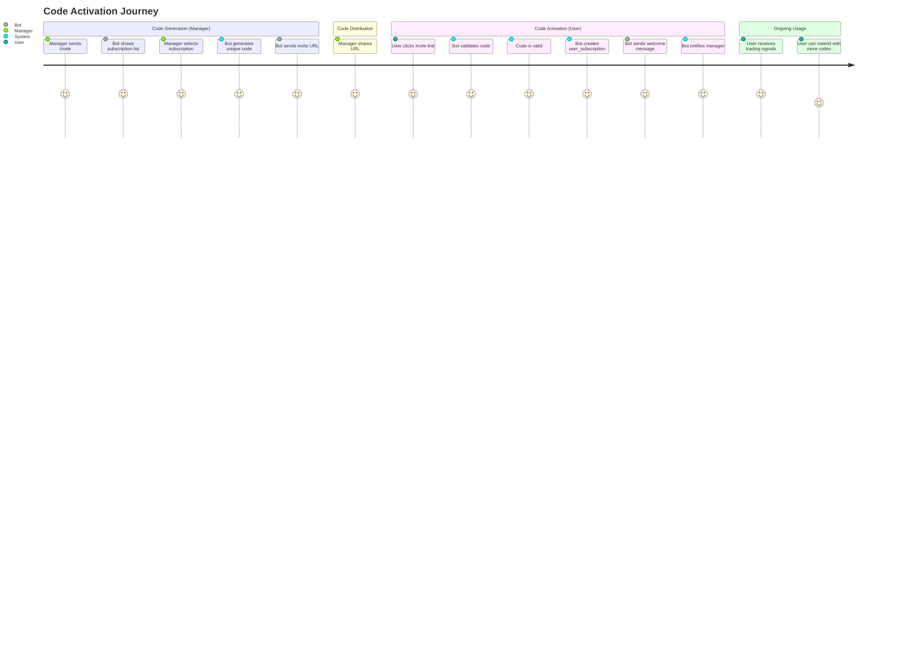
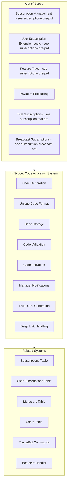
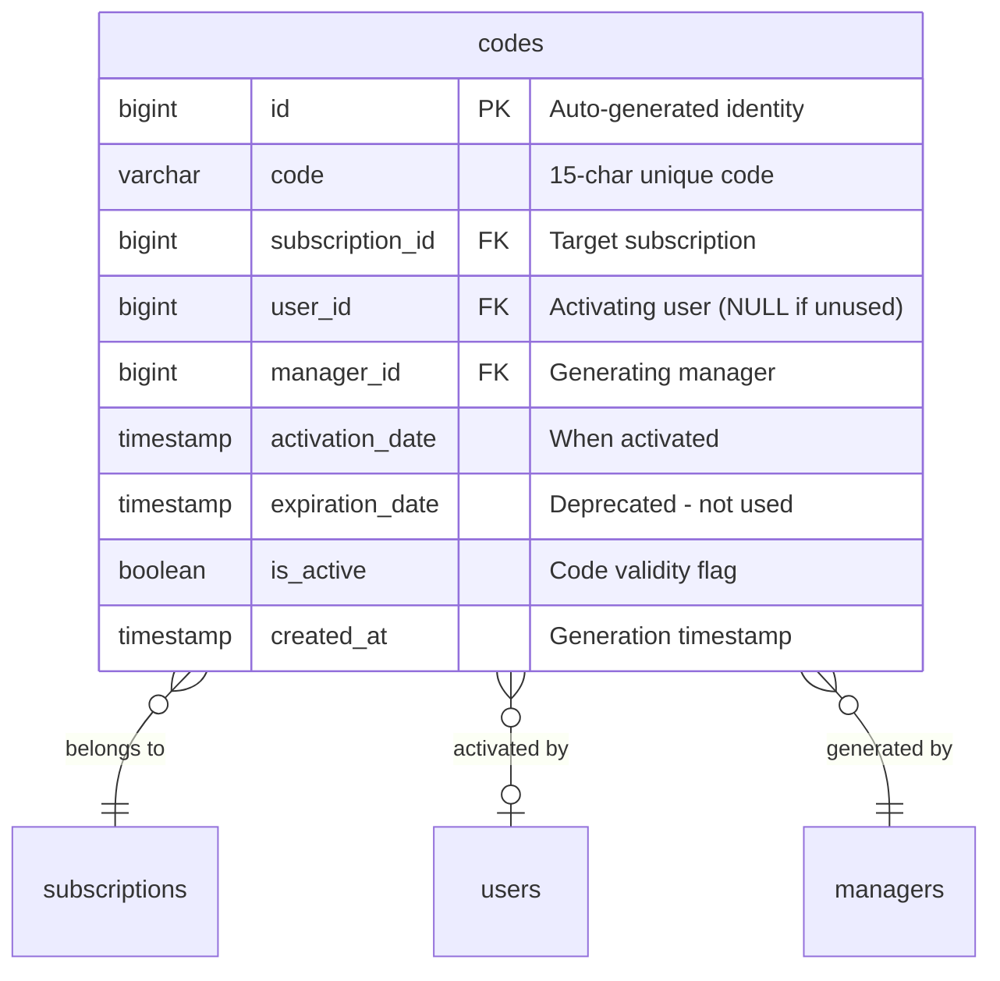

# PRD: Code Activation System

## Overview

### One-line Summary
A subscription code generation and activation system that enables managers to create unique invite codes for subscriptions and allows users to activate subscriptions through Telegram deep links.

### Background
The Quantum Deal platform requires a mechanism for distributing subscription access to users. Rather than using direct payment flows for initial subscription activation, the system uses invite codes that:

1. Are generated by managers through the MasterBot admin interface
2. Are distributed via Telegram deep links (t.me/BotName?start=CODE)
3. Can be activated by users through the /start command
4. Automatically create user_subscription records with appropriate expiration dates
5. Track which manager generated each code for attribution and audit purposes

This code-based distribution model supports:
- Partner-managed subscription distribution (managers generate codes for their audience)
- Marketing campaigns with trackable code usage
- Trial/promotional code distribution
- Audit trail for code generation and activation

## User Stories

### Primary Users

1. **Managers**: Administrative users who generate invite codes for subscriptions via MasterBot
2. **End Users**: Subscribers who activate codes to gain access to trading signals
3. **System**: Automated processes that validate codes and create subscriptions

### User Stories

**As a manager:**
```
As a manager
I want to generate unique subscription codes
So that I can distribute them to potential subscribers
```

```
As a manager
I want to select which subscription a code applies to
So that I can control what access level each code grants
```

```
As a manager
I want to receive notifications when my codes are activated
So that I can track campaign effectiveness and user acquisition
```

```
As a manager
I want generated codes to be formatted as invite URLs
So that I can easily share them with users
```

**As an end user:**
```
As a user
I want to activate a subscription by clicking an invite link
So that I can start receiving trading signals without complex registration
```

```
As a user
I want the activation process to be seamless
So that I can start using the service immediately
```

```
As a user
I want my existing subscription to be extended if I activate another code
So that I don't lose my remaining subscription time
```

### Use Cases

1. **Code Generation**: Manager uses /code command, selects subscription, receives code URL
2. **Code Distribution**: Manager shares invite URL with potential subscriber
3. **Code Activation via Deep Link**: User clicks invite URL, bot activates subscription automatically
4. **Code Activation via /start**: User sends /start CODE, bot validates and activates
5. **Extension Activation**: Existing subscriber activates another code, subscription extends by 30 days
6. **Manager Notification**: System sends activation confirmation to the code's generating manager
7. **Invalid Code Handling**: User receives appropriate feedback for invalid/used codes

## User Journey Diagram



## Scope Boundary Diagram



## Functional Requirements

### Must Have (MVP) - IMPLEMENTED

- [x] **FR-001**: Code format: 15-character uppercase alphanumeric string
- [x] **FR-002**: Code uniqueness: Collision detection with up to 10 retry attempts
- [x] **FR-003**: Code storage: Persistent storage with subscription and manager references
- [x] **FR-004**: Code status tracking: isActive flag for validity control
- [x] **FR-005**: Code-subscription binding: Each code belongs to exactly one subscription
- [x] **FR-006**: Manager attribution: Track which manager generated each code
- [x] **FR-007**: Invite URL generation: Format `https://t.me/{botUsername}?start={code}`
- [x] **FR-008**: Code validation: Check code exists and userId IS NULL (not activated)
- [x] **FR-009**: Code activation: Mark code as used by setting userId and activationDate
- [x] **FR-010**: Subscription creation on activation: Create user_subscription with 30-day expiration
- [x] **FR-011**: Manager notification: Send activation details to generating manager
- [x] **FR-012**: Subscription validation: Verify subscription exists and is active before activation
- [x] **FR-013**: Deep link support: Handle codes via /start command with parameter
- [x] **FR-014**: Subscription extension: Add 30 days to existing subscription if active
- [x] **FR-015**: Silent failure for invalid codes: Return user gracefully without error on invalid/used code

### Nice to Have - IMPLEMENTED

- [x] **FR-016**: Batch code deactivation: Deactivate all codes for a subscription when closed
- [x] **FR-017**: Code statistics: Query unused/used codes per subscription
- [x] **FR-018**: Subscription selection UI: Inline keyboard for subscription selection in /code command

### Out of Scope

- **Code expiration dates**: Codes do not expire (validity controlled by subscription status)
- **Code usage limits**: Codes are single-use by design
- **Bulk code generation**: Generate one code at a time
- **Code editing/modification**: Codes are immutable after creation
- **Custom code formats**: Fixed 15-character format only
- **Payment-linked codes**: No integration with payment transactions

## Non-Functional Requirements

### Performance
- **Code Generation**: Generate unique code within 10 attempts (exponentially unlikely to fail)
- **Validation**: Code lookup indexed by code string for O(1) lookup
- **Activation**: Single transaction for code update and subscription creation

### Reliability
- **Uniqueness Guarantee**: Cryptographic randomness via `crypto.randomBytes()`
- **Collision Prevention**: Check-before-insert pattern with retry logic
- **Atomic Activation**: Code activation and subscription creation in same request flow

### Security
- **Manager Authentication**: Only authenticated managers can generate codes
- **Code Entropy**: 36^15 possible combinations (approximately 2.2 x 10^23)
- **Single-Use Enforcement**: userId IS NULL check prevents double activation
- **Audit Trail**: Manager ID stored for each generated code

### Scalability
- **Code Volume**: No practical limit on total codes (bigint ID)
- **Generation Rate**: One code per manager request (rate limited by Telegram)
- **Lookup Performance**: Indexed code column for fast validation

## Data Model

### Codes Table Schema



### Code States

| State | userId | isActive | Description |
|-------|--------|----------|-------------|
| Available | NULL | true | Ready for activation |
| Activated | NOT NULL | true | Used by a user |
| Deactivated | * | false | Manually disabled or subscription closed |

### Code Format Specification

- **Characters**: `A-Z` (uppercase letters) + `0-9` (digits) = 36 possible characters
- **Length**: 15 characters
- **Pattern**: Random distribution using `crypto.randomBytes()`
- **Example**: `A7K2M9X4P1N6C3B8`

## Code Generation Algorithm

```
1. Generate 15 random bytes using crypto.randomBytes()
2. Map each byte to character set (chars[byte % 36])
3. Query database for existing code with same string
4. If exists: retry (max 10 attempts)
5. If unique: insert into codes table
6. Return code with invite URL
```

## API Reference

### CodeGenerationService

| Method | Parameters | Returns | Description |
|--------|------------|---------|-------------|
| `generateUniqueCode` | subscriptionId, managerId | CodeDto | Generate and store unique code |
| `validateCode` | code | boolean | Check if code exists and is active |
| `getInviteUrl` | code, botUsername | string | Generate Telegram invite URL |

### CodesRepository

| Method | Parameters | Returns | Description |
|--------|------------|---------|-------------|
| `findByCode` | code | Code or null | Find available (unused) code |
| `findBySubscription` | subscriptionId | Code[] | Get all codes for subscription |
| `findActiveCodesBySubscription` | subscriptionId | Code[] | Get active codes |
| `findUnusedActiveCodesBySubscription` | subscriptionId | Code[] | Get available codes |
| `findActivatedCodesBySubscription` | subscriptionId | Code[] | Get used codes |
| `activateCode` | codeId, userId, dates | Code | Mark code as used |
| `deactivateCode` | id | Code | Disable single code |
| `deactivateCodesBySubscription` | subscriptionId | void | Disable all subscription codes |

### MasterBot Commands

| Command | Action | Description |
|---------|--------|-------------|
| `/code` | Menu | Show subscription selection keyboard |
| `subscription_{id}` callback | Generate | Create code for selected subscription |

### Bot StartUpdate

| Handler | Trigger | Description |
|---------|---------|-------------|
| `onStart` | /start [code] | Handle activation if code provided |
| `activateCode` | Internal | Process code activation flow |
| `sendManagerNotification` | Internal | Notify generating manager |

## Success Criteria

### Quantitative Metrics

1. **Code Generation Success Rate**: 100% unique code generation (< 10 collision retries)
2. **Activation Success Rate**: 100% successful activation for valid, unused codes
3. **Manager Notification Rate**: 100% notification delivery for activations with valid managerId

### Qualitative Metrics

1. **User Experience**: Seamless one-click activation via invite URL
2. **Manager Experience**: Simple code generation through conversational UI
3. **Audit Capability**: Full traceability from code to manager to user

## Technical Considerations

### Dependencies
- **Database**: PostgreSQL with Drizzle ORM
- **Crypto**: Node.js `crypto.randomBytes()` for secure randomness
- **Telegram**: Deep link format `?start=` parameter
- **Framework**: NestJS with dependency injection
- **Related PRDs**: subscription-core-prd.md (for user_subscriptions table)

### Constraints
- **Code Length**: Fixed at 15 characters (cannot be changed without migration)
- **Character Set**: Uppercase only for readability (no lowercase, no special chars)
- **Single Use**: Codes cannot be reused after activation
- **Subscription Binding**: Code cannot be transferred to different subscription

### Risks and Mitigation

| Risk | Impact | Probability | Mitigation |
|------|--------|-------------|------------|
| Code collision | Low | Very Low | 36^15 combinations, 10 retry attempts |
| Manager notification failure | Low | Low | Try-catch with logging, non-blocking |
| Invalid subscription at activation | Medium | Low | Validation check before activation |
| Telegram API rate limits | Low | Low | One code per request, user-initiated |

## Appendix

### References
- Database schema: `libs/db/src/schema/codes.ts`
- Repository: `libs/db/src/repositories/codes.repository.ts`
- Generation service: `libs/masterbot/src/services/code-generation.service.ts`
- Management service: `libs/masterbot/src/services/subscription-management.service.ts`
- MasterBot handler: `libs/masterbot/src/masterbot.update.ts`
- Bot activation: `libs/bot/src/commands/start/start.update.ts`
- Related PRD: `docs/prd/subscription-core-prd.md`

### Glossary
- **Code**: A 15-character unique string used to activate a subscription
- **Invite URL**: Telegram deep link format for code activation
- **Deep Link**: URL pattern `https://t.me/BotName?start=CODE`
- **Manager**: Administrative user with access to MasterBot
- **Activation**: Process of marking code as used and creating user_subscription
- **Code Collision**: Two generated codes being identical (extremely rare)

### Manager Notification Format

```
{checkmark} *Subscription Activated*

{person} User: @username
{document} Subscription: Subscription Name
{tag} Type: signals subscription / broadcast group
{calendar} Valid until [expiration date]
{ticket} Code: `CODE123...`
```

---

**Document Version**: 1.0.0
**Created**: 2025-11-25
**Status**: Reverse-engineered from implementation
**Last Updated**: 2025-11-25
