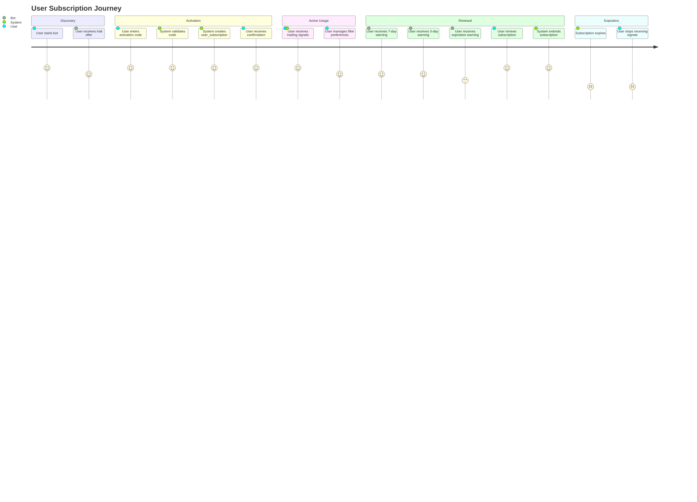
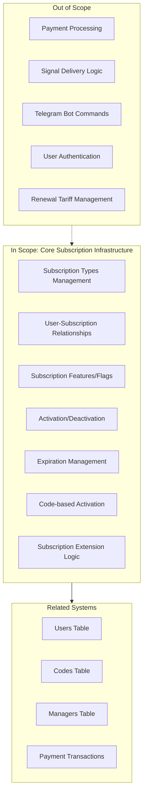
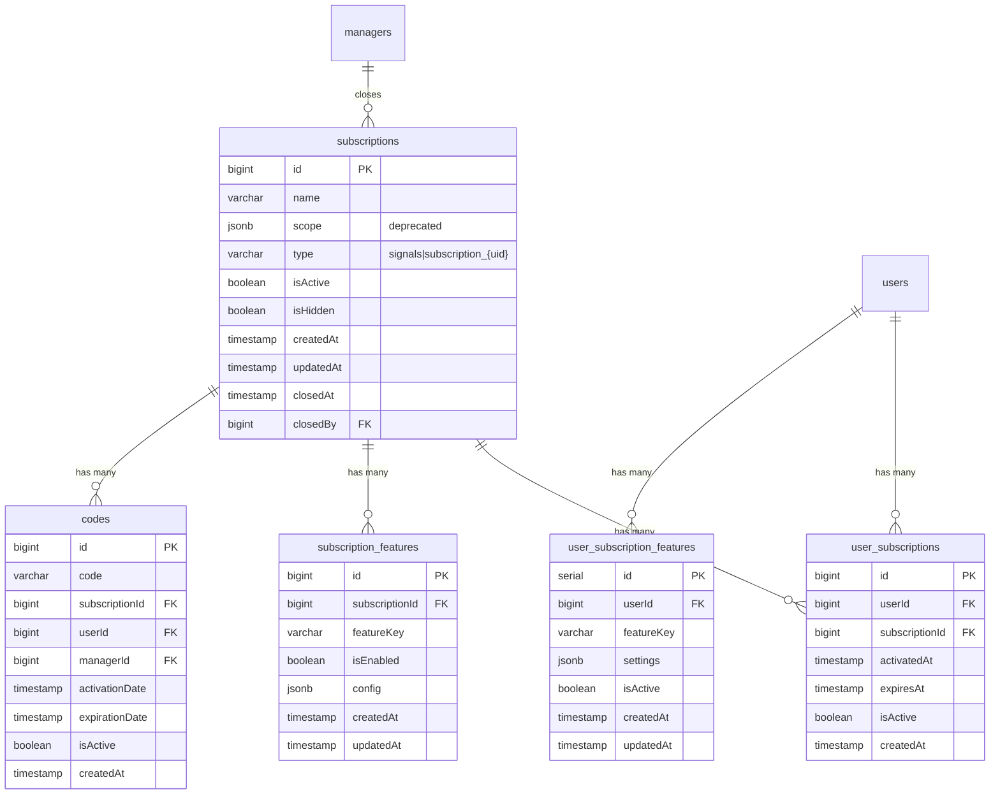

# PRD: Core Subscription Infrastructure

## Overview

### One-line Summary
A flexible subscription management system that enables users to access trading signals through multiple subscription types (signals and broadcast) with support for feature flags, expiration management, and multi-subscription per user capability.

### Background
The Quantum Deal platform provides professional trading signals to beginner traders via Telegram. To monetize this service and manage access control, a comprehensive subscription infrastructure was required. The system evolved from a simple one-to-one user-subscription model (`users.subscribeId`) to a many-to-many architecture (`user_subscriptions` table) that supports:

1. Multiple simultaneous subscriptions per user
2. Different subscription types (signals for trading signals, broadcast for announcements)
3. Feature-based access control via subscription features
4. Time-based subscription management with expiration tracking
5. Code-based subscription activation and renewal

## User Stories

### Primary Users

1. **End Users (Subscribers)**: Beginner traders who subscribe to receive trading signals
2. **Managers**: Administrative users who create and manage broadcast subscriptions
3. **System**: Automated processes that manage expiration notifications and subscription lifecycle

### User Stories

**As an end user:**
```
As a subscriber
I want to activate a subscription using a code
So that I can receive trading signals for a defined period
```

```
As a subscriber
I want to have multiple active subscriptions simultaneously
So that I can receive both trading signals and broadcast notifications
```

```
As a subscriber
I want to extend my existing subscription when I activate a new code
So that my subscription duration adds to my remaining time instead of resetting
```

```
As a subscriber
I want to receive expiration notifications before my subscription ends
So that I can renew in time and not miss any signals
```

**As a manager:**
```
As a manager
I want to create broadcast subscriptions with unique identifiers
So that I can manage different announcement channels
```

```
As a manager
I want to close broadcast subscriptions
So that I can stop announcements and invalidate associated codes
```

### Use Cases

1. **New User Subscription Activation**: User enters an activation code, system creates a new user_subscription record with expiration date
2. **Subscription Extension**: Existing subscriber activates additional code, system extends current expiration by adding days
3. **Subscription Reactivation**: Expired subscriber activates code, system reactivates from current date
4. **Expiration Notification**: System sends notifications at 7, 3, and 0 days before expiration
5. **Broadcast Subscription Management**: Manager creates/closes broadcast subscriptions via masterbot commands
6. **Feature-based Access**: System checks subscription features before delivering filtered signals

## User Journey Diagram



## Scope Boundary Diagram



## Functional Requirements

### Must Have (MVP) - IMPLEMENTED

- [x] **FR-001**: Subscription types support (`signals`, `subscription_{uid}` for broadcasts)
- [x] **FR-002**: Many-to-many user-subscription relationships via `user_subscriptions` table
- [x] **FR-003**: Subscription status flags (`isActive`, `isHidden`, `closedAt`, `closedBy`)
- [x] **FR-004**: User subscription status tracking (`isActive`, `activatedAt`, `expiresAt`)
- [x] **FR-005**: Code-based subscription activation with expiration date calculation
- [x] **FR-006**: Subscription extension logic (add days to current expiration when active)
- [x] **FR-007**: Subscription reactivation from current date when expired
- [x] **FR-008**: Find users with expiring subscriptions for notifications
- [x] **FR-009**: Subscription feature flags (`tier_based_filtering`, `custom_user_filtering`)
- [x] **FR-010**: User-specific feature settings storage (`user_subscription_features`)
- [x] **FR-011**: Trial subscription identification via `is_trial` feature flag
- [x] **FR-012**: Broadcast subscription creation with unique type generation
- [x] **FR-013**: Broadcast subscription closure with audit trail (closedBy, closedAt)
- [x] **FR-014**: Sector-based subscription filtering via feature config
- [x] **FR-015**: Deactivation of other subscriptions of same type when renewing

### Nice to Have - IMPLEMENTED

- [x] **FR-016**: Soft delete for user feature settings (preserve on downgrade)
- [x] **FR-017**: Subscription name validation (3-50 characters, alphanumeric)
- [x] **FR-018**: Hidden subscription support (`isHidden` flag)
- [x] **FR-019**: Partial JSONB settings updates via `jsonb_set`

### Out of Scope

- **Payment integration**: Handled by separate payment-transactions system
- **Signal delivery**: Core webhook processing module
- **Bot commands**: Handled by bot command handlers
- **User management**: Handled by users repository
- **Renewal tariff pricing**: Handled by renewal-tariffs system

## Non-Functional Requirements

### Performance
- **Response Time**: Database queries optimized with proper indexes (unique constraints on subscription_id + feature_key)
- **Query Efficiency**: JOIN-based queries for fetching users with subscriptions in single operations
- **Batch Operations**: Support for finding multiple expiring subscriptions across date ranges

### Reliability
- **Data Integrity**: Foreign key constraints with cascade deletion
- **Audit Trail**: Closure tracking with `closedAt` and `closedBy` fields
- **Soft Deletion**: `isActive` flags preserve data for historical analysis

### Security
- **Access Control**: Subscription features control access to premium functionality
- **Manager Verification**: `closedBy` references managers table for audit
- **Type Validation**: Broadcast subscriptions cannot be confused with signals subscription

### Scalability
- **Multi-subscription Model**: Users can have unlimited subscriptions
- **Feature Extensibility**: JSONB config allows adding new feature parameters without schema changes
- **Type Pattern**: `subscription_{uid}` pattern allows unlimited broadcast subscription types

## Data Model

### Core Tables



### Subscription Types

| Type | Pattern | Description |
|------|---------|-------------|
| Signals | `signals` | Trading signals subscription (primary) |
| Broadcast | `subscription_{10-char-uid}` | Announcement/broadcast channels |

### Feature Flags

| Feature Key | Description | Config Example | In Enum |
|-------------|-------------|----------------|---------|
| `tier_based_filtering` | System-controlled sector filtering | `{ sectors: ['crypto', 'forex'] }` | ✅ Yes |
| `custom_user_filtering` | User-configurable symbol filtering | `{}` (settings in user_subscription_features) | ✅ Yes |
| `is_trial` | Marks subscription as trial tier | `{}` | ❌ No (string literal) |

> **Note**: `is_trial` is intentionally not part of the `FeatureFlag` enum. It is stored as a plain string in `featureKey` column and used to identify trial subscriptions. This design allows adding marker flags without modifying the enum.

## Success Criteria

### Quantitative Metrics

1. **Subscription Activation Rate**: 100% of valid codes successfully create user_subscriptions
2. **Extension Accuracy**: Subscription extensions correctly add days to existing expiration
3. **Query Performance**: User subscription lookups complete within database query time limits
4. **Data Integrity**: Zero orphaned user_subscription records (enforced by CASCADE)

### Qualitative Metrics

1. **Developer Experience**: Clean repository API with consistent method naming
2. **Maintainability**: Type-safe schema definitions with TypeScript inference
3. **Extensibility**: Feature flags system allows adding new features without schema changes

## Technical Considerations

### Dependencies
- **Database**: PostgreSQL with Drizzle ORM
- **Schema**: Uses bigint for IDs with auto-identity generation
- **Framework**: NestJS with dependency injection (uses `DRIZZLE_CLIENT` provider token)
- **Pattern**: BaseRepository pattern for common CRUD operations

### Constraints
- **Backward Compatibility**: Legacy `users.subscribeId` field still exists but `user_subscriptions` is authoritative
- **Deprecation**: `subscriptions.scope` field deprecated in favor of `subscription_features.config.sectors`
- **Unique Constraints**: One record per (subscriptionId, featureKey) and (userId, featureKey)
- **Timezone Handling**: `subscription_features` uses `timestamp with timezone`, while `user_subscriptions` uses timestamp without timezone
- **Foreign Key**: `closedBy` references `managers.telegramId` (not `managers.id`)

### Database Indexes
- `uq_subscription_feature`: UNIQUE on `subscription_features(subscription_id, feature_key)`
- `uq_user_subscription_feature`: UNIQUE on `user_subscription_features(user_id, feature_key)`

### Risks and Mitigation

| Risk | Impact | Probability | Mitigation |
|------|--------|-------------|------------|
| Data migration from legacy model | Medium | Low | New user_subscriptions table operates alongside legacy fields |
| Feature flag complexity | Low | Low | Only 2 filtering features implemented, clear documentation |
| Subscription type confusion | Medium | Low | Helper functions `isBroadcastSubscription()` enforce type checking |
| Orphaned subscriptions | High | Low | CASCADE deletion rules on foreign keys |

## API Reference (Repository Methods)

### SubscriptionsRepository

| Method | Description |
|--------|-------------|
| `findById(id)` | Find subscription by ID |
| `findByName(name)` | Find subscription by name |
| `findSignalsSubscription()` | Find the primary signals subscription |
| `findTrialSubscription()` | Find subscription with is_trial feature |
| `findActiveSubscriptions()` | Find all active, non-hidden subscriptions |
| `findActiveBroadcastSubscriptions()` | Find active subscriptions (⚠️ Note: currently returns ALL active subscriptions, not just broadcast type - potential bug) |
| `findAllBroadcastSubscriptions()` | Find all broadcast subscriptions |
| `findBySector(sector)` | Find subscriptions/users by sector filter |
| `updateStatus(id, isActive)` | Update subscription active status |
| `closeSubscription(id, managerId)` | Close subscription with audit |
| `reopenSubscription(id)` | Reopen closed subscription |
| `isTrialSubscription(subscriptionId)` | Check if subscription is trial |
| `isBroadcastSubscriptionById(id)` | Check if subscription is broadcast type |

### UserSubscriptionsRepository

| Method | Description |
|--------|-------------|
| `findByUserId(userId)` | Find all subscriptions for user |
| `findActiveByUserId(userId)` | Find active, non-expired subscriptions for user |
| `findByUserAndSubscription(userId, subscriptionId)` | Find specific user-subscription |
| `findActiveByUserIdWithSubscription(userId)` | Find active with full subscription details |
| `findBySubscriptionId(subscriptionId)` | Find all users for subscription |
| `findActiveBySubscriptionId(subscriptionId)` | Find active users for subscription |
| `isUserSubscribed(userId, subscriptionId)` | Check if user has subscription (any status) |
| `hasActiveSubscription(userId, subscriptionId)` | Check if user has active subscription |
| `activate(userId, subscriptionId, expiresAt)` | Activate or extend subscription |
| `deactivate(userId, subscriptionId)` | Deactivate user subscription |
| `findExpiring(daysFromNow, subscriptionType)` | Find subscriptions expiring in N days |
| `findActiveUsersWithActiveSubscription(type)` | Find active users with active subscriptions |
| `findActiveUsersWithActiveWithSubscriptionId(subscriptionId)` | Find active users with active subscription by ID |
| `findSubscribersWithUserDetails(subscriptionId)` | Find subscribers with user info (alias: `findActiveBySubscriptionId` delegates to this) |
| `deactivateOtherSubscriptionsOfSameType(...)` | Deactivate other same-type subscriptions |
| `extendSubscription(userSubscriptionId, days)` | Extend subscription by days |

### SubscriptionFeaturesRepository

| Method | Description |
|--------|-------------|
| `getFeaturesBySubscriptionId(subscriptionId)` | Get enabled features for subscription |
| `getFeaturesByUserId(userId)` | Get all enabled features for user |
| `hasFeature(userId, featureKey)` | Check if user has specific feature |
| `getFeature(subscriptionId, featureKey)` | Get feature with config |
| `upsertFeature(...)` | Create or update feature |
| `enableFeature(...)` | Enable feature for subscription |
| `disableFeature(...)` | Disable feature (soft delete) |
| `removeFeature(...)` | Remove feature (hard delete) |
| `setFeatures(subscriptionId, features)` | Replace all features |
| `getSubscriptionsWithFeature(featureKey)` | Get subscriptions with specific feature |

### UserSubscriptionFeaturesRepository

| Method | Description |
|--------|-------------|
| `getUserFeatureSettings(userId, featureKey)` | Get user's feature settings |
| `getAllUserSettings(userId)` | Get all user's feature settings |
| `upsertUserSettings(...)` | Create or update user settings |
| `deleteUserSettings(...)` | Delete user settings (hard) |
| `deactivateUserSettings(...)` | Deactivate settings (soft) |
| `reactivateUserSettings(...)` | Reactivate deactivated settings |
| `hasConfiguredFeature(...)` | Check if user has configured feature |
| `getUsersWithFeatureSettings(featureKey)` | Get users with specific feature settings |
| `updateSettingsField(...)` | Partial JSONB update |

## Appendix

### References
- Database schema: `libs/db/src/schema/subscriptions.ts`
- Database schema: `libs/db/src/schema/user-subscriptions.ts`
- Database schema: `libs/db/src/schema/subscription-features.ts`
- Database schema: `libs/db/src/schema/user-subscription-features.ts`
- Repository: `libs/db/src/repositories/subscriptions.repository.ts`
- Repository: `libs/db/src/repositories/user-subscriptions.repository.ts`
- Repository: `libs/db/src/repositories/subscription-features.repository.ts`
- Repository: `libs/db/src/repositories/user-subscription-features.repository.ts`
- Service: `libs/masterbot/src/services/subscription-management.service.ts`
- Service: `libs/bot/src/services/subscription-expiration.service.ts`

### Glossary
- **Subscription**: A product tier that users can subscribe to (signals or broadcast)
- **User Subscription**: The relationship between a user and a subscription with activation/expiration dates
- **Feature Flag**: A configurable capability attached to a subscription (filtering, trial status)
- **Signals**: The primary subscription type for trading signals
- **Broadcast**: A subscription type for announcement channels (`subscription_{uid}` pattern)
- **Sector**: A trading market category (crypto, forex, stocks) used for signal filtering
- **Code**: An activation code that links users to subscriptions

---

**Document Version**: 1.0.1
**Created**: 2025-11-25
**Status**: Reverse-engineered from implementation
**Last Updated**: 2025-11-25
**Review Status**: Reviewed and updated based on document-reviewer feedback
