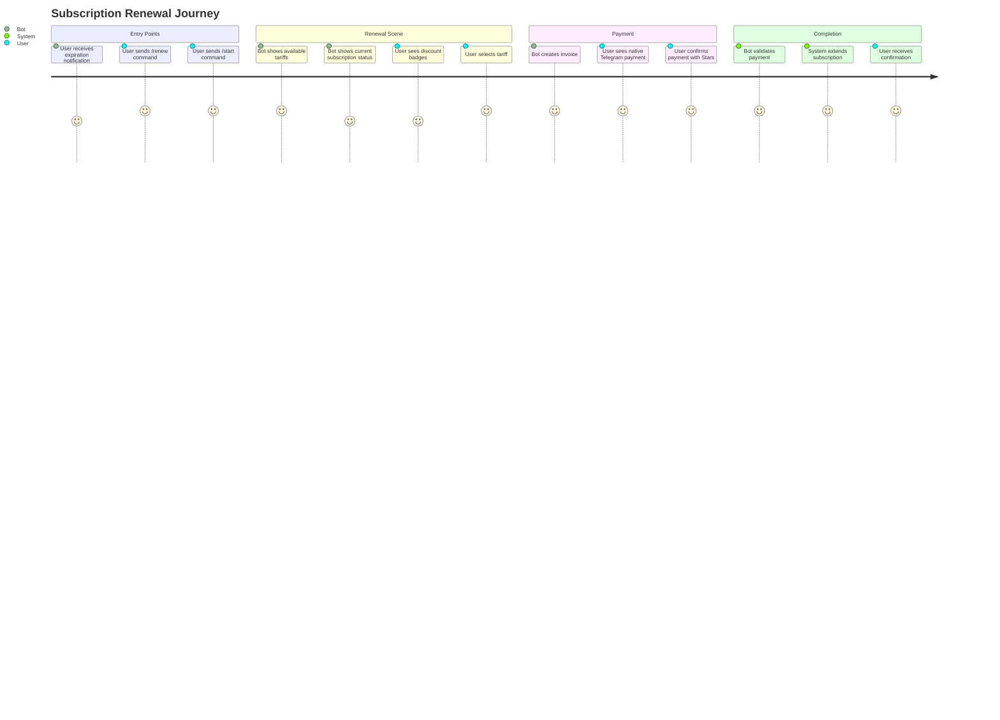
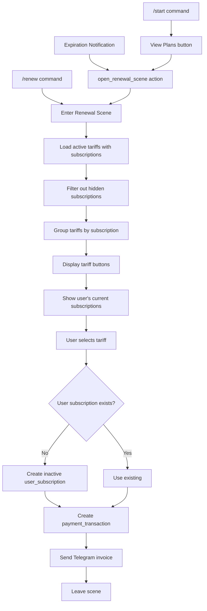
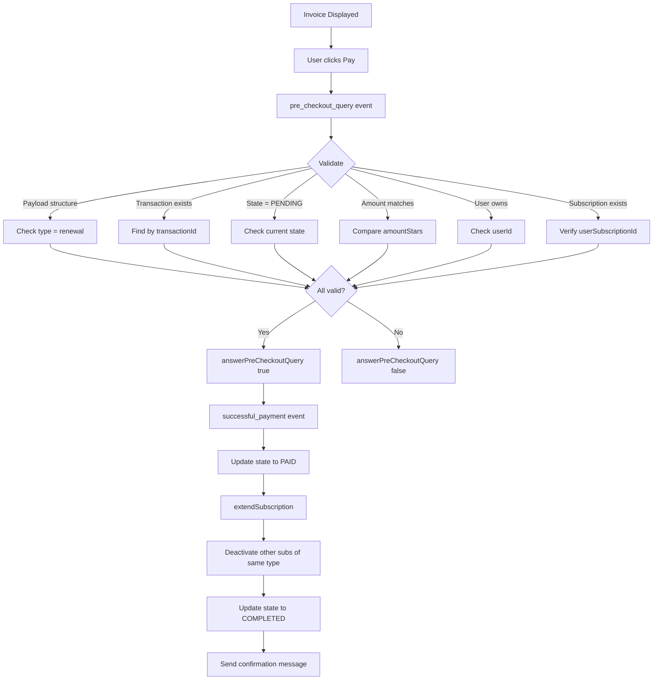
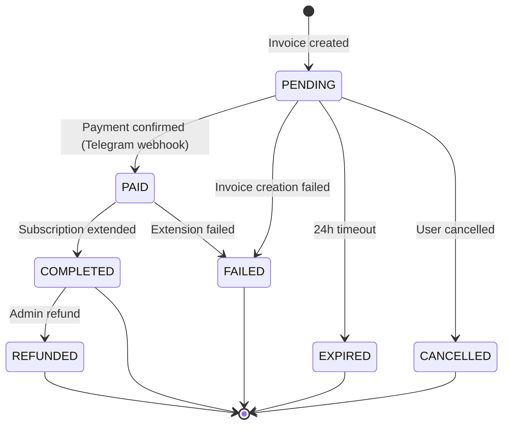

# PRD: Subscription Renewal Feature

## Overview

### One-line Summary
A seamless subscription renewal system that enables users to extend their trading signal subscriptions via Telegram Stars payment with flexible tariff options and one-click renewal from expiration notifications.

### Background
Quantum Deal AI provides trading signals to subscribers. The Subscription Renewal feature ensures continuous service by allowing users to extend their subscriptions before or after expiration. This feature:

1. Provides multiple entry points for renewal (command, notification, /start)
2. Offers flexible tariff options with various periods and pricing
3. Integrates with Telegram Stars for native in-app payments
4. Supports multi-language UI (8 languages)
5. Handles payment lifecycle with full audit trail

**Relationship to Other Features**:
- **Signals Subscription** (`subscription-signals-prd.md`): Renewal extends signals subscriptions
- **Core Infrastructure** (`subscription-core-prd.md`): Uses user_subscriptions table for extension logic
- **Expiration Notifications**: Entry point for one-click renewal (documented in Signals PRD)

## User Stories

### Primary Users

1. **Active Subscribers**: Users with valid subscriptions wanting to extend
2. **Expired Subscribers**: Users whose subscriptions expired but want to reactivate
3. **New Users**: Users without subscriptions viewing available tariffs

### User Stories

**As an active subscriber:**
```
As an active subscriber
I want to renew my subscription before it expires
So that I don't miss any trading signals
```

```
As an active subscriber
I want to see the new expiration date before paying
So that I can confirm the renewal period
```

**As an expired subscriber:**
```
As an expired subscriber
I want to reactivate my subscription quickly
So that I can resume receiving signals
```

**As a new user:**
```
As a new user
I want to view available subscription plans
So that I can choose the best option for me
```

**As any user:**
```
As any user
I want to pay with Telegram Stars
So that I can complete payment without leaving Telegram
```

```
As any user
I want to see discount information clearly
So that I can choose cost-effective options
```

### Use Cases

1. **Direct Renewal**: User sends /renew command, selects tariff, pays
2. **One-Click Renewal**: User clicks renewal button from expiration notification
3. **Start Flow Renewal**: User views subscription status via /start and clicks renew
4. **New Purchase**: User without subscription selects tariff to purchase

## User Journey Diagram



## Scope Boundary Diagram

```mermaid
flowchart TB
    subgraph InScope["In Scope: Subscription Renewal Feature"]
        R1[/renew Command Handler]
        R2[Renewal Scene UI]
        R3[Tariff Selection Interface]
        R4[Telegram Stars Payment Integration]
        R5[Pre-checkout Validation]
        R6[Payment Processing & State Machine]
        R7[Subscription Extension Logic]
        R8[Multi-language Support - 8 langs]
        R9[One-Click Renewal Action]
        R10[Payment Transaction Audit Trail]
    end

    subgraph OutScope["Out of Scope (Separate PRDs)"]
        O1[Expiration Notifications]
        O2[Core Subscription Infrastructure]
        O3[Signal Delivery]
        O4[User Registration]
        O5[Activation Codes]
    end

    subgraph Dependencies["Dependencies"]
        D1[renewal_tariffs Table]
        D2[payment_transactions Table]
        D3[user_subscriptions Table]
        D4[Telegram Bot API - Stars]
        D5[Core Subscription PRD]
    end

    InScope --> Dependencies
    OutScope -.->|triggers| R9
```

## Functional Requirements

### Must Have (MVP) - IMPLEMENTED

- [x] **FR-001**: /renew command opens renewal scene
- [x] **FR-002**: Scene displays all available tariffs grouped by subscription
- [x] **FR-003**: Tariff buttons show period, price, and discount
- [x] **FR-004**: User's current subscriptions displayed with expiry dates
- [x] **FR-005**: Tariff selection creates Telegram Stars invoice
- [x] **FR-006**: Pre-checkout validation verifies transaction integrity
- [x] **FR-007**: Successful payment extends subscription
- [x] **FR-008**: Active subscription extended from current expiry
- [x] **FR-009**: Expired subscription reactivated from current date
- [x] **FR-010**: Payment state machine with full lifecycle tracking
- [x] **FR-011**: Transaction audit trail with timestamps
- [x] **FR-012**: Multi-language UI support (8 languages)
- [x] **FR-013**: Cancel option to exit renewal flow
- [x] **FR-014**: Error handling with user-friendly messages

### Nice to Have - IMPLEMENTED

- [x] **FR-015**: One-click renewal from expiration notifications (`renew_now` action)
- [x] **FR-016**: Discount percentage display with visual badge
- [x] **FR-017**: Strikethrough original price display
- [x] **FR-018**: Open renewal scene from /start command button
- [x] **FR-019**: Hidden subscriptions (trial) excluded from tariff display
- [x] **FR-020**: Automatic user_subscription creation for new purchases

### Out of Scope

- **Expiration Notifications**: Trigger mechanism documented in `subscription-signals-prd.md`
- **Core Infrastructure**: Subscription tables documented in `subscription-core-prd.md`
- **Refund Processing**: Admin-initiated, not user-facing
- **Tariff Management**: Admin/seeding operation

## Non-Functional Requirements

### Performance

| Metric | Target | Current |
|--------|--------|---------|
| Tariff Load Time | < 200ms | < 200ms |
| Invoice Creation | < 500ms | < 500ms |
| Payment Webhook Processing | < 1s | < 1s |
| Subscription Extension | < 300ms | < 300ms |

### Reliability

- **Invoice Creation Retry**: Automatic failure handling with transaction state update
- **Payment Webhook Idempotency**: State machine prevents duplicate processing
- **Database Transactions**: Atomic subscription extension
- **Fallback Messages**: Static error messages when dynamic generation fails

### Security

- **User Verification**: Transaction ownership validation before processing
- **Payment Validation**: Amount and tariff verification in pre-checkout
- **State Validation**: Only PENDING transactions can be paid
- **Subscription Ownership**: User can only renew their own subscriptions

### Scalability

- **Tariff Caching**: Repository queries ordered by sort_order
- **Transaction Indexing**: Optimized queries by user_id, state, invoice_id
- **Concurrent Payments**: Independent transaction records per payment attempt

## Data Flow

### Renewal Flow (Scene-based)



### Payment Processing Flow



### Payment State Machine



## Database Schema

### renewal_tariffs

| Column | Type | Description |
|--------|------|-------------|
| id | bigint | Primary key |
| subscription_id | bigint | FK to subscriptions |
| period_days | integer | Renewal period (1-3650) |
| price_stars | integer | Price in Telegram Stars |
| display_name | varchar(100) | UI display text |
| discount_percent | integer | Optional discount badge |
| is_active | boolean | Soft delete flag |
| sort_order | integer | Display ordering |
| created_at | timestamp | Creation time |
| updated_at | timestamp | Last update time |

**Constraints**:
- Unique: (subscription_id, period_days)

### payment_transactions

| Column | Type | Description |
|--------|------|-------------|
| id | bigint | Primary key |
| user_id | bigint | FK to users.telegram_id |
| user_subscription_id | bigint | FK to user_subscriptions |
| tariff_id | bigint | FK to renewal_tariffs (nullable) |
| telegram_invoice_id | varchar | Telegram invoice identifier |
| telegram_payment_charge_id | varchar | Telegram charge identifier |
| amount_stars | integer | Payment amount (denormalized) |
| period_days | integer | Extension period (denormalized) |
| state | varchar(20) | Current payment state |
| created_at | timestamp | Invoice creation time |
| paid_at | timestamp | Payment confirmation time |
| completed_at | timestamp | Subscription extension time |
| failed_at | timestamp | Failure time |
| refunded_at | timestamp | Refund time |
| expired_at | timestamp | Expiry time |
| cancelled_at | timestamp | Cancellation time |
| failure_reason | varchar(500) | Failure details |
| cancellation_reason | varchar(500) | Cancellation details |
| refund_reason | varchar(500) | Refund details |
| refund_amount | integer | Partial refund amount |
| metadata | jsonb | Additional data |
| updated_at | timestamp | Last update time |

**Indexes**:
- idx_payment_transactions_user_id
- idx_payment_transactions_state
- idx_payment_transactions_telegram_invoice_id
- idx_payment_transactions_created_at
- idx_payment_transactions_user_subscription

## Tariff Configuration

| Period | Example Price | Discount | Display Order |
|--------|---------------|----------|---------------|
| 30 days | 100 Stars | 0% | 0 |
| 90 days | 250 Stars | 17% | 1 |
| 180 days | 450 Stars | 25% | 2 |
| 365 days | 800 Stars | 33% | 3 |

*Note: Actual tariffs are configured in database and may vary per subscription.*

## Internationalization

### Supported Languages

| Code | Language | Status |
|------|----------|--------|
| ru | Russian | Full support |
| en | English | Full support |
| uk | Ukrainian | Full support |
| hi | Hindi | Full support |
| fr | French | Full support |
| kk | Kazakh | Full support |
| uz | Uzbek | Full support |
| tg | Tajik | Full support |

### Key Message Types

- Scene header and instructions
- Current subscription status display
- Tariff button text with pricing
- Processing indicators
- Success/error confirmation messages
- Cancel confirmation

## Invoice Payload Structure

```typescript
interface RenewalInvoicePayload {
  type: 'renewal';           // Payload type identifier
  version: number;           // Schema version (currently 1)
  transactionId: number;     // payment_transactions.id
  userSubscriptionId: number; // user_subscriptions.id
  tariffId: number;          // renewal_tariffs.id
  timestamp: number;         // Creation timestamp (ms)
}
```

## Success Criteria

### Quantitative Metrics

1. **Payment Success Rate**: > 95% of initiated payments complete successfully
2. **Invoice Creation Success**: > 99% of tariff selections result in valid invoices
3. **Extension Accuracy**: 100% of completed payments extend correct subscription
4. **State Consistency**: 0 orphaned transactions (stuck in intermediate states)
5. **Response Time**: P95 < 500ms for all user-facing operations

### Qualitative Metrics

1. **User Experience**: One-click renewal from notification works seamlessly
2. **Clarity**: Discount and pricing information clearly displayed
3. **Error Recovery**: Failed payments show actionable error messages
4. **Multi-language**: All messages display correctly in user's language

## Technical Considerations

### Dependencies

- **Telegram Bot API**: sendInvoice, answerPreCheckoutQuery, successful_payment webhook
- **@quantumdeal/telegraf**: Scene management, callback handling
- **Drizzle ORM**: Database operations
- **Core Infrastructure**: user_subscriptions.extendSubscription()

### Constraints

- **Telegram Stars Currency**: Code 'XTR', empty provider_token
- **Invoice Expiry**: Telegram invoices expire after 24 hours
- **Payment Irreversibility**: Stars payments cannot be automatically refunded
- **Bot Scope**: Each bot handles its own payments independently

### Environment Variables

| Variable | Description |
|----------|-------------|
| (No renewal-specific env vars) | Configuration via database |

### Risks and Mitigation

| Risk | Impact | Probability | Mitigation |
|------|--------|-------------|------------|
| Telegram payment outage | High | Low | Show retry message, preserve transaction state |
| Duplicate payment processing | High | Low | State machine with idempotent transitions |
| User subscription deleted mid-payment | Medium | Very Low | Pre-checkout validation checks existence |
| Tariff deactivated during selection | Low | Low | Tariff validation in invoice creation |
| Database transaction failure | High | Very Low | Atomic operations, state rollback on error |

## API Reference

### RenewalScene

| Method | Description |
|--------|-------------|
| `onSceneEnter()` | Scene entry - loads and displays tariffs |
| `showAllTariffs()` | Render grouped tariffs with user status |
| `onSelectTariff()` | Handle tariff selection, create invoice |
| `onCancel()` | Handle cancellation, leave scene |

### RenewUpdate

| Method | Description |
|--------|-------------|
| `onRenew()` | Handle /renew command |
| `onPreCheckoutQuery()` | Validate payment before processing |
| `onSuccessfulPayment()` | Process completed payment |

### RenewalAction

| Method | Description |
|--------|-------------|
| `handleRenewNow()` | One-click renewal from notification |
| `handleOpenRenewalScene()` | Open scene from button callback |

### PaymentService

| Method | Description |
|--------|-------------|
| `createRenewalInvoice()` | Create transaction and send invoice |
| `validatePreCheckout()` | Validate payment parameters |
| `handleSuccessfulPayment()` | Process payment and extend subscription |

### Repositories

| Repository | Key Methods |
|------------|-------------|
| RenewalTariffsRepository | `findAllWithSubscriptions()`, `findBySubscription()`, `findById()` |
| PaymentTransactionsRepository | `create()`, `updateState()`, `findById()`, `getStatistics()` |
| UserSubscriptionsRepository | `extendSubscription()`, `findByUserAndSubscription()` |

## Appendix

### References

- Core Infrastructure PRD: `docs/prd/subscription-core-prd.md`
- Signals PRD: `docs/prd/subscription-signals-prd.md`
- Renewal Flow Documentation: `docs/renewal/renewal-flow.md`
- Scene: `libs/bot/src/commands/renew/renewal.scene.ts`
- Update Handler: `libs/bot/src/commands/renew/renew.update.ts`
- Action: `libs/bot/src/actions/renewal/renewal.action.ts`
- Payment Service: `libs/bot/src/services/payment.service.ts`
- I18n: `libs/bot/src/commands/renew/renewal.i18n.ts`
- Tariff Schema: `libs/db/src/schema/renewal-tariffs.ts`
- Transaction Schema: `libs/db/src/schema/payment-transactions.ts`

### Glossary

- **Telegram Stars (XTR)**: Telegram's native payment currency for in-app purchases
- **Invoice**: Telegram payment request sent to user's chat
- **Pre-checkout Query**: Validation hook before payment is finalized
- **Tariff**: A pricing option with period and price
- **User Subscription**: The relationship between a user and a subscription plan
- **Extension**: Adding days to an existing subscription's expiry date
- **Reactivation**: Activating an expired subscription from current date

---

**Document Version**: 1.0.0
**Created**: 2025-11-25
**Status**: Reverse-engineered from implementation
**Last Updated**: 2025-11-25
**Related PRDs**: `subscription-core-prd.md`, `subscription-signals-prd.md`
