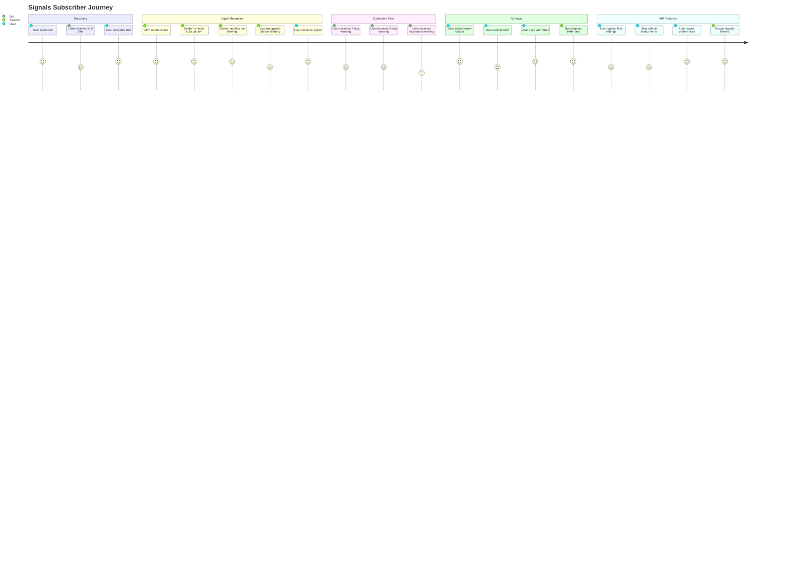
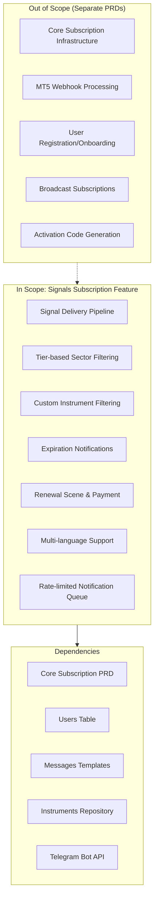
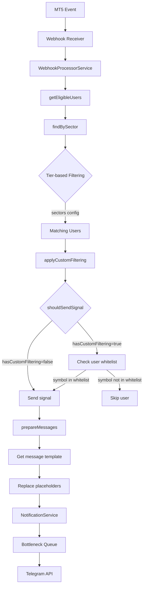
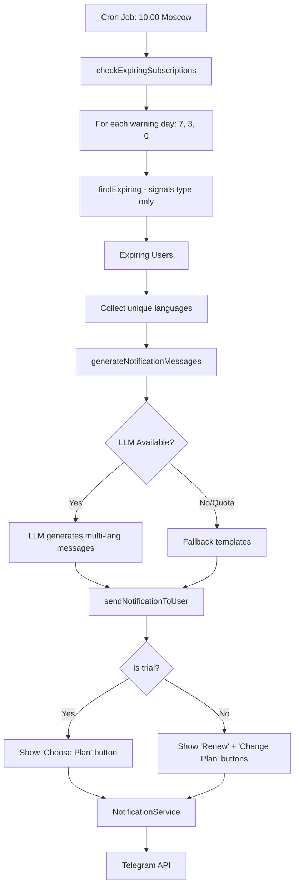

# PRD: Signals Subscription Feature

## Overview

### One-line Summary
A trading signals subscription feature that delivers real-time MT5 trading signals to subscribers via Telegram with multi-tier access control, sector-based filtering, and personalized instrument filtering.

### Background
Quantum Deal AI provides professional trading signals to beginner traders who want to safely enter the trading market. The Signals Subscription is the core product offering that:

1. Delivers real-time trading signals when MT5 positions open/close
2. Supports multiple subscription tiers (Trial, Standard, VIP)
3. Provides sector-based signal filtering (crypto, forex, stocks)
4. Enables personalized instrument filtering for VIP subscribers
5. Manages subscription lifecycle with expiration notifications and renewal
6. Supports multi-language notifications (EN, RU, UK, HI, FR, KK, UZ, TG)

**Relationship to Core Infrastructure**: This feature builds upon the Core Subscription Infrastructure (documented in `subscription-core-prd.md`) which provides the foundational subscription management capabilities.

## User Stories

### Primary Users

1. **Subscribers (End Users)**: Beginner traders receiving trading signals
2. **VIP Subscribers**: Premium users with custom filtering capabilities
3. **System**: Automated signal delivery and notification processes

### User Stories

**As a subscriber:**
```
As a signals subscriber
I want to receive real-time trading signals via Telegram
So that I can follow AI-generated trading recommendations
```

```
As a signals subscriber
I want to receive notifications before my subscription expires
So that I can renew in time and not miss any trading signals
```

```
As a signals subscriber
I want to renew my subscription using Telegram Stars
So that I can continue receiving signals without interruption
```

**As a VIP subscriber:**
```
As a VIP subscriber
I want to filter signals by specific instruments
So that I only receive notifications for symbols I trade
```

```
As a VIP subscriber
I want to save my instrument preferences
So that I don't need to configure them each time
```

**As a trial subscriber:**
```
As a trial subscriber
I want to experience the service with limited signals
So that I can evaluate before purchasing a full subscription
```

### Use Cases

1. **Signal Reception**: Subscriber receives formatted trading signal when MT5 position opens/closes
2. **Expiration Warning**: Subscriber receives notifications at 7, 3, and 0 days before expiration
3. **One-Click Renewal**: Subscriber clicks renewal button from notification and pays with Telegram Stars
4. **Custom Filtering**: VIP subscriber configures preferred instruments via /filter command
5. **Tariff Selection**: Subscriber views available tariffs and selects renewal period

## User Journey Diagram



## Scope Boundary Diagram



## Functional Requirements

### Must Have (MVP) - IMPLEMENTED

- [x] **FR-001**: Signal delivery to subscribers when MT5 events occur (OPEN, CLOSE)
- [x] **FR-002**: Tier-based sector filtering via `TIER_BASED_FILTERING` feature flag
- [x] **FR-003**: Sector configuration in feature config (`{ sectors: ['crypto', 'forex', '*'] }`)
- [x] **FR-004**: Wildcard `*` support for all-sector access
- [x] **FR-005**: User language preference for signal messages
- [x] **FR-006**: Message template system with placeholders (symbol, price, profit, etc.)
- [x] **FR-007**: Subscription expiration check cron job (configurable schedule)
- [x] **FR-008**: Multi-day expiration warnings (7, 3, 0 days - configurable)
- [x] **FR-009**: LLM-generated personalized expiration notifications
- [x] **FR-010**: Fallback message templates when LLM unavailable
- [x] **FR-011**: Renewal scene with tariff selection
- [x] **FR-012**: Telegram Stars payment integration
- [x] **FR-013**: One-click renewal from expiration notification
- [x] **FR-014**: Multi-language renewal UI (8 languages)
- [x] **FR-015**: Notification queue with rate limiting (28 msg/sec)
- [x] **FR-016**: High-priority processing for webhook signals

### Nice to Have - IMPLEMENTED

- [x] **FR-017**: Custom instrument filtering for VIP subscribers (`CUSTOM_USER_FILTERING`)
- [x] **FR-018**: Instrument whitelist storage in user_subscription_features
- [x] **FR-019**: Empty whitelist = receive all signals (default behavior)
- [x] **FR-020**: Discount display on tariff buttons
- [x] **FR-021**: Trial subscription identification (different renewal button behavior)
- [x] **FR-022**: Retry logic with exponential backoff for failed notifications
- [x] **FR-023**: Permanent error detection (blocked users, deactivated accounts)
- [x] **FR-024**: Automatic user deactivation on permanent delivery failure

### Out of Scope

- **Core subscription infrastructure**: Documented in `subscription-core-prd.md`
- **MT5 webhook processing**: Separate webhook processing module
- **Activation code generation**: Managed by masterbot
- **Broadcast subscriptions**: Different subscription type with separate handling
- **User registration**: Handled by bot /start command

## Non-Functional Requirements

### Performance
- **Signal Delivery Latency**: < 5 seconds from MT5 event to Telegram delivery
- **Rate Limiting**: 28 messages/second to Telegram API
- **Concurrent Processing**: 4 concurrent message sends
- **Queue Throughput**: High-priority messages processed first

### Reliability
- **Retry Logic**: Up to 3 retries with exponential backoff (1s, 2s, 4s)
- **Fail-Open Filtering**: On custom filter error, signals are delivered (not blocked)
- **Fallback Templates**: Hardcoded templates when LLM unavailable
- **Error Tracking**: Sentry integration for delivery failures

### Security
- **Subscription Validation**: Active subscription + non-expired check
- **User Verification**: Ownership check before payment processing
- **Permanent Error Handling**: Auto-deactivation prevents repeated failures

### Scalability
- **Bottleneck Queue**: Reservoir-based rate limiting adapts to load
- **Priority System**: 4-level priority (Critical, High, Normal, Low)
- **Parallel Filtering**: Custom filtering checks run in parallel

## Data Flow

### Signal Delivery Pipeline



### Expiration Notification Flow



## Subscription Tiers

| Tier | Feature Flags | Sectors | Custom Filtering |
|------|--------------|---------|------------------|
| Trial | `is_trial` | Limited (config-based) | No |
| Standard | `tier_based_filtering` | Full access (`*`) | No |
| VIP | `tier_based_filtering` + `custom_user_filtering` | Full access (`*`) | Yes |

## Renewal Tariffs

Tariffs are stored in `renewal_tariffs` table with:
- `periodDays`: Number of days to extend (flexible: 1-3650)
- `priceStars`: Price in Telegram Stars
- `displayName`: Localized display name
- `discountPercent`: Optional discount badge
- `sortOrder`: Display order in UI

## Message Templates

### Signal Message Placeholders

| Placeholder | Description | Example |
|-------------|-------------|---------|
| `{symbol}` | Trading symbol (formatted bold) | `**\`EURUSD.a\`**` |
| `{order_type}` | Order type with hashtag | `#BUY` |
| `{lots}` | Position size | `0.5` |
| `{open_price}` | Entry price | `1.0855` |
| `{close_price}` | Exit price | `1.0892` |
| `{profit}` | Profit/loss value | `37.5` |
| `{stop_loss}` | Stop loss level | `1.0820` |
| `{take_profit}` | Take profit level | `1.0920` |
| `{created_at}` | Open timestamp | `2025.01.15 14:30` |
| `{close_time}` | Close timestamp | `2025.01.15 16:45` |

### Expiration Notification Elements

| Element | Description |
|---------|-------------|
| Greeting | Formal, polite opening |
| Timing | Days remaining with appropriate emoji (7: :calendar:, 3: :warning:, 0: :rotating_light:) |
| Features mention | AI signals, comments, statistics |
| CTA | Renew or upgrade to VIP |
| Instructions | Contact brokerage expert |

## Notification Service Configuration

| Parameter | Value | Description |
|-----------|-------|-------------|
| `maxConcurrent` | 4 | Parallel message sends |
| `minTime` | 30ms | Minimum time between messages |
| `reservoir` | 28 | Messages per second |
| `reservoirRefreshInterval` | 1000ms | Refresh interval |
| `maxRetries` | 3 | Retry attempts before failure |

### Priority Levels

| Priority | Bottleneck Value | Use Case |
|----------|-----------------|----------|
| CRITICAL | 5 | System alerts |
| HIGH | 3 | Trading signals (webhooks) |
| NORMAL | 1 | Standard notifications |
| LOW | 0 | Non-urgent messages |

## Success Criteria

### Quantitative Metrics

1. **Signal Delivery Rate**: >99% of signals delivered to eligible subscribers
2. **Delivery Latency**: <5 seconds from MT5 event to Telegram message
3. **Renewal Notification Rate**: 100% of expiring users receive warnings
4. **Custom Filter Accuracy**: 100% of filtered signals match user preferences
5. **Rate Limit Compliance**: Zero 429 errors from Telegram API

### Qualitative Metrics

1. **Message Quality**: Localized, formatted messages readable in Telegram
2. **User Experience**: One-click renewal from notification
3. **Error Resilience**: Graceful degradation with fallback templates

## Technical Considerations

### Dependencies

- **Core Infrastructure**: `subscription-core-prd.md` (subscriptions, user_subscriptions, features)
- **Database**: PostgreSQL with Drizzle ORM
- **Bot Framework**: NestJS-Telegraf
- **Rate Limiting**: Bottleneck library
- **LLM Service**: GPT-5-mini for notification generation
- **Monitoring**: Sentry for error tracking

### Constraints

- **Telegram API Limits**: 30 messages/second per bot
- **LLM Quota**: Fallback to templates when quota exceeded
- **Cron Timezone**: Expiration check runs in Europe/Moscow timezone
- **Message Format**: MarkdownV2 for signal messages

### Environment Variables

| Variable | Default | Description |
|----------|---------|-------------|
| `EXPIRATION_CHECK_ENABLED` | `true` | Enable/disable expiration cron |
| `EXPIRATION_CHECK_CRON` | `0 0 10 * * *` | Cron expression (10:00 daily) |
| `EXPIRATION_CHECK_TIMEZONE` | `Europe/Moscow` | Timezone for cron |
| `EXPIRATION_WARNING_DAYS` | `7,3,0` | Warning day thresholds |
| `EXPIRATION_LLM_MODEL` | `gpt-5-mini` | LLM model for notifications |

### Risks and Mitigation

| Risk | Impact | Probability | Mitigation |
|------|--------|-------------|------------|
| Telegram rate limiting | High | Medium | Bottleneck queue with reservoir |
| LLM quota exhaustion | Low | Medium | Hardcoded fallback templates |
| User blocking bot | Medium | Low | Permanent error detection + deactivation |
| Custom filter query slowdown | Medium | Low | Parallel filter checks, fail-open design |
| Missed expirations | High | Low | Daily cron with multi-day warnings |

## API Reference

### WebhookProcessorService

| Method | Description |
|--------|-------------|
| `sendOrderNotifications(order, eventType)` | Main signal delivery method |
| `getEligibleUsers(order)` | Find subscribers by sector |
| `applyCustomFiltering(users, symbol)` | Apply user instrument filters |
| `prepareMessages(users, eventType, order)` | Generate localized messages |
| `getNotificationStats()` | Get queue statistics |

### SubscriptionExpirationService

| Method | Description |
|--------|-------------|
| `checkExpiringSubscriptions()` | Main cron job handler |
| `processExpirationDay(days)` | Process specific warning day |
| `generateNotificationMessages(...)` | LLM message generation |
| `sendNotificationToUser(user, days, messages)` | Send with renewal button |

### NotificationService

| Method | Description |
|--------|-------------|
| `addMessage(userId, message, options)` | Queue single message |
| `addMessages(messages)` | Queue batch of messages |
| `getQueueStatus()` | Get queue statistics |
| `clearQueue()` | Clear queue (emergency) |

### InstrumentFilterService

| Method | Description |
|--------|-------------|
| `getUserFilterSymbols(userId)` | Get user's whitelist |
| `saveUserFilters(userId, symbols)` | Save user preferences |
| `clearUserFilters(userId)` | Reset to default (all) |
| `calculateFilterSummary(symbols)` | Get filter statistics |

## Appendix

### References

- Core Infrastructure PRD: `docs/prd/subscription-core-prd.md`
- Service: `libs/bot/src/services/webhook.service.ts`
- Service: `libs/bot/src/services/notification.service.ts`
- Service: `libs/bot/src/services/subscription-expiration.service.ts`
- Service: `libs/bot/src/services/instrument-filter.service.ts`
- Scene: `libs/bot/src/commands/renew/renewal.scene.ts`
- Action: `libs/bot/src/actions/renewal/renewal.action.ts`
- Schema: `libs/db/src/schema/renewal-tariffs.ts`
- I18n: `libs/bot/src/commands/renew/renewal.i18n.ts`

### Glossary

- **Signal**: A trading notification sent when MT5 position opens/closes
- **Sector**: Trading market category (crypto, forex, stocks)
- **Tier-based Filtering**: System-controlled sector access by subscription tier
- **Custom Filtering**: User-controlled instrument whitelist (VIP feature)
- **Telegram Stars**: Telegram's native payment currency
- **Bottleneck**: Rate-limiting library for API compliance
- **Fail-Open**: Design pattern where errors result in permissive behavior

---

**Document Version**: 1.0.0
**Created**: 2025-11-25
**Status**: Reverse-engineered from implementation
**Last Updated**: 2025-11-25
**Related PRD**: `subscription-core-prd.md`
