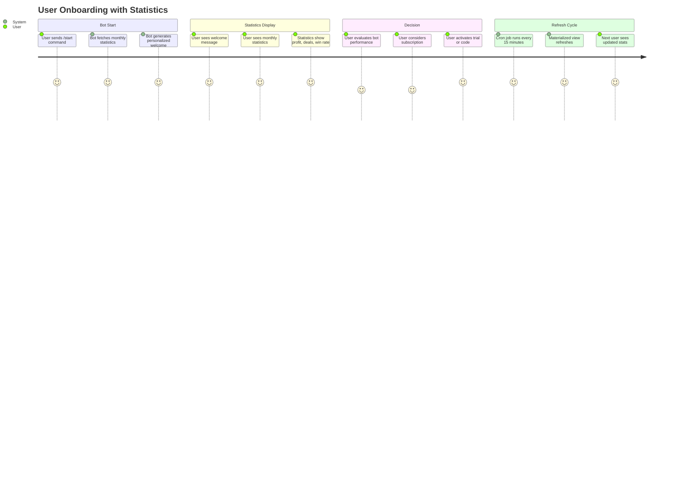
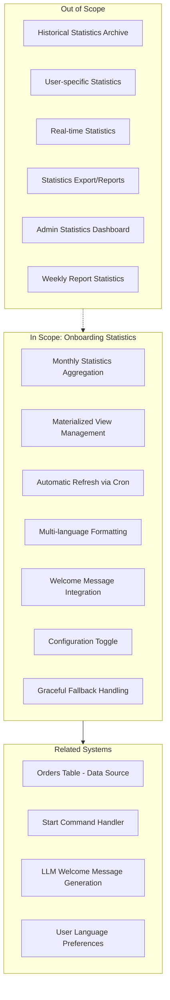
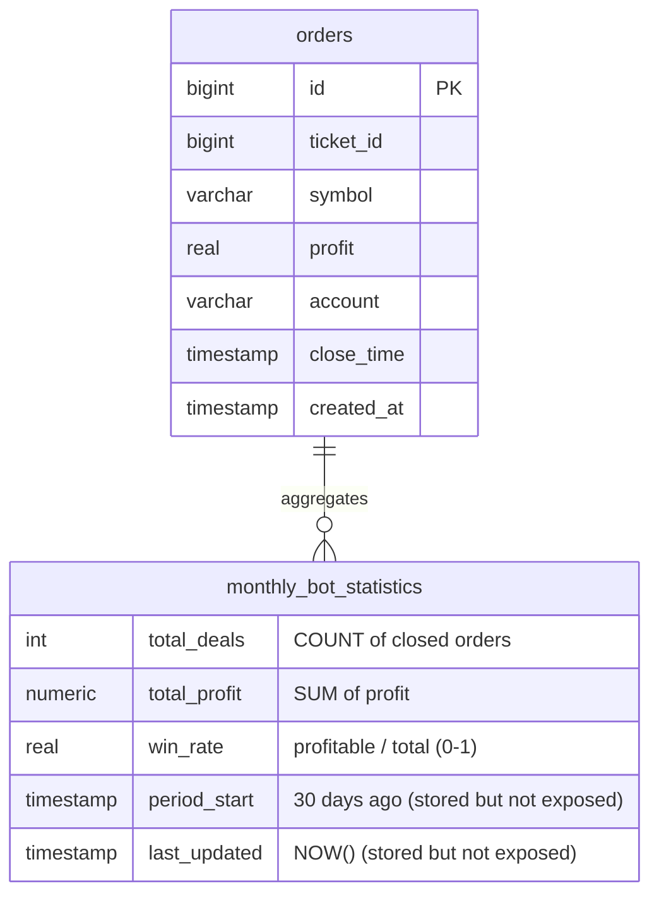
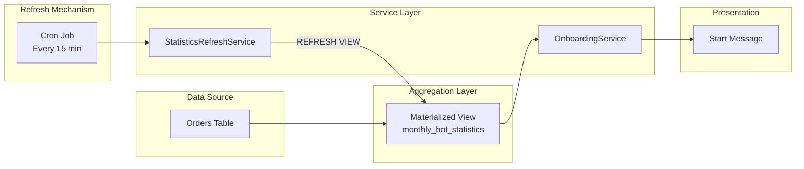

# PRD: Onboarding Statistics

## Overview

### One-line Summary
A system that displays aggregated monthly trading statistics (total deals, profit, win rate) to new users during bot onboarding to build trust and demonstrate bot performance.

### Background
The Quantum Deal platform provides trading signals to beginner traders via Telegram. New users entering the bot through the `/start` command need to understand the value proposition before subscribing. Displaying real trading statistics builds trust and demonstrates the bot's track record.

The Onboarding Statistics feature:
1. Aggregates trading data from the last 30 days using a materialized view for performance
2. Automatically refreshes statistics every 15 minutes via cron job
3. Integrates with the welcome message flow in the `/start` command
4. Supports 8 languages for international user base
5. Provides graceful fallback when statistics are unavailable

## User Stories

### Primary Users

1. **New Users**: First-time visitors who need to understand bot value before subscribing
2. **Returning Users**: Existing users who see updated statistics when restarting the bot
3. **System**: Automated processes that refresh statistics periodically

### User Stories

**As a new user:**
```
As a potential subscriber
I want to see the bot's monthly trading performance when I start
So that I can make an informed decision about subscribing
```

```
As an international user
I want to see statistics in my preferred language
So that I can understand the information clearly
```

**As a returning user:**
```
As a returning user
I want to see updated statistics when I restart the bot
So that I know the bot continues to perform well
```

**As a system administrator:**
```
As a system administrator
I want statistics to update automatically
So that users always see fresh, accurate data
```

```
As a system administrator
I want to control statistics visibility via configuration
So that I can disable statistics during testing or data issues
```

### Use Cases

1. **New User Onboarding**: User sends `/start`, bot displays personalized welcome message with monthly statistics showing total deals, profit, and win rate
2. **Language-Specific Display**: Russian user sees statistics in Russian with correct number formatting
3. **Statistics Disabled**: Administrator sets `STATISTICS_SHOW_ON_ONBOARDING=false`, users see welcome message without statistics section
4. **No Data Scenario**: Bot has no closed deals in last 30 days, welcome message displays without statistics section
5. **Performance Optimization**: Statistics query returns in <10ms due to materialized view caching

## User Journey Diagram



## Scope Boundary Diagram



## Functional Requirements

### Must Have (MVP) - IMPLEMENTED

- [x] **FR-001**: Aggregate statistics from orders closed in the last 30 days
- [x] **FR-002**: Calculate total number of closed deals
- [x] **FR-003**: Calculate total profit from closed deals
- [x] **FR-004**: Calculate win rate (profitable deals / total deals)
- [x] **FR-005**: Store statistics in PostgreSQL materialized view for performance
- [x] **FR-006**: Refresh materialized view automatically every 15 minutes
- [x] **FR-007**: Query materialized view for statistics display (<10ms response time)
- [x] **FR-008**: Format statistics for display with appropriate number formatting
- [x] **FR-009**: Support 8 languages (RU, EN, UK, HI, FR, KK, UZ, TG)
- [x] **FR-010**: Integrate statistics into `/start` command welcome message
- [x] **FR-011**: Graceful fallback when statistics unavailable (null return)
- [x] **FR-012**: Configuration toggle via `STATISTICS_SHOW_ON_ONBOARDING` env variable
- [x] **FR-013**: Return null when no deals exist (totalDeals === 0)
- [x] **FR-014**: Convert win rate from decimal (0-1) to percentage (0-100)

### Nice to Have - NOT IMPLEMENTED

- [ ] **FR-015**: Manual refresh trigger for administrators (method exists in code but no admin UI exposed)
- [ ] **FR-016**: Statistics caching at application level
- [ ] **FR-017**: Separate statistics by account/trader

### Out of Scope

- **Historical Statistics**: Long-term statistics archive beyond 30 days
- **User-specific Statistics**: Personal trading performance per user
- **Real-time Statistics**: Live statistics without caching
- **Weekly Reports**: Weekly report statistics (separate feature)
- **Admin Dashboard**: Administrative statistics viewing interface
- **Core Infrastructure**: Subscription management, code activation (see subscription-core-prd.md)

## Non-Functional Requirements

### Performance
- **Query Response Time**: <10ms for materialized view query (achieved via caching)
- **Refresh Duration**: <100ms for view refresh (single aggregated row)
- **Refresh Interval**: Every 15 minutes (configurable via cron expression)

### Reliability
- **Graceful Degradation**: Welcome message displays without statistics if query fails
- **Error Logging**: All failures logged with context for debugging
- **No Blocking**: Refresh failures do not crash the application

### Security
- **Read-only Access**: Statistics are read-only, no user data modification
- **No PII**: Statistics are aggregated, contain no personally identifiable information

### Scalability
- **Materialized View**: Eliminates repeated expensive aggregation queries
- **Single Row**: Statistics stored as single aggregated row for efficient lookup
- **Index Support**: Period start index for potential future time-range queries

## Data Model

### Materialized View Schema



### Statistics Data Flow



### MonthlyStats Interface

The TypeScript interface exposed by `OnboardingService.getMonthlyStatistics()`:

```typescript
export interface MonthlyStats {
  totalDeals: number;
  totalProfit: number;
  winRate: number;
}
```

| Field | Type | Description | Source Calculation |
|-------|------|-------------|-------------------|
| totalDeals | number | Total closed deals | `COUNT(*)` from orders where close_time IS NOT NULL |
| totalProfit | number | Sum of all profits | `COALESCE(SUM(profit), 0)` from orders |
| winRate | number | Win percentage (0-100) | `COUNT(profit > 0) / COUNT(*)` * 100 |

> **Note**: The materialized view stores additional fields (`active_traders`, `period_start`, `last_updated`) for potential future use, but these are not currently exposed in the service API.

### Configuration

| Environment Variable | Type | Default | Description |
|---------------------|------|---------|-------------|
| `STATISTICS_SHOW_ON_ONBOARDING` | boolean | true | Enable/disable statistics display |

## Success Criteria

### Quantitative Metrics

1. **Query Performance**: Statistics query completes in <10ms (materialized view)
2. **Refresh Reliability**: 99%+ of scheduled refreshes complete successfully
3. **Data Freshness**: Statistics never older than 15 minutes during market hours
4. **Zero Downtime**: Statistics failures do not affect bot availability

### Qualitative Metrics

1. **User Trust**: Statistics display builds confidence in bot performance
2. **International Support**: All 8 supported languages have appropriate formatting
3. **Developer Experience**: Clean service API with consistent method naming
4. **Maintainability**: Separation of concerns between refresh, query, and formatting

## Technical Considerations

### Dependencies

- **Database**: PostgreSQL with materialized view support
- **Drizzle ORM**: Schema definition and SQL execution
- **NestJS Schedule**: `@Cron` decorator for periodic refresh
- **ConfigService**: Environment variable access for feature toggle
- **Orders Table**: Source data for statistics aggregation

### Constraints

- **Materialized View Limitations**: Cannot use CONCURRENTLY refresh without unique index (not needed for single-row view)
- **Data Lag**: Statistics may be up to 15 minutes behind real-time
- **30-Day Window**: Only last 30 days of data included (by design)
- **Closed Orders Only**: Only orders with `close_time IS NOT NULL` included

### Implementation Files

| File | Purpose |
|------|---------|
| `libs/bot/src/services/onboarding.service.ts` | Statistics query and formatting service |
| `libs/bot/src/services/statistics-refresh.service.ts` | Cron-based refresh service |
| `libs/db/src/schema/statistics.ts` | Drizzle schema for materialized view |
| `libs/db/migrations/20251101094100_create_monthly_statistics_view.sql` | Migration creating the view |
| `libs/bot/src/commands/start/start.update.ts` | Integration with /start command |

### Risks and Mitigation

| Risk | Impact | Probability | Mitigation |
|------|--------|-------------|------------|
| View refresh failure | Low | Low | Graceful fallback to no statistics display |
| Stale data display | Low | Medium | 15-minute refresh interval acceptable for use case |
| Database performance impact | Low | Low | Refresh is fast (<100ms) and non-blocking |
| Incorrect calculations | Medium | Low | SQL logic verified, only closed orders included |

## Appendix

### Multi-language Statistics Templates

| Language | Code | Template Example |
|----------|------|------------------|
| English | en | "Our Community This Month: Total Profit: $X, Successful Deals: Y, Win Rate: Z%" |
| Russian | ru | "Naше сообщество за месяц: Общая прибыль: $X, Успешных сделок: Y, Винрейт: Z%" |
| Ukrainian | uk | "Наша спільнота за місяць: Загальний прибуток: $X, Успішних угод: Y, Вінрейт: Z%" |
| Hindi | hi | "इस महीने हमारा समुदाय: कुल लाभ: $X, सफल सौदे: Y, जीत दर: Z%" |
| French | fr | "Notre communaute ce mois: Profit total: $X, Transactions reussies: Y, Taux de reussite: Z%" |
| Kazakh | kk | "Біздің қауымдастық осы айда: Жалпы пайда: $X, Сәтті мәмілелер: Y, Жеңіс деңгейі: Z%" |
| Uzbek | uz | "Bizning jamiyat bu oyda: Umumiy foyda: $X, Muvaffaqiyatli bitimlar: Y, G'alabalar nisbati: Z%" |
| Tajik | tg | "Ҷомеаи мо дар ин моҳ: Фоидаи умумӣ: $X, Созишҳои муваффақ: Y, Нисбати ғалаба: Z%" |

### Number Formatting

- **Thousands Separator**: US locale (`toLocaleString('en-US')`)
- **Currency**: USD prefix (`$X`)
- **Percentage**: One decimal place (`X.X%`)

### Materialized View SQL

```sql
CREATE MATERIALIZED VIEW monthly_bot_statistics AS
SELECT
  COUNT(*)::int as total_deals,
  COALESCE(SUM(profit), 0)::numeric as total_profit,
  COALESCE(
    COUNT(CASE WHEN profit > 0 THEN 1 END)::float / NULLIF(COUNT(*), 0),
    0
  ) as win_rate,
  COUNT(DISTINCT account)::int as active_traders,
  CURRENT_DATE - INTERVAL '30 days' as period_start,
  NOW() as last_updated
FROM orders
WHERE created_at >= CURRENT_DATE - INTERVAL '30 days'
  AND close_time IS NOT NULL;
```

### References

- Service: `libs/bot/src/services/onboarding.service.ts`
- Refresh Service: `libs/bot/src/services/statistics-refresh.service.ts`
- Schema: `libs/db/src/schema/statistics.ts`
- Migration: `libs/db/migrations/20251101094100_create_monthly_statistics_view.sql`
- Start Handler: `libs/bot/src/commands/start/start.update.ts`
- Welcome Prompt: `libs/bot/src/commands/start/welcome.ts`
- i18n: `libs/bot/src/commands/start/start.i18n.ts`
- Orders Schema: `libs/db/src/schema/orders.ts`

### Glossary

- **Materialized View**: A database object containing the results of a query, stored on disk for fast retrieval
- **Win Rate**: Percentage of profitable trades (profit > 0) out of total trades
- **Onboarding**: The process of introducing new users to the bot via the /start command
- **Graceful Fallback**: System behavior where failures result in degraded functionality rather than errors

---

**Document Version**: 1.0.0
**Created**: 2025-11-25
**Status**: Reverse-engineered from implementation
**Last Updated**: 2025-11-25
**Review Status**: Initial creation
