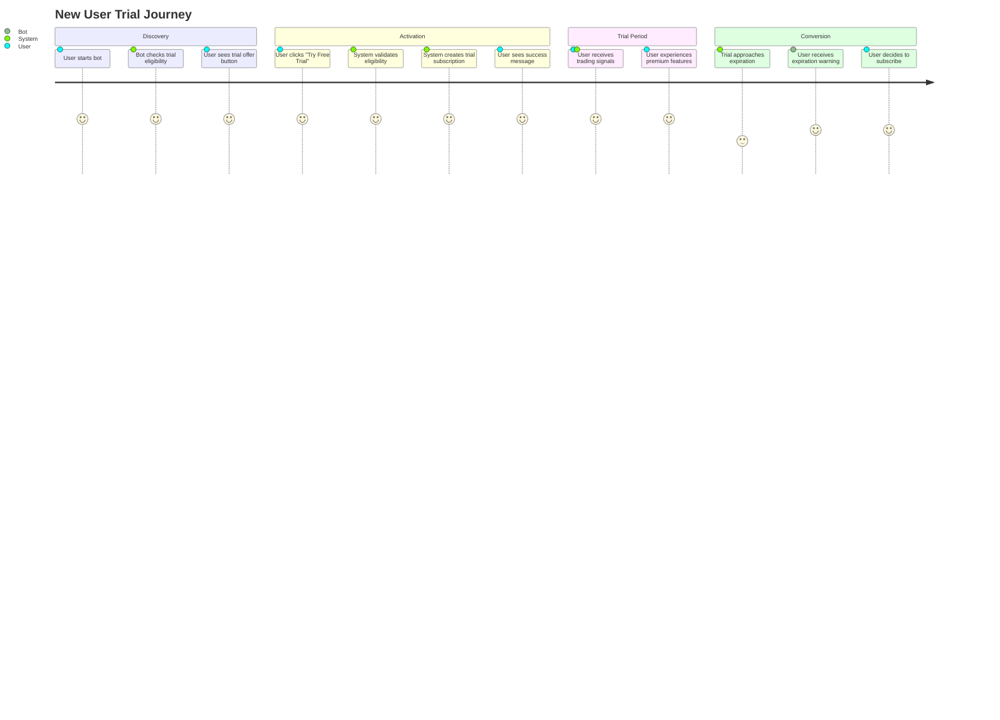
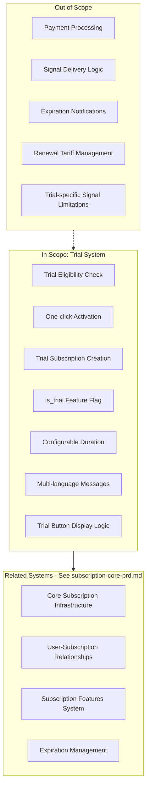
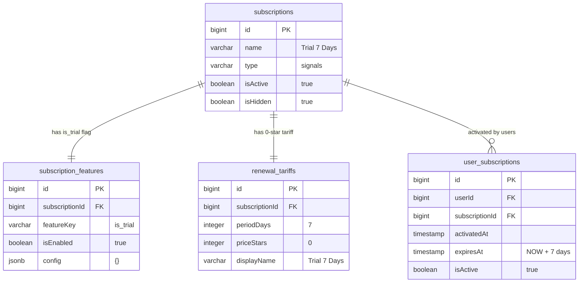

# PRD: Trial Subscription System

## Overview

### One-line Summary
A 7-day free trial system that enables new users to experience premium trading signals before committing to a paid subscription, driving user acquisition and conversion.

### Background
The Quantum Deal platform provides professional trading signals to beginner traders via Telegram. To reduce friction for new users and demonstrate value before purchase, a trial subscription system was implemented. The trial system allows first-time users to access all premium features for a configurable period (default 7 days) without payment, encouraging conversion to paid subscriptions after experiencing the service quality.

**Business Goals:**
1. **User Acquisition**: Lower the barrier to entry for hesitant users
2. **Value Demonstration**: Let users experience premium signals before committing financially
3. **Conversion Optimization**: Create a natural pathway from trial to paid subscription
4. **Trust Building**: Show confidence in product quality by offering free access

## User Stories

### Primary Users

1. **New Users**: First-time visitors who want to try the service before paying
2. **System**: Automated processes that manage trial eligibility and activation

### User Stories

**As a new user:**
```
As a new user
I want to try the trading signals for free
So that I can evaluate the service quality before subscribing
```

```
As a new user
I want to know how long my trial lasts
So that I can plan when to subscribe or make a purchase decision
```

```
As a new user
I want a simple one-click trial activation
So that I can start receiving signals immediately without complex registration
```

**As a returning user:**
```
As a returning user who used my trial
I want to see subscription options instead of trial button
So that I can easily upgrade to a paid plan
```

### Use Cases

1. **New User Onboarding**: User starts bot for first time, sees trial offer button, activates with one click
2. **Trial Activation Flow**: User clicks "Try Free Trial" button, system validates eligibility, creates subscription, confirms activation
3. **Eligibility Check**: System verifies user has never had any subscription before showing trial option
4. **Post-Trial Conversion**: After trial expires, user receives expiration notification with subscription options

## User Journey Diagram



## Scope Boundary Diagram



## Functional Requirements

### Must Have (MVP) - IMPLEMENTED

- [x] **FR-T001**: Trial eligibility check - user must have zero subscription history
- [x] **FR-T002**: Global trial enable/disable via `TRIAL_ENABLED` environment variable
- [x] **FR-T003**: Configurable trial duration via `TRIAL_DURATION_DAYS` (default: 7 days)
- [x] **FR-T004**: One-click trial activation via `activate_trial` callback button
- [x] **FR-T005**: Trial subscription identified by `is_trial` feature flag in `subscription_features`
- [x] **FR-T006**: Trial subscription record with `is_hidden=true` (not shown in public subscription list)
- [x] **FR-T007**: Zero-cost renewal tariff for trial (0 stars price)
- [x] **FR-T008**: Trial button shown only to eligible users on `/start` command
- [x] **FR-T009**: Multi-language support for trial messages (8 languages: en, ru, uk, hi, fr, kk, uz, tg)
- [x] **FR-T010**: Success confirmation with trial expiration date
- [x] **FR-T011**: Bot commands menu update after trial activation
- [x] **FR-T012**: Double eligibility check before activation (in action handler)

### Nice to Have - NOT IMPLEMENTED

- [ ] **FR-T013**: Trial reminder notifications (3 days, 1 day before expiration)
- [ ] **FR-T014**: Trial extension capability for support cases
- [ ] **FR-T015**: Analytics tracking for trial conversion rates
- [ ] **FR-T016**: Trial referral bonuses

### Out of Scope

- **Trial-specific signal limitations**: Trial provides full access, same as paid subscriptions
- **Payment collection during trial**: No payment info required for trial activation
- **Trial abuse prevention (device/IP)**: Only subscription history check implemented
- **Multiple trial offers**: Single trial type, no A/B testing of trial durations

## Non-Functional Requirements

### Performance
- **Eligibility Check**: Single database query to `user_subscriptions` table
- **Activation Time**: Under 2 seconds from button click to confirmation message
- **Database Load**: Minimal - only 2 queries per activation (eligibility + insert)

### Reliability
- **Double Validation**: Eligibility checked twice (on /start and on activation)
- **Error Handling**: Graceful degradation with user-friendly error messages
- **Feature Flag Safety**: Trial disabled by default if `TRIAL_ENABLED` not set

### Security
- **Single Trial Policy**: Users cannot reactivate trial after first use
- **No Authentication Bypass**: Uses standard Telegram user identification
- **Audit Trail**: Trial subscription tracked in `user_subscriptions` with timestamps

### Scalability
- **Stateless Design**: No session state required for trial management
- **Horizontal Scaling**: Works across multiple bot instances
- **Configuration-based**: Duration configurable without code changes

## Eligibility Rules

### Current Implementation

| Rule | Description | Check |
|------|-------------|-------|
| No subscription history | User has zero records in `user_subscriptions` table | `findByUserId(userId).length === 0` |
| Trial system enabled | Environment variable `TRIAL_ENABLED` is true | `configService.get('TRIAL_ENABLED', true)` |

### Important Notes

1. **First-subscription-only**: Any subscription (trial, paid, broadcast) disqualifies from trial
2. **No re-trial**: Once a user has had ANY subscription, trial is permanently unavailable
3. **Default enabled**: If `TRIAL_ENABLED` not configured, trial is enabled by default

## Data Model

### Trial Subscription Record



## Configuration

### Environment Variables

| Variable | Type | Default | Description |
|----------|------|---------|-------------|
| `TRIAL_ENABLED` | boolean | `true` | Enable/disable trial system globally |
| `TRIAL_DURATION_DAYS` | number | `7` | Trial period duration in days |

### Database Seed (Migration)

The trial subscription is created via migration `20251101094200_seed_trial_subscription.sql`:

1. Creates subscription with `name='Trial 7 Days'`, `type='signals'`, `is_hidden=true`
2. Creates renewal tariff with `period_days=7`, `price_stars=0`
3. Creates feature flag `is_trial=true`

## Success Criteria

### Quantitative Metrics

1. **Trial Activation Rate**: Percentage of new users who activate trial
2. **Trial-to-Paid Conversion**: Percentage of trial users who purchase subscription
3. **Activation Success Rate**: 100% of eligible users can successfully activate trial
4. **Error Rate**: <1% of activation attempts result in errors

### Qualitative Metrics

1. **User Experience**: Simple one-click activation without friction
2. **Message Clarity**: Users understand trial duration and next steps
3. **Localization Quality**: Natural-sounding messages in all 8 supported languages

## Technical Considerations

### Dependencies

- **Core Subscription Infrastructure**: Uses `subscription-core-prd.md` components
  - `user_subscriptions` table for trial records
  - `subscription_features` for `is_trial` flag identification
  - `UserSubscriptionsRepository.activate()` for subscription creation
- **Configuration Service**: NestJS ConfigService for environment variables
- **Bot Framework**: Telegraf with NestJS for Telegram integration

### Constraints

- **Single Trial Per User**: Cannot reset trial status without database intervention
- **No Partial Trial**: Full feature access during trial (no limitations)
- **Expiration Handling**: Uses standard subscription expiration system (not trial-specific)

### File References

| Component | Path |
|-----------|------|
| Trial Service | `libs/bot/src/services/trial.service.ts` |
| Trial Action | `libs/bot/src/actions/trial/trial.action.ts` |
| Trial i18n | `libs/bot/src/actions/trial/trial.i18n.ts` |
| Start Handler | `libs/bot/src/commands/start/start.update.ts` |
| Subscriptions Repo | `libs/db/src/repositories/subscriptions.repository.ts` |
| Migration | `libs/db/migrations/20251101094200_seed_trial_subscription.sql` |

### Risks and Mitigation

| Risk | Impact | Probability | Mitigation |
|------|--------|-------------|------------|
| Trial abuse via new accounts | Medium | Low | Telegram account age/verification could be added |
| Trial not converting to paid | High | Medium | Implement reminder notifications before expiration |
| Database missing trial subscription | High | Low | Migration ensures trial exists; fallback error message |
| Configuration misconfiguration | Medium | Low | Defaults ensure trial works without explicit config |

## API Reference

### TrialService

| Method | Description | Returns |
|--------|-------------|---------|
| `isEligible(userId)` | Check if user can activate trial | `Promise<boolean>` |
| `activate(userId)` | Activate trial for user | `Promise<{ success, expiresAt?, error? }>` |

### SubscriptionsRepository (Trial-related)

| Method | Description | Returns |
|--------|-------------|---------|
| `findTrialSubscription()` | Find subscription with is_trial flag | `Promise<Subscription \| null>` |
| `isTrialSubscription(id)` | Check if subscription is trial | `Promise<boolean>` |

### Callback Actions

| Action | Description | Trigger |
|--------|-------------|---------|
| `activate_trial` | Activates trial subscription | Inline button click |

## Appendix

### Supported Languages

| Code | Language | Pluralization |
|------|----------|---------------|
| `en` | English | 2 forms (1 day, N days) |
| `ru` | Russian | 3 forms (complex rules) |
| `uk` | Ukrainian | 3 forms (complex rules) |
| `hi` | Hindi | 1 form |
| `fr` | French | 2 forms (1 jour, N jours) |
| `kk` | Kazakh | 1 form |
| `uz` | Uzbek | 1 form |
| `tg` | Tajik | 1 form |

### Glossary

- **Trial**: A time-limited free subscription for new users
- **Eligibility**: Condition determining if user can activate trial (no prior subscriptions)
- **is_trial flag**: Feature flag in `subscription_features` marking trial subscription
- **Hidden subscription**: Subscription with `is_hidden=true`, not shown in public lists

---

**Document Version**: 1.0.0
**Created**: 2025-11-25
**Status**: Reverse-engineered from implementation
**Related Documents**: `subscription-core-prd.md`
